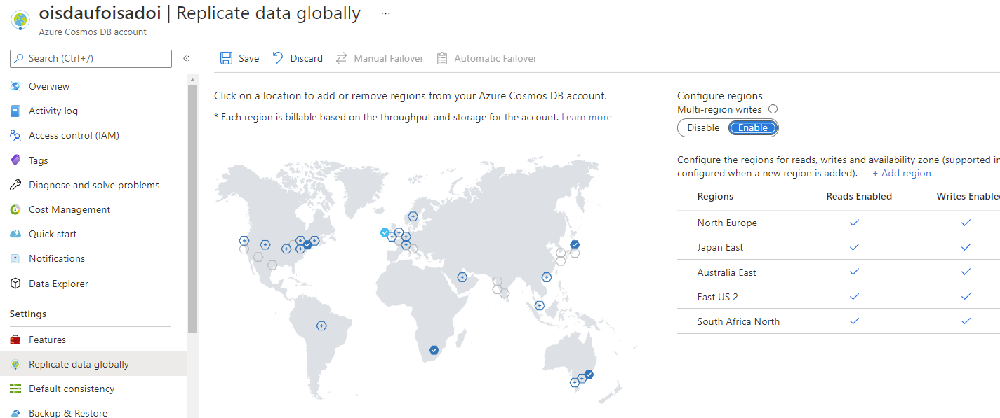

With Azure Cosmos DB, every region supports both writes and reads. Enabling the ability to write to any region is a turnkey operation that doesn’t interrupt the application’s availability. With the combination of Azure Cosmos DB’s global geo-replication functionality, and the ability to write to any region, Azure Cosmos DB can be used in application scenarios with significant write performance and scalability demands.

In practice, an account with multi-region writes enabled has stronger write guarantees than a single-region account or a single writable region account.

With multi-region write enabled, many of the features associated with a single-region Azure Cosmos DB account are still available:

- Sliding scale of well-defined consistency models
- Low latency write operations across the globe
- High availability with financially backed SLA

> [!NOTE]
> Strong consistency is not supported in a multi-region write scenario.

In the event of a data center outage, accounts with multiple write-regions will continue to be available for read and write operations as the SDK will automatically attempt requests at another region from the preferred regions list.

Multi-region write can be configured using the Azure CLI, PowerShell, code, Azure Resource Manager templates (JSON/Bicep), or the Azure portal.

Once the multiple write-region functionality is enabled, all replica regions associated with the account will automatically become writable regions.
