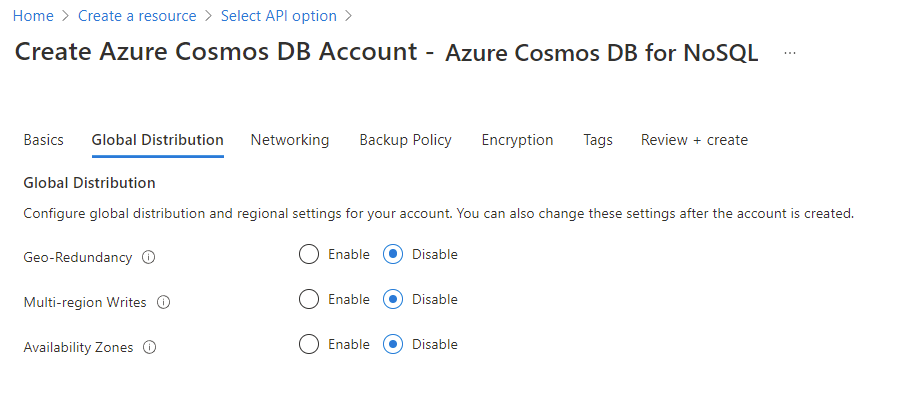
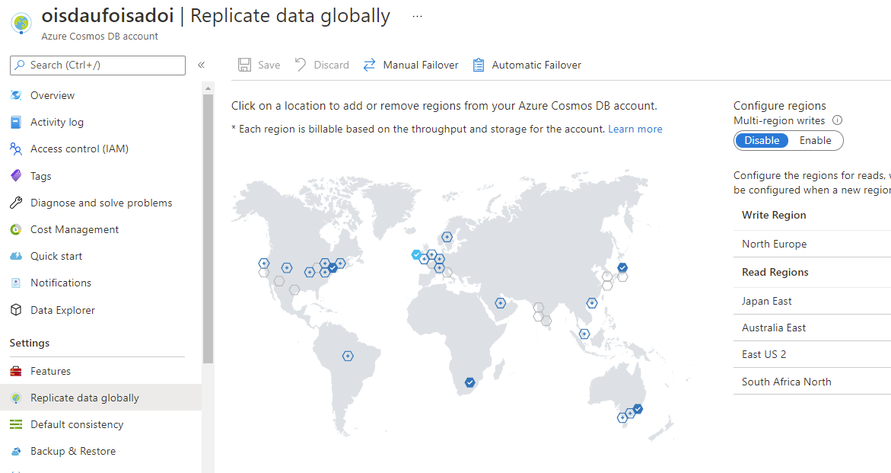

Configuring global distribution in Azure Cosmos DB is a turnkey operation that is performed when an account is created or afterward.

## Configuring geo-redundancy for a new account

In the creation wizard, the Basics tab will require you to select a location for the new Azure Cosmos DB account. This location is referred to as the primary region. If multi-region write is not enabled, this location is the only location where you can perform write operations.

The creation wizard includes a Global Distribution tab where the geo-redundancy option should be enabled to add additional geo-redundant read-only regions. Enabling this setting will add the Azure region pair as your first replica for your data in Azure Cosmos DB.

## Configuring geo-redundancy for an existing account

For existing Azure Cosmos DB accounts, the Replicate data globally pane is used to add or remove regions. Each region is added using a map, and then replication only occurs once the changes are saved. This pane can also be used to remove existing regions where data is currently replicated.

