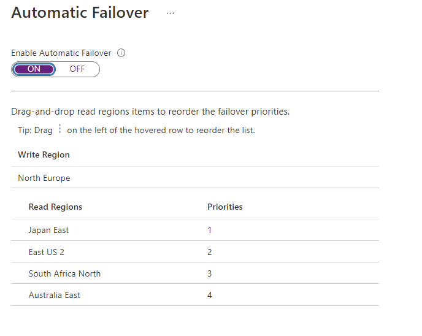

An Azure Cosmos DB account with a single write region can be susceptible to downtime if a complete data center outage ever occurs. While this is rare, many organizations like to have a contingency plan in place. In the context of Azure Cosmos DB, an automatic failover plan can transfer the write region to one of the read regions in the case of such an outage.

By default, automatic failover is not enabled for an Azure Cosmos DB account. Automatic failover must be enabled before defining a plan. Once enabled, the read regions can then be sorted by order of failover priority. After sorting, the new priority list can then be persisted and applied to the account.

As an illustrative example, an Azure Cosmos DB account is configured with a write region, **West US 2**, and two read regions of **East US** and **UK South**. The automatic failover priorities are provided in this table:

| **Region** | **Priority** |
| :--- | :--- |
| **West US 2** | (N/A - write region) |
| **East US** | 1 |
| **UK South** | 2 |

If the **West US 2** region experiences a data center outage, the **East US** region will first become the new write region. If **East US** experiences an outage, then **UK South** will become the new write region.
