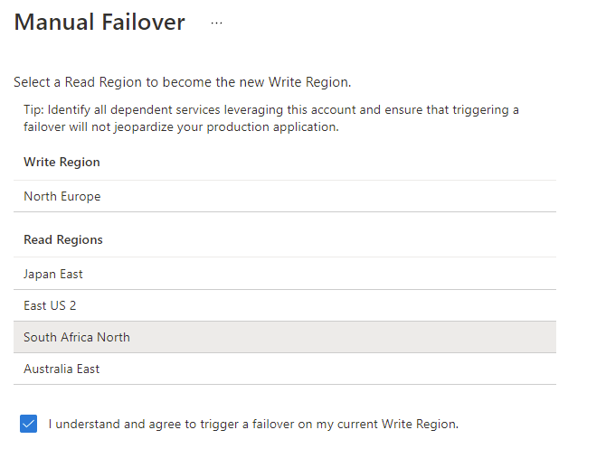

As part of your organization’s disaster recovery exercises, you may wish to test the failover capabilities in Azure Cosmos DB. A manual failover can be invoked using the Azure portal to validate the entire process.

The failover process requires connectivity between the two regions to ensure that it will succeed and maintain consistency in the data. For this reason, a manual failover should not be triggered during a service-wide Azure Cosmos DB outage.
