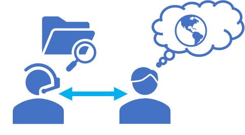

All organizations rely on information to make decisions, answer questions, and function efficiently. The problem for most organizations is not a lack of information, but the challenge of finding and  extracting the information from the massive set of documents, databases, and other sources in which the information is stored.

For example, suppose *Margie's Travel* is a travel agency that specializes in organizing trips to cities around the world. Over time, the company has amassed a huge amount of information in documents such as brochures, as well as reviews of hotels submitted by customers. This data is a valuable source of insights for travel agents and customers as they plan trips, but the sheer volume of data can make it difficult to find relevant information to answer a specific customer question.

To address this challenge, Margie's Travel can implement a solution in which the documents are indexed and made easy to search. This solution enables agents and customers to query the index to find relevant documents and extract information from them.

## Azure Cognitive Search

Azure Cognitive Search provides a cloud-based solution for indexing and querying a wide range of data sources, and creating comprehensive and high-scale search solutions. With Azure Cognitive Search, you can:

- Index documents and data from a range of sources.
- Use cognitive skills to enrich index data.
- Store extracted insights in a knowledge store for analysis and integration.

