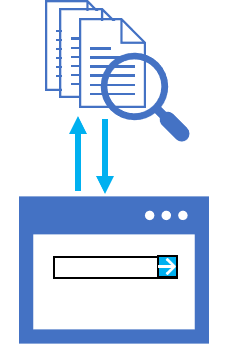

A search solution consists of two core elements:

- An index that makes it possible to query the data source and find relevant information, and which is incrementally updated as documents are changed or are added.
- A search interface, often in a web application or app, that submits queries to the index and presents the results.

In an Azure Cognitive Search solution, you create the index and other associated objects within an Azure Cognitive Search resource in an Azure subscription. The search interface can be developed using the application framework of your choice, and integrated with the index through Azure Cognitive Search application programming interfaces (APIs).

> [!NOTE]
> While it's possible to use the graphical interface in the Azure portal to create an Azure Cognitive Search index and related objects, a code-based approach is preferred when developing an enterprise solution. Using code to define infrastructure and service configuration makes it easier to apply a repeatable DevOps process in which the solution can be automatically built and deployed to test and staging environments for validation before being released to production.
>
> For this reason, you will use a completely code-based approach to implement the Margie's Travel search solution.

## Prepare a development environment

To create the Margie's Travel search solution, you'll need:

- A Microsoft Azure subscription. If you don't already have one, you can sign up for a free trial at [https://azure.microsoft.com](https://azure.microsoft.com?azure-portal=true).
- A Visual Studio Codespace based on the **MicrosoftDocs/km** repo. The Codespace is a hosted instance of Visual Studio Code, in which you'll be able to view, edit, and run the code needed to create and test the search solution.

To set up the Codespace:

1. Open <a href = "https://online.visualstudio.com/environments/new?name=ml-basics&repo=MicrosoftDocs/km-search" target="_blank" rel="noopener">Visual Studio Codespaces</a> in a new browser tab; and if prompted, sign in using the Microsoft account associated with your Azure subscription.
2. Create a Codespace with the following settings (if you don't already have a Visual Studio Codespaces billing plan, you'll be prompted to create one):
    - **Codespace name**: *A name for your Codespace - for example, **km-code**.*
    - **Git repository**: MicrosoftDocs/km
    - **Instance type**: Standard (Linux) 4 cores, 8GB RAM
    - **Suspend idle Codespace after**: 30 minutes
3. Wait for the Codespace to be created. This will take around 3 minutes.
4. If you are prompted to sign into GitHub to use the Pull Requests feature, ignore the prompt.
5. When prompted to restore .NET dependencies, do so.
6. After preparation is complete, you can close the **Welcome** and **Creation Log** panes. You can also change the color scheme to suit your preference - just click the **&#9881;** icon at the bottom left and select a new **Color Theme**.
