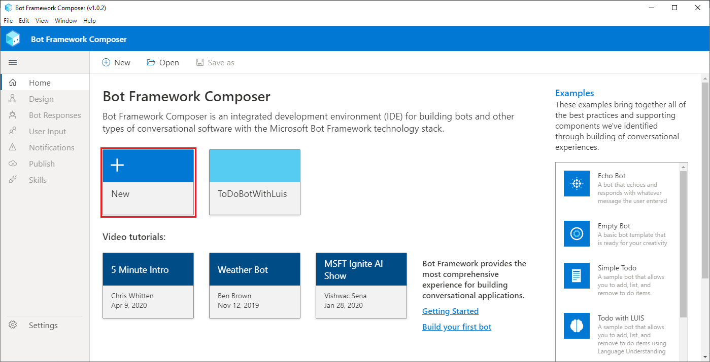

Using the Bot Framework Composer presents some advantages when compared to creating a bot with the SDK and coding.

- Use of Adaptive Dialogs allow for Language Generation (LG), which can simplify interruption handling and give bots character.
- Visual design surface in Composer eliminates the need for boilerplate code and makes bot development more accessible.
- Time saved with fewer steps to set up your environment.
- The Composer bot projects contain reusable assets in the form of JSON and Markdown files that can be bundled and packaged with a bot's source code. The files can be checked into source control systems and deployed along with code updates, such as dialogs, language understanding (LU) training data, and message templates.

>[!TIP]
>Keep up-to-date with the releases of the Composer in the [GitHub repo](https://github.com/microsoft/BotFramework-Composer/releases)

## Install the Composer

Before you can begin to work with the Bot Framework Composer, you will need to [download](https://docs.microsoft.com/composer/install-composer) the correct desktop application for your operating system..

You will also need to install the [Bot Framework Emulator](https://github.com/Microsoft/BotFramework-Emulator/blob/master/README.md) and ensure that you have [.NET Core SDK 3.1](https://dotnet.microsoft.com/download/dotnet-core/3.1) or later installed as well.

## Explore the Bot Framework Composer

Once you have the prerequisites installed, and have downloaded and installed the Bot Framework Composer, start the application. You will review some of the key features of the interface to get familiar with how to use it. When you first start the Composer, you will see the Home screen where you begin creating your bot.

The first time you run the application, the product tour is displayed in the lower right corner. Take some time to run through that tour and get a basic understanding of some of the components of the interface. When you have completed all the steps, select the Done button to close it.

After reviewing the product tour, you have some knowledge of the different aspects of the interface of the Composer. We will go over a few more items here.

### Home Screen

On the Home screen, you can create a new bot, open an existing bot on your computer, view some tutorial videos, and also examine some example bots created using the Composer. The Home screen can be accessed at any time by selecting **Home** from the **&#9776;** menu.

The **&#9776;** menu provides options for designing and working on your bot. The **Design** option opens up the visual designer where you will lay out the conversation and navigation flow of your bot. If you have a bot project open, selecting *Navigation** will open the designer for that bot.

**Bot Responses** is the option where you can view and select the various options that the Composer provides for responding to users.  Here you will find common response types such as single or multi-line text options as well as some language generation options that allow you to integrate variables in the response.

**User Input** provides options for prompting and accepting input from the user as they interact with your bot.

**Notifications**  you can manage the notifications for the bot here.

**Publish** allows you to manage publishing profiles. Currently, the Composer supports publishing to Azure Functions or Azure Web Apps, both in Preview at this time.

**Skills** you configure any skills that you want your bot to use.  Skills require a Microsoft App ID and a host endpoint.

**Settings**  an editor for the **Bot settings**, **Application settings**, and **Runtime config** options. For example, under **Bot settings**, you would configure the necessary authoring key and endpoint information for LUIS integration. Perhaps you want to log your bot conversations to a CosmosDB instance on Azure so you would edit the CosmosDB section to include the password, app ID, CosmosDB authKey, collectionId, endpoint, and database ID.

The Application settings portion allows you to configure Composer-specific behaviors. You can select a custom runtime option as well in the **Settings** for the Composer. We will not cover custom runtime configs.

## Create a basic bot

Now you're ready to use Composer to create a bot. Throughout this module, you'll develop a bot that retrieves information about local weather conditions.

### Before you start

1. Ensure you have installed the [Bot Framework Emulator](https://github.com/Microsoft/BotFramework-Emulator/blob/master/README.md) and the [Bot Framework Composer](https://docs.microsoft.com/composer/install-composer).
2. You will require an API key for the service to work so visit the [OpenWeather site](https://openweathermap.org/price) to create a user account and get a free API key before you start.

### Create a bot and customize the "welcome" dialog flow

1. Start the Bot Framework Composer.
1. On the **Home** screen, select **New**. Then create a new bot from scratch; naming it **WeatherBot** and saving it in a local folder.

    Close the **Welcome** dialog box and leave the tour if prompted.

1. In the navigation pane on the left, select **Greeting** to open the authoring canvas and show the ConversationUpdate activity that is called when a user initially joins a conversation with the bot. The activity consists of a flow of actions.
1. In the properties pane on the right, edit the title of **Greeting** by selecting the word **Greeting** at the top of the properties pane on the right and changing it to **WelcomeUsers**.
1. In the authoring canvas, select the **Send a response** action. Then, in the properties pane, change the default text in the **Language Generation** box from *- ${WelcomeUser()}*  to **- Hi! I'm WeatherBot.** (including the preceding "-" dash).
1. In the authoring canvas, select the final **+** symbol just above the circle at the end of the dialog flow, and add a new **Ask a question** action for a **Text** response.

    The new action creates two nodes in the dialog flow. The first node defines a prompt for the bot to ask the user a question, and the second node represents the response that will be received from the user. In the properties pane, these nodes have corresponding **Bot asks** and **User input** tabs.

1. In the properties pane, on the **Bot Asks** tab, set the **Prompt for text** value to **- What's your name?**. Then, on the **User Input** tab, set the **Property** value to **user&period;name** to define a variable that you can access later in the bot conversation.
1. Back in the authoring canvas, select the **+** symbol under the **User Input(Text)** action you just added, and add a **Send a response** action.
1. Select the newly added **Send a response** action and in the properties pane, set the **Language generation** value to **- Hello ${user&period;name}, nice to meet you!**.

    The completed activity flow should look like this:

    

### Test the bot

Your basic bot is complete so now let's test it.

1. Select **Start Bot** in the upper right-hand corner of Composer, and wait a minute or so while your bot is compiled and started. After a few minutes, a **Test in Emulator** option is available next to the button.

    * If a Windows Firewall message is displayed, enable access for all networks.

1. In the Bot Framework Composer, select **Test in Emulator**. Then wait for the Bot Framework Emulator to start.

    *If the emulator doesn't start, and you are prompted to search the Windows store for an app. Copy the URL for your bot in the the **Local bot runtime manager** pane. Then start the Bot Framework Emulator manually and open your bot using the URL.*

1. In the Bot Framework Emulator, after a short pause, you will see the welcome message and the prompt to enter your first name.  Enter you first name and press **Enter**.
1. The bot should respond with the **Hello *your_first_name*, nice to meet you!**.
1. Close the emulator.
1. In Composer, in the **Local bot runtime manager** pane. use the ⏹ icon to stop the bot.
