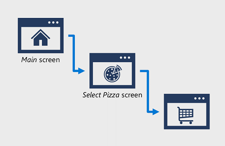
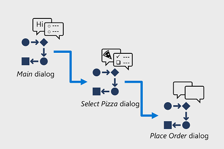
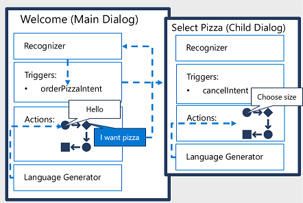

Before starting to develop a bot with the Bot Framework Composer, it's useful to understand a key concept in bot design - *dialogs*.

In all but the most simple cases, your bot will likely make use multiple *dialogs* to implement multi-turn conversations in which the bot gathers information from the user, storing state between turns. Commonly, a bot interaction begins with a *main* dialog in which the bot welcomes a user and establishes the initial conversation, and then triggers child dialogs.

## A flow of dialogs

It may be useful to compare the flow of interactions in a traditional application to that of a bot. Consider a pizza ordering application.

In a traditional application, users tend to think of the interactions as a series of "screens" or "pages". For example, on a pizza ordering web site, the user may start on the *Home* screen. Next, the user may select an option to view the available pizza options, moving the application on the *Select Pizza* screen, where the user can select and customize a pizza. Finally, the user may decide to check out, taking them to the *Place Order* screen where they can provide payment and delivery details.

A bot might follow a similar sequential pattern in which each "screen" is replaced by a dialog that gathers the required information before moving the user along to the next stage.

The important thing is to consider the purpose of your bot - what should it help the user achieve? Then design a conversation flow based on dialogs that will gather the required information and get to a resolution efficiently.

## Implementing dialogs with the Bot Framework Composer

The Bot Framework Composer implements dialogs (previously called adaptive dialogs, which they're still sometimes referred to) to build the bot conversation. Dialogs have a flexible conversation flow, allowing for interruptions, cancellations, and context switches at any point in the conversation. Each dialog consists of:

- One or more *actions* that define the flow of message activities in the dialog. These include sending a message, prompting the user for input, asking a question, and branching the conversation.
- A *Trigger*, which invokes the dialog logic for certain conditions or based on intent detected.
- A *recognizer*, which interprets user input to determine semantic *intent*. Recognizers are based on the Language Understanding service by default, but you can also use other types of recognizer; such as the QnA Service or simple regular expression matches.

A message or response for your bot can have one or more responses to choose from, which are chosen by random for a more dynamic conversation.

In addition to these elements, a dialog has *memory* in which values are stored as properties. Properties can be defined at various scopes, including the *user* scope (variables that store information for the lifetime of the user session with the bot, such as `user.greeted`) and *dialog* scope (variables that persist for the lifetime of the dialog, such as `dialog.response`).

In this style of conversation, the bot initiates a *main* dialog, which contains a flow of actions (which can include branches and loops). Within the dialog, input from users is analyzed by the recognizer, and responses are returned depending on the input event. The recognizer analyzes the event or natural language input to detect intents, which can be mapped to triggers that change the flow of the conversation. This change in flow often starts new child dialogs, which contain their own actions, triggers, and recognizers.

For example, when a new user is added to the conversation and triggers a `ConversationUpdate` activity, the bot can greet them with various welcome responses, and then ask them a question.

For another example, the pizza ordering bot might start with a main dialog that simply welcomes the user. When the user enters a message indicating that they want to order a pizza, the recognizer detects this intent and uses a trigger to start another dialog containing the flow of actions required to gather information about the pizza order.

