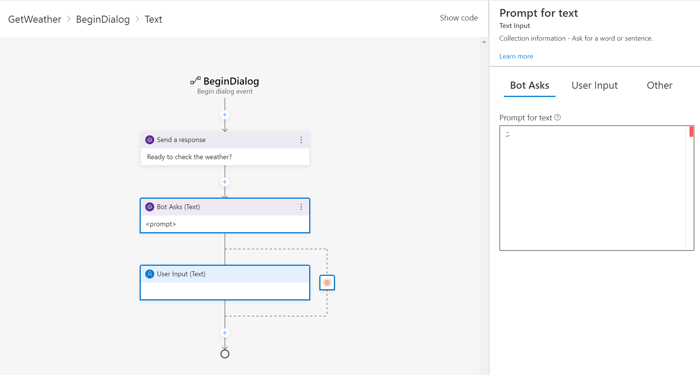

In this exercise, and subsequent exercises in this training, you will work with various components in the Bot Framework Composer as you build out a bot that will retrieve weather for a zip code in the United States.

## Create a new bot

1. Ensure that you have installed the prerequisites and the Bot Framework Composer.
1. Start the Bot Framework Composer and create a new bot from scratch, naming it **WeatherBot**.
In the navigation pane on the left, select **Greeting** to open the designer and show the *ConversationUpdate** activity that is called when a user joins a conversation with the bot.
1. Edit the title of **Greeting** by selecting the word **Greeting** at the top of the properties pane on the right, and changing it to **WelcomeUsers**.
1. In the **Designer pane**, select the **Send a response** item.
1. In the **Properties** panel on the right, change the default message *-${WelcomeUser()}* to **- Hi! I'm a friendly bot that can help with the weather.**.
1. Start the Bot (allowing firewall access if prompted) and test it in the Bot Emulator. After the emulator connects with the bot, your message should display as the welcome message presented to the user.
1. When you have finished testing, close the emulator, but keep composer open.

## Add a dialog

1. In Composer, in the top toolbar, select **+ Add** and add a new dialog named **getWeather** with the description **Get the current weather condition for the provide zip code**.

    The new dialog is created and opens in the **Authoring canvas**. At the top of the dialog is the **BeginDialog** trigger. You will use the trigger to send a message to the user.

1. In the navigation pane, select the **BeginDialog** trigger. Then on the authoring canvas, use the **+** symbol to add a **Send a response** action.
1. In the **Property** panel, in the **Language Generation** area, enter **- Ready to check the weather?**.

    Now you will connect this dialog to the main dialog to make it part of the conversation flow.

1. In the **Navigation** pane, select **WeatherBot**.
1. In the **Properties** pane, in the **Language Understanding** section, set the **Recognizer type** to **Regular expression recognizer**.
1. Select **+ Add** from the toolbar and then select **Add new Trigger on WeatherBot**.
1. In the dialog that is displayed:
    - Select **Intent recognized** from the **What is the type of this trigger?** drop-down list.
    - Enter **weather** for the **What is the name of this trigger (RegEx)** value.
    - Enter **weather** for the **Please input regex pattern** value.

    > [!Note]
    > The text entered in the regex pattern text box is a simply regular expression pattern that will cause the bot to look for the word *weather* in any incoming message.  If weather is present, the message becomes a **recognized intent**.

1. Now that the trigger is created, you need to configure an action for it. Select the **+** symbol under your new **weather** trigger node. Then in the list of actions, select **Dialog Management** and select **Begin a new dialog**.
1. With the **Begin a new dialog** action selected, in the **Properties** pane, select the **getWeather** dialog from the **Dialog name** drop-down list to start the **getWeather** dialog you defined earlier when the **weather** intent is recognized.
1. Restart the bot and use the Bot emulator to test your progress so far. Enter a phrase containing "weather", and your bot should respond with, **Ready to check the weather?**.
1. When you have finished testing, close the emulator, but keep composer open.

## Set up the user request for zipcode

Now that you have the starting point for the weather bot in place, it's time to gather some information from the user and then call the weather service using the zip code.

1. With your weather bot project open in the Bot Framework Composer, in the navigation pane, select the the **BeginDialog** trigger under the **getWeather** dialog. 
1. Directly under the **Send a response** action you added previously, add a new **Ask a question** action for a **Text** response.

    The new action creates two nodes in the dialog flow. The first node defines a prompt for the bot to ask the user a question, and the second node represents the response that will be received from the user. In the properties pane, these nodes have corresponding **Bot asks** and **User input** tabs.

   

1. In the **Properties** pane, on the **Bot asks**, set the **Prompt for text** to **- Enter your zipcode**.
1. On the **User Input** tab, set the **Property** field to **user.zipcode**, and set the **Output format** field to the expression **=trim(this.value)** to remove any superfluous spaces around the user-provided value.
1. On the **Other** tab, set the following values to define validation rules for the zipcode input:
    - In the **Recognizers** areas, set the **Unrecognized Prompt** field, to **- Sorry the value '${this.value}' doesn't appear to be a valid entry.  Please enter a zip code in the form of 12345.**.
    - In the **Validation** section, add the validation rule **length(this.value) == 5** to will check that the length of the zipcode entry is only five characters. Then set the **Invalid Prompt** field to **- Sorry, '${this.value}' is not valid. I'm looking for a 5-digit number as zip code. Please specify a zip code in the form 12345.**.
    - In the **Prompt configurations** section, set the **Default value** property to **98052**.

    >[!Note]
    >By default, prompts are configured to ask the user for information *Max turn count* times (with a default of 3). When the max turn count is reached, the prompt will stop and the property will be set to the value defined in the **Default value** field before moving forward with the conversation.

## Make the weather report request

In this exercise, you will add an action that uses an HTTP request to retrieve the weather forecast for the zipcode entered by the user. You will require an API key for the service to work so visit the [**OpenWeather site**](https://openweathermap.org/price) to create a user account and get a free API key before you start.

1. Ensure you have your weather bot open in the Bot Framework Composer.
1. Directly under the last action you created for the user zipcode entry, select the **+** symbol.
1. From the list of options, select **Access external resources** and then **Send an HTTP request**.
1. Set the properties for the **HTTP request** as follows:
    - **HTTP method**: GET
    - **Url**: `http://weatherbot-ignite-2019.azurewebsites.net/api/getWeather?zipcode=${user.zipcode}&api_token=` *Your_API_Token*
    - **Result property**: dialog.api_response

    The result can include any of the following four properties from the HTTP response:

    - statusCode. Accessed via dialog.api_response.statusCode.
    - reasonPhrase. Accessed via dialog.api_response.reasonPhrase.
    - content. Accessed via dialog.api_response.content.
    - headers. Accessed via dialog.api_response.headers.

    If the Response type is Json, it will be a deserialized object available via dialog.api_response.content property.

1. On the authoring canvas, under the **Send HTTP Request** action on the you created, add a **Create a condition** > **Branch: if/else** action.
1. In the **Properties** of the branch action, set the **Condition** field to the expression **=dialog.api_response.statusCode == 200**
1. On the authoring canvas, in the **True** branch, add a **Manage properties** > **Set a Property** action. Then in the **Properties** pane, set the properties of the **Set a Property** action as follows:
    - **Property**: dialog.weather
    - **Value**: =dialog.api_response.content

    Your **Properties** pane should look like this image.

        :::image type="content" source="../media/set-property.png" alt-text="True branch property settings":::

1. If the status is true, you want to send a response to the user with the weather information so, still in the **True** branch, add a **Send a response** action under the **Set a property** action and set its **Language generation** text to **- The weather in ${dialog.weather.city} is ${dialog.weather.weather} and the temp is ${dialog.weather.temp}\&deg;.**

1. The flow should now appear in the **Authoring canvas** as follows:

        :::image type="content" source="../media/if-else.png" alt-text="if/else branch True settings":::

1. You also need to account for a response from the weather service that is not 200, so in the **False** branch, add a **Send a response** action and set its **Language generation** text to **- I got an error: ${dialog.api_response.content.message}.**

    > [!Note]
    >For the purposes of this exercise we will assume that if you are in this branch, it is because the zip code is invalid, and if it is invalid it should be removed so that the invalid value does not persist in the user.zipcode property.

1. To remove the invalid value from the zipcode property, in the **False** branch, after the  **Send a response** action you just created, add a **Manage properties** > **Delete a property** action and set its **Property** field to **user.zipcode**.
1. The finished branching statement should look like the following image:

        :::image type="content" source="../media/if-else-2.png" alt-text="Completed if/else branch":::

1. Restart the bot and test it in the Bot Framework Emulator. Wait for the greeting from the bot and then enter "What is the weather like?". Then, when prompted, enter a valid U.S. zip code, such as 98004. The bot will contact the service and should respond with a small weather report statement.
1. When you have finished testing, close the Bot Framework Emulator.
