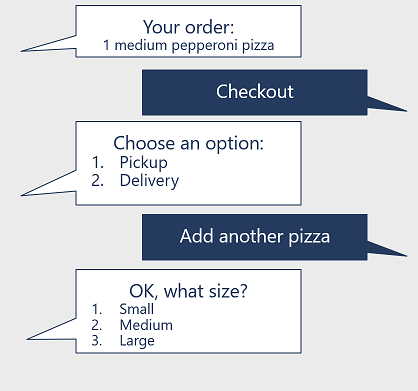

In the previous topic, you learned about the importance of designing a conversation flow based on dialogs. The Bot Framework Composer makes use of dialogs that can handle unexpected input as an interruption to the programmed flow of the conversation.

For example, our pizza ordering customer might be in the *Place Order* dialog, ready to place an order; and then decide to add another pizza, change the selected pizza size or toppings, or cancel the order altogether and start again.

Without the ability to adapt to this kind of interruption to the conversational flow, a bot can become locked in a fixed flow that a user might find frustrating:

A better design is to implement an adaptive dialog that enables you to handle the interruption and redirect the flow of the conversation. The dialog can maintain state so that relevant information that has already been gathered can be retained to pick up where it left off; or in some cases, restart the dialog (or the entire conversation), resetting state as appropriate.

## Managing interruptions with the Bot Framework Composer

When using the Bot Framework Composer, user input is provided through actions in a dialog flow, which can be configured to allow interruptions. An interruption occurs when the recognizer identifies input that fires a trigger, signaling a conversational context change - usually by ending the current dialog flow or starting a child dialog. For example, a trigger might respond to the entry of the term "cancel" by ending the current dialog flow and resetting all dialog-scope variables.

For the pizza ordering bot, the main dialog welcomes the user, and contains a trigger that starts a child dialog to select pizza details. At any point during the select pizza dialog, the user might enter a message indicating that they want to do something else (for example, cancel the order). The recognizer for the select pizza dialog (or its parent dialog) can be used to trigger an appropriate change in the conversational flow, ending the select pizza dialog, resetting the dialog scope properties, and returning to the main dialog.

The ability to handle interruptions is configurable for each user input action, under the **Prompt Configurations** tab of the action.
