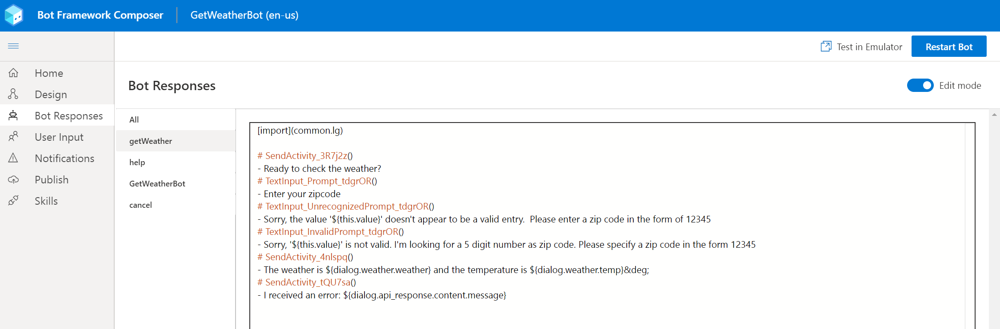

Everything that you have created up to this point, has provided basic bot interaction with input and response handling. It has been fairly scripted in what a user input is and a basic response would be. However, bot interactions will involve users entering phrases, or utterances, that will need to be interpreted so the bot understands what the user's intentions are. That means the bot must understand what the user means conversationally and in the proper context. Without this understanding, the bot may not respond correctly. The challenge that you will face as a bot developer is interpretation.

The Bot Framework Composer integrates with the Bot Framework Language Generation (LG) library. The library is a set of powerful templating and message formatting tools that let you include variation, conditional messages, and dynamic content. LG gives you greater control of how your bot responds to the user. The following exercise will guide you through integration of language generation in your bot.

## Add multiple greetings

Currently, your weather bot has only one phrase to greet users with. To add some variety in the greetings, you can add multiple phrases with different wording in each, and the bot will randomly choose one of the phrases when a new conversation is started.  To implement this, follow the steps outlined next.

1. Ensure that your weather bot is open in the Bot Framework Composer.
1. Select the **GetWeatherBot** item in the navigation pane.
1. Select the **WelcomeUsers** activity in the navigation pane.
1. Select the **Send a response** action in the **Authoring canvas**
1. In the **Properties** pane on the right, modify the contents of the **Language Generation** text area to include the following phrases, or enter multiple phrases of your own choosing, preceding each phrase with a hyphen or dash (-).

- **- Hello. Welcome to the Get Weather Bot. Enter WEATHER to start.**
- **- Hi! I am a weather bot and can retrieve weather conditions for you. Try saying WEATHER.**
- **- Need to know the weather conditions? Say WEATHER and I can help.**

## Manage templates

All of your bot responses can be found in the **Bot Responses** panel by selecting **Bot Responses** from the menu.  You can expand the menu to see the names in the event the icons are not clear enough.

:::image type="content" source="../media/bot-responses.png" alt-text="bot responses menu selected":::

The default view is shown in the previous image.  You can also select the **Edit mode** slider to enter edit mode. You will use **edit mode** in this next exercise to create more responses, using the concept of a template.

1. Ensure that your weather bot is open in the Bot Framework Composer.
1. Select the **Bot Responses** menu.
1. Select the **getWeather** entry in the list of actions.
1. Move the **Edit mode** slider to the right to enable edit mode.  Your Composer interface should resemble the following image.

   [](../media/edit-bot-responses.png#lightbox)

1. To create a template for weather condition responses, copy and paste the following text at the end of the current text in the edit pane.

```dos
# DescribeWeather(weather)
- IF: ${weather.weather=="Clouds"}
    - It is cloudy
- ELSEIF: ${weather.weather=="Thunderstorm"}
    - There's a thunderstorm
- ELSEIF: ${weather.weather=="Drizzle"}
    - It is drizzling
- ELSEIF: ${weather.weather=="Rain"}
    - It is raining
- ELSEIF: ${weather.weather=="Snow"}
    - There's snow
- ELSEIF: ${weather.weather=="Clear"}
    - The sky is clear
- ELSEIF: ${weather.weather=="Mist"}
    - There's a mist in the air
- ELSEIF: ${weather.weather=="Smoke"}
    - There's smoke in the air
- ELSEIF: ${weather.weather=="Haze"}
    - There's a haze
- ELSEIF: ${weather.weather=="Dust"}
    - There's a dust in the air
- ELSEIF: ${weather.weather=="Fog"}
    - It's foggy
- ELSEIF: ${weather.weather=="Ash"}
    - There's ash in the air
- ELSEIF: ${weather.weather=="Squall"}
    - There's a squall
- ELSEIF: ${weather.weather=="Tornado"}
    - There's a tornado happening
- ELSE:
    - ${weather.weather}
```

The template contains an IF/ELSEIF/ELSE structure and is known as a Language Generation Template. When the weather data is returned from the service, the Language Generation system will evaluate the weather.weather variable, match it to one of the clauses in the IF structure, and generate a more user-friendly response that will be displayed to the user. For the template to function, you will need to modify the design of the **getWeather** dialog.

## Modify getWeather dialog

1. Select the **Design** menu in Composer.
1. Select the **getWeather** dialog on the navigation pane.
1. If the **BeginDialog** is not automatically selected, then select it.
1. At the bottom of the designer window is the **true/false** structure that you created in earlier exercises.  Locate that and select the **Send a response** action in the **true** path.  It will start with the text. The weather is...*.
1. Replace the current text in the **Language Generation** text area with this text, **${DescribeWeather(dialog.weather)} and the temp is ${dialog.weather.temp}&deg;**
1. You will see the use of the **DescribeWeather** template that you created with the IF/ELSE structure above. This syntax lets you nest the DescribeWeather template inside another template. LG templates can be combined in this way to create more complex templates.
1. Test your changes by restarting the bot and testing it with the emulator.

>[!Tip]
>For more information on language generation templates, see the [language generation concept web page](https://docs.microsoft.com/composer/concept-language-generation).