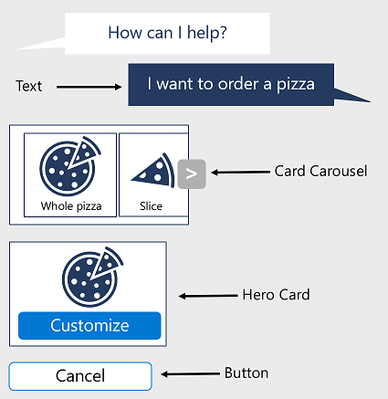

An important consideration for the user experience is how you present the bot and its components to the user. You can implement the following features into a bot:

- Text - a typical interaction that is lightweight and involves presenting text to the user and having the user respond with text input
- Buttons - presenting the user with buttons from which to select options. In a pizza order bot, you might decide to use buttons to represent the pizza sizes available. They are a visual way to represent choices to users and add more visual appeal when compared to text
- Images - using images in the bot interaction adds a graphical appearance to the bot and can enhance the user experience
- Cards - allow you to present your users with various visual, audio, and/or selectable messages and help to assist conversation flow



There are some considerations to be aware of when it comes to adding these features. Different channels will render each of these components differently. If a channel doesn't support the feature, the user experience can be degraded due to poor rendering or functional impairments.

## Text

Text input from users is parsed to determine the intent. The ability to add natural language understanding to a bot is possible. Careful consideration around language understanding is important. One of the main reasons concerns how different users will respond to a question. For example, your bot would ask "What is your name?". Users might respond with their name, such as Terry. The user may also respond with a phrase, "My name is Terry". If you want to personalize the conversation with follow-up prompts including the user's name, your bot logic needs to parse the response and isolate the name from the rest of the text.

Careful planning could reveal a better design option where the bot is specific in the prompt. Your bot could prompt the user with "What is your first name?". It doesn't completely eliminate ambiguity but it leans toward a more appropriate response that may not require extensive parsing logic.

Your bot can integrate different Azure AI services to aid in language understanding, keyword, or phrase detection, and sentiment analysis. These features make your bot more "intelligent" but they also lead to response time delays if too many services are integrated for each response. Essentially, the less processing required on the user input, the less chance for misinterpretation or bot performance.  The following are recommended considerations for text input, from Microsoft.

- Whenever possible, ask specific questions that do not require natural language understanding capabilities to parse the response. It will simplify your bot and increase the success with which your bot understands the user
- Designing a bot to require specific commands from the user can often provide a good user experience while also eliminating the need for natural language understanding capability.
- If you are designing a bot that will answer questions based on structured or unstructured data from databases, web pages, or documents, consider using technologies like QnA Maker that are designed specifically to address this scenario.
- When building natural language models, do not assume that users will provide all the required information in their initial query. Design your bot to specifically request the information it requires, guiding the user to provide that information by asking a series of questions, if necessary.

## Speech

You can design your bot to take advantage of speech input and output. You may decide that your bot application needs to support speech if it will be accessed from devices that do not contain keyboards or monitors. You may also design your bot for users with differing abilities to interact with computing devices.

Using speech will require your bot to interact with the Azure AI Speech to transcribe the spoken word to text, for actions by the bot, and then synthesize the text responses to speech as the output.

## Rich user controls

Buttons, images, carousels, and menus are examples of rich user controls. The advantage to using these types of controls with your bot are;

- Provide a more guided experience with the bot.
- Emulate an application. Users are familiar with using applications on their computers or devices so it makes the bot use more "natural".
- Presents the user with discrete choices resulting in less ambiguity and misinterpretation by the bot's logic.
- Ease of use on mobile devices where typing text is not optimal or less-preferred by users.

## Cards

Cards allow you to present your users with various visual, audio, and/or selectable messages and help to assist conversation flow. Cards are programmable objects containing standardized collections of rich user controls. An advantage of cards is that they are recognized across a wide range of channels. Examples of cards include:

- **Adaptive cards**: An open card exchange format rendered as a JSON object. Typically used for cross-channel deployment of cards. Cards adapt to the look and feel of each host channel.
- **Audio cards**: A card that can play audio files. This card could be helpful in a bot that interacts with users who have visual impairments.
- **Animation cards**: This type of card can play animated GIFs or short video files, for example to depict actions or status indicators.
- **Hero cards**: A card that contains a single large image, one or more buttons, and text. Typically used to visually highlight a potential user selection.
- **Thumbnail cards**: A card that contains a single thumbnail image, one or more buttons, and text. Typically used to visually highlight the buttons for a potential user selection.
- **SignIn card**: A card that enables a bot to request that a user sign-in. It typically contains text and one or more buttons that the user can select to initiate the sign-in process.
- **Video card**: A card that can play videos. Typically used to open a URL and stream an available video.

For examples on how to use cards in your bot, see the [send cards with composer](/composer/how-to-send-cards) documentation page.

## Recommendations for choosing the experience options

The following table highlights some considerations for designing the user experience through choices on the elements your bot uses. The table is not exhaustive but offers some insights around decision making for a good user experience.

|Scenario|User Experience|Rationale|
|---|---|---|
|Pizza Order Bot|Text, Adaptive card, Hero card|Text can be used for initial greeting and some prompting as well as input for special instructions. Using the Adaptive card to customize images and buttons can help constrain the user to legitimate choices. The Adaptive card could be used to present the final order with details and an image of the ordered pizza. Finally, the Receipt card can be used to provide the user with the order receipt for their records.|
|Flight Booking|Text, Thumbnail card, Adaptive card|Text input an allow the user to enter items such as destination city and number of passengers. Use the Thumbnail card to display the departure airport as an image and buttons for a list of acceptable airports for a destination. The Adaptive card control can be used to display the flight details for the user to verify before making the purchase.|
|Sporting Events|Hero card, Adaptive card, Video card|The Hero card can be used to display a list of sporting events for the user's location.  It can display graphics representing team logos or perhaps a seating chart for the user to select from. The Adaptive card can serve as a visual validation of the seats ordered and event details. Users could print the Adaptive card layout as a proof of purchase as well. You could use the Video card to play promotions for upcoming events, or a preview of the event seats were ordered for.|

## Presenting responses with the Bot Framework Composer

All responses that your bot presents to users are listed for the current (or parent) dialog. At the root of the bot, it uses what's called *language generator (lg)* to create the responses. You use  templates to define responses (viewed by clicking `Show code` for the selected dialog within Composer), which can include multiple phrases for a given type of response, or specific graphical responses.

For example, the following language generation code defines multiple possible responses that the bot can send for a greeting:

```
#Greeting
- Hi!
- Hello
- Welcome ${user.name}!
- Welcome to your bot.
```

Observe that the third option includes a placeholder for a property value - in this case the **name** property in the **user** scope.

At runtime, if an action specifies a *Greeting* activity, the bot will send one of the defined responses, chosen at random from the responses available.

You can also define structured responses that consist of explicit text and other user interface elements. For example:

```
[Activity
    text = Hello ${user.name}!)
]
```

Structured responses are especially useful for responses that consist of graphical user interfaces and text. For example, the following response displays a thumbnail card.

```
[ThumbnailCard
    title = Pizza Order Confirmation
    text = Your pizza is on its way!
    image = http://.../pizza.png
]
```

The Bot Framework Composer interface includes a Response Editor that can generate the appropriate language generation code for you, making it easier to create conversational responses. Additional responses for a given message can be added under the **Bot responses** in the right side pane of Composer.
