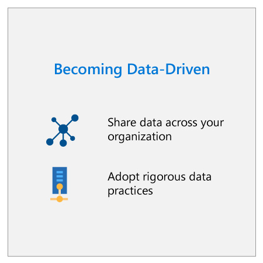
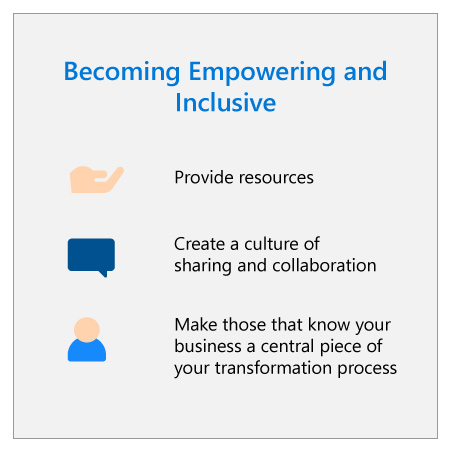

A successful AI strategy must consider cultural issues as well as business issues. Becoming an AI-ready organization requires a fundamental transformation in how you do things, how employees relate to each other, what skills they have, and what processes and principles guide your behaviors. This transformation goes to the core of an organization's culture, and it's vital for organizations to tackle such transformation with a holistic approach. Leaders should back this cultural change for everyone at the organization to embrace and adopt AI. 

Fostering an AI-ready culture requires:

* Being a data-driven organization.
* Empowering people to participate in the AI transformation, and creating an inclusive environment that allows cross-functional, multidisciplinary collaboration.
* Creating a responsible approach to AI that addresses the challenging questions AI presents.

Of course, this is only possible with strong leadership that drives change by both adopting the changes this transformation will require and actively supporting people throughout. Below we share our perspective on the changes you need to make to achieve an AI-ready culture.

## Data-driven

:::row:::
:::column span="2":::

Any good AI system relies on having the best and most complete data and being able to reason over your entire data estate. In other words, it depends on a matter of integrity and access.

### Access

Due to data ownership or storage issues, most organizations generate, organize, and use data in a siloed manner. While each department may have a good view of the data coming from their own processes, they may lack other information that could be relevant to their operations.

For instance, a sales department might not have a complete view of a customer, because they're missing pieces of data, like e-commerce activity and payment status, which are controlled by other departments. In this case, a seller may make the mistake of trying to sell a customer an insurance policy that they already purchased through an online channel.

:::column-end:::
:::column span="2":::

:::column-end:::
:::row-end:::

By sharing data across the organization, the sum becomes greater than the parts. It's no longer each piece of data that matters, but what that data adds up to: a unified view of the customer. With that unified view, you can make better decisions, act more effectively, and provide a better customer experience. Your data estate must be accessible to be useful, whether it's on-premises, in the cloud, or on the edge.

### Integrity

The quality of the data is also key. In this example, if the customer data was riddled with errors, like inaccurate contact information, irrelevant data, or duplication, it wouldn't matter that the data had been unified; the seller could still make significant mistakes in interacting with the customer.

Just as quality of data is key to creating next-level experiences for customers, it's also key to successful AI. An AI model is only as good and complete as the data it can operate on and learn from. So, it's of paramount importance to work in a way that ensures your data is as complete and rigorous as possible.

In summary, becoming data-driven means acquiring a **mindset of data sharing and rigorousness** that drives how you work and relate, and ultimately how you collaborate. This enables you to realize the value of AI and better confront the challenges that AI brings.

## Empowering and inclusive

:::row:::
:::column span="2":::
Fostering an AI-ready culture means **empowering people to be part of the AI transformation**. Organizations should provide the following opportunities to achieve this goal:

* **Enablement:** Space, resources, guidance, security, and support is needed to improve what people do with AI.

* **Time for learning:** Organizations should help people get the knowledge and the skills.

* **Room for experimentation:** During this process, you should encourage new ideas and continuous improvement. This experimentation must allow room for errors, sas well as celebration and acknowledgment of success.

It also means to create an **inclusive environment**, one that is predicated on the willingness and ability of employees to work in cross-functional teams that cut across organizational boundaries.
:::column-end:::
:::column span="2":::

:::column-end:::
:::row-end:::

 Furthermore, it means to make those who best understand the business a central piece of your transformation process. Data scientists working in isolation often create models that lack the business knowledge, purpose, or value that would make them an effective AI resource. Similarly, business people working in isolation lack the technical knowledge to understand what can be done from a data science perspective. A multidisciplinary approach is important.

By enabling cross-functional teams that include both data scientists and the business employees closest to the business need, you can create powerful and effective AI solutions. An example of this is our hugely successful compliance predictive analytics tools, which were inspired and developed by employees working on our finance teams. They were successful only because they were created with the insights of those closest to the business need. This example illustrates how powerful it's to create an inclusive, cross-organizational collaborative approach.

## Responsible

The third key element of an AI-ready culture is fostering a responsible approach to AI. As AI continues to evolve, it has the potential to drive considerable changes to our lives, raising complex and challenging questions about what future we want to see.

Like a Corporate Vice President of Strategic Missions and Technologies at Microsoft says: the question very often is not what AI can do, it's what AI should do. Organizations need to ask themselves: How do we design, build, and use AI systems to create a positive impact on individuals and society? How can we ensure that AI systems treat everyone fairly? How can we best prepare the workforce for the new AI era?

These questions demand for organizations to think about their AI principles and how to ensure them throughout the company. To ensure responsible AI practices, specific planning is required that should include an AI governance model. In this way, you can deliver transparent, explainable, and ethical AI. The module [Embrace responsible AI principles and practices](/training/modules/embrace-responsible-ai-principles-practices) provides a more detailed discussion of the implications of responsible AI for business.

Now that you understand the principles that enable organization to embrace AI, let's assess whether your organization is ready and how it should evolve.
