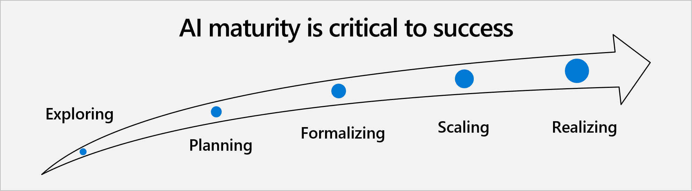

Now that you've learned about the basics of an AI-centric organization, it's important to understand the current maturity of your organization to determine where to start the transformation.

For this purpose, you can leverage a **maturity assessment of AI customer adoption**. This four-tiered assessment is a tool to help organizations take AI to the next level.

1. **Foundational level:** Organizations at this initial stage of AI adoption haven't started their AI journey yet. They're still questioning what AI is and how to apply it. For the time being, they focus on digitization and managing, governing, and organizing their data and digital assets.

2. **Approaching level:** These companies are at an early stage of AI adoption. They're experimenting with new or pretrained models. Their AI projects are limited to embedding and infusing intelligence into one or two applications. They approach AI as a way to improve certain tasks but in a cautious way that doesn't challenge their overall business.

3. **Aspirational level:** At this stage, organizations already think of AI as a fuel or a catalyst for innovation and transformation. AI adoption isn't restricted to a few, isolated business processes; it orients the way they think and plan how they go to market. This commitment impacts the structure of organizations because these companies are building centers of excellence on AI.

4. **Mature level:** Companies have achieved a broad internal adoption of AI. They've fully incorporated AI strategy into their business plans and AI is part of their corporate culture. As a Principal PM Manager at Microsoft says, these companies have already built a culture of experimentation and a learning mindset that's required to truly harness the power of this new technology. Thanks to their data science expertise, they monetize AI. Organizations who have adopted AI also have a manifesto, they have a set of principles and core understanding about what they want to achieve, and the approach that they want to take. The goal of this module is to take your organization to this stage.

## How mature *are* organizations?

Where is your organization on its AI journey? On which stage of the maturity assessment level are your competitors? A Microsoft survey in Europe showed that 30 percent of companies were at the foundational level in 2019. Only 4 percent were fully mature.

However, we've experienced an enormous AI acceleration during the last few years. Great breakthroughs in generative AI and premade models, such as the large language models (LLM) offered by OpenAI or Bing Chat AI, have greatly disrupted the field. This new context has two major implications:

* **Need to be up to date:** Now, even mature companies need to reinvent themselves and adopt new waves of AI to avoid losing their competitive edge. Their AI strategy must reflect and leverage the impact brought by recent technologies.

* **Mainstream AI:** Generative AI has changed the rules of AI adoption by empowering business users at an unprecedented level. It may be easier than ever to implement AI in business. Many companies are working hard to rank higher in the maturity assessment model.

Now that you’ve considered various aspects of what it means to have an AI-ready culture, how to assess your organization’s AI maturity, and prepare for change, let’s wrap up everything you’ve learned with a knowledge check.