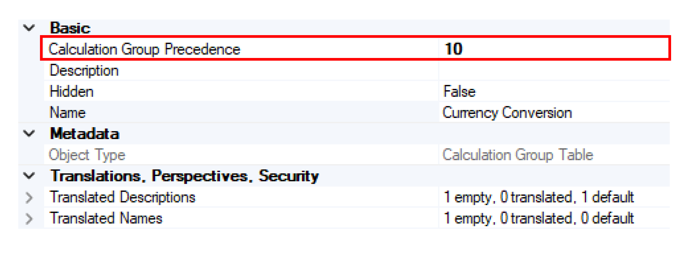
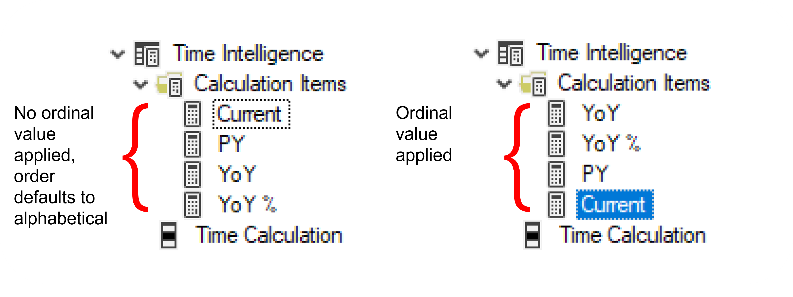
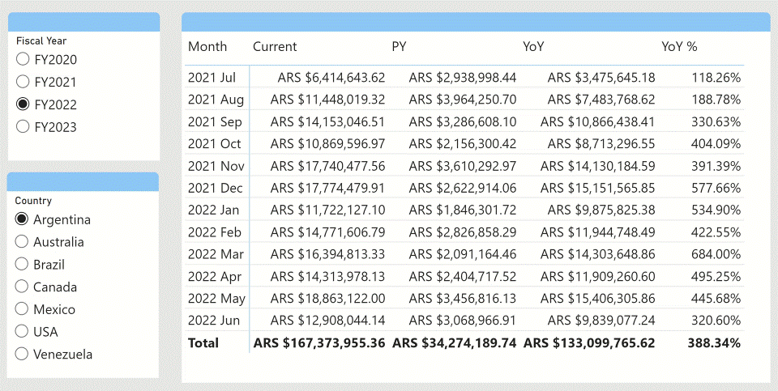

Before creating calculation groups, let's explore their properties. Calculation groups are made up of *calculation items*, which are simply DAX statements containing a substitute or placeholder for existing explicit measures in your model. For example, a calculation group, Time Intelligence, may contain the calculation items Year to Date, Quarter to Date, and Month to Date.

## Calculation group properties
Anyone using calculation groups needs to be aware of the *precedence* property of a calculation group. 

### Precedence

*Precedence* is a property defined for a calculation group. When a data model contains more than one calculation group it's essential to define the *precedence*, or the order of evaluation. 

Defining the precedence ensures that the different calculation groups are executed in the proper order. A higher number indicates greater precedence, meaning it will be applied before calculation groups with lower precedence.

All calculation items within a single calculation group share the same precedence. 

Use [Tabular Editor](https://github.com/TabularEditor/TabularEditor) to set the precedence property for the calculation group.

## Calculation item properties
Calculation items also contain properties that are important to report developers, including ordering and dynamic format strings.

### Ordering

The *ordinal value* is the sort order of the calculation item. The order in which calculation items appear in a report can be changed by specifying the Ordinal property. Specifying calculation item order with the Ordinal property doesn't change precedence, the order in which calculation items are evaluated.    

If the ordinal value isn't specified, the default behavior is that calculation items are ordered alphabetically by name. 

### Dynamic format strings

Calculation groups can also be used to define conditional format strings to a measure.

A simple example of using dynamic format strings may be having a different format for totals compared to other values.

Dynamic format strings are particularly useful for currency conversion. For example, report consumers may want to see sales by country, with the correct currency formatting applied for each. This is accomplished by adding a format string column to the currency dimension table and then creating a currency conversion calculation group and item.

