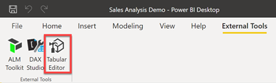
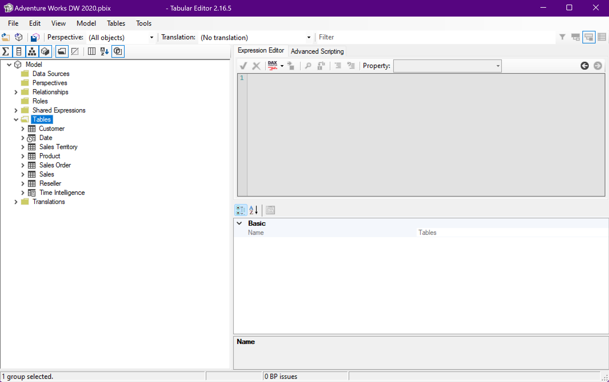
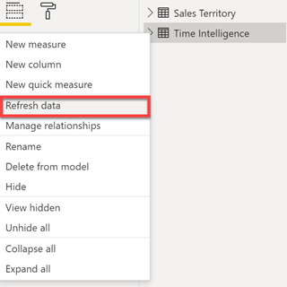
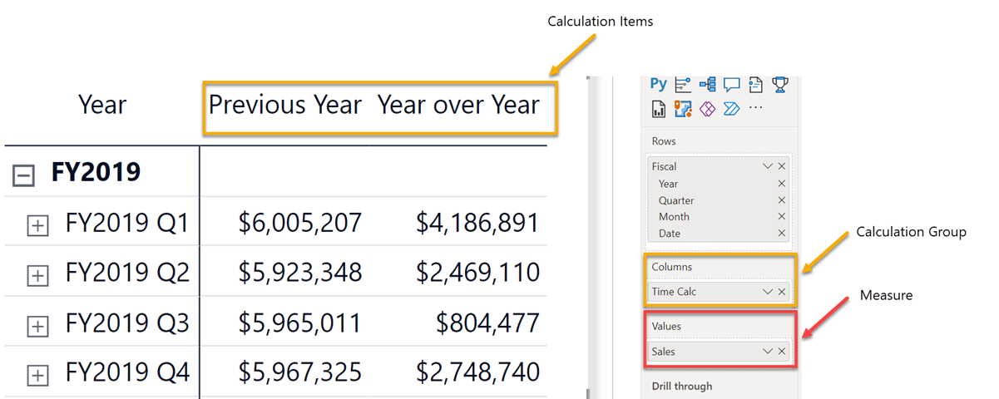

Using calculation groups requires a baseline knowledge of DAX and filter context. This unit describes the application of calculation groups in a Power BI data model using Tabular Editor.

## Install Tabular Editor

Application of calculation groups can't be accomplished in Power BI desktop. Download the open-source [Tabular Editor 2.x](https://github.com/TabularEditor/TabularEditor) tool to apply calculation groups.

With Tabular Editor installed, you can access it from the external tools tab of the ribbon in Power BI.

Launching Tabular Editor from the External Tools tab of the ribbon will open the Tabular Editor interface, with a connection to your Power BI data model.

In the screenshot below, Tabular Editor was launched from the Adventure Works DW 2020 Power BI report.

>[!NOTE]
>Learn more about [external tools in Power BI Desktop](/power-bi/transform-model/desktop-external-tools).

## Create calculation group and items

Use the Tabular Editor interface to create calculation groups and calculation items within those groups.

## Apply a calculation group

Saving the calculation group in Tabular Editor will save changes to the connected data model. To apply those changes, you must refresh the calculation group query in Power BI desktop.

> [!NOTE]
> Calculation groups do not work with implicit measures. Measures to be evaluated by the calculation group must be explicitly defined.

## Use your calculation group in a visual

You can now add your calculation group to a visual. A simple way to visualize your calculation group is to drop the calculation group into the columns field of a matrix visual. This will apply the calculation group to the measure you've placed in the values field.

