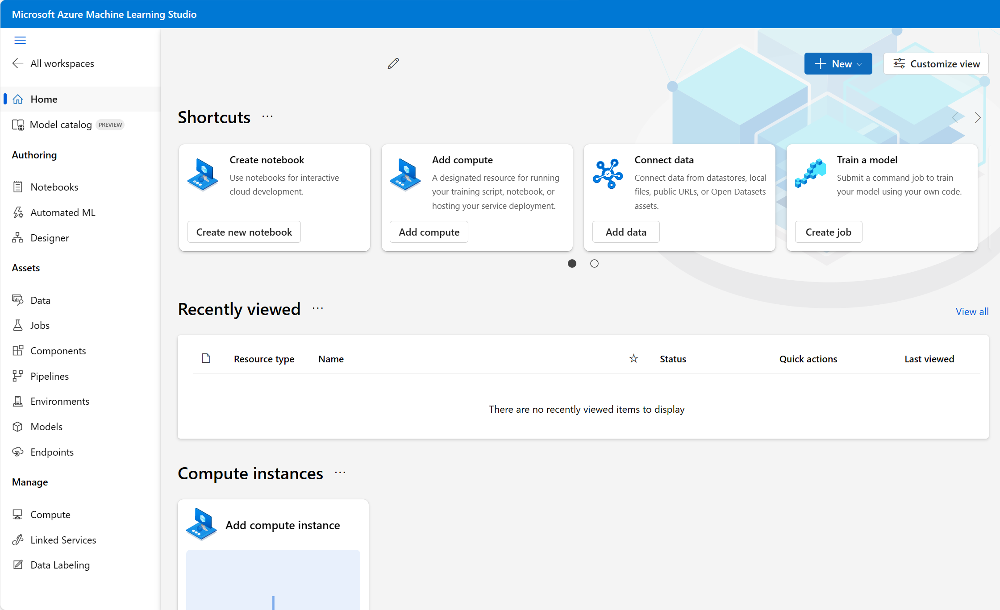

Training and deploying an effective machine learning model involves a lot of work, much of it time-consuming and resource-intensive. Azure Machine Learning is a cloud-based service that helps simplify some of the tasks it takes to prepare data, train a model, and deploy a predictive service. Classification machine learning models can be built using Azure Machine Learning.

Most importantly, Azure Machine Learning helps data scientists increase their efficiency by automating many of the time-consuming tasks associated with training models. It enables them to use cloud-based compute resources that scale effectively to handle large volumes of data while incurring costs only when actually used.

## Azure Machine Learning workspace 

To use Azure Machine Learning, you first create a *workspace* resource in your Azure subscription. You can then use this workspace to manage data, compute resources, code, models, and other artifacts related to your machine learning workloads.

After you have created an Azure Machine Learning workspace, you can develop solutions with the Azure Machine Learning Service either with developer tools or the Azure Machine Learning studio web portal.

## Azure Machine Learning studio 

Azure Machine Learning studio is a web portal for machine learning solutions in Azure. It includes a wide range of features and capabilities that help data scientists prepare data, train models, publish predictive services, and monitor their usage. To begin using the web portal, you need to assign the workspace you created in the Azure portal to Azure Machine Learning studio. 

## Azure Machine Learning compute 

At its core, Azure Machine Learning is a service for training and managing machine learning models, for which you need compute resources on which to run the training process. Compute targets are cloud-based resources on which you can run model training and data exploration processes.

In [Azure Machine Learning studio](https://ml.azure.com?azure-portal=true), you can manage the compute targets for your data science activities. There are four kinds of compute resource you can create:
- **Compute Instances**: Development workstations that data scientists can use to work with data and models.
- **Compute Clusters**: Scalable clusters of virtual machines for on-demand processing of experiment code.
- **Kubernetes Clusters**: Deployment targets for predictive services that use your trained models.  You can access previous versions of "inference clusters" here. 
- **Attached Compute**: Links to existing Azure compute resources, such as Virtual Machines or Azure Databricks clusters.

