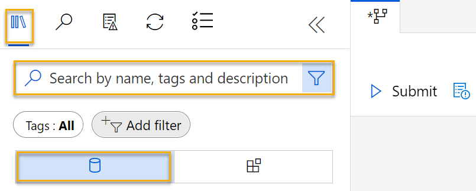
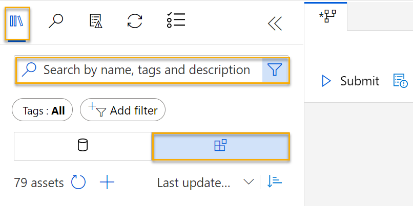
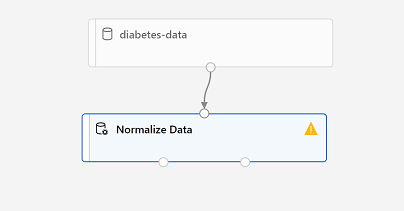

To train a classification model, you need a dataset that includes historical *features* (characteristics of the entity for which you want to make a prediction) and known *label* values (the class indicator that you want to train a model to predict).

## Create a dataset

In Azure Machine Learning, data for model training and other operations is usually encapsulated in an object called a *dataset*.

1. In [Azure Machine Learning studio](https://ml.azure.com?azure-portal=true), expand the left pane by selecting the three lines at the top left of the screen. View the **Data** page (under **Assets**). The Data page contains specific data files or tables that you plan to work with in Azure ML. You can create datasets from this page as well.

2. Create a dataset **from web files**, using the following settings:
    * **Basic Info**:
        * **Web URL**: https://aka.ms/diabetes-data
        * **Name**: diabetes-data
        * **Dataset type**: Tabular
        * **Description**: Diabetes data
        * **Skip data validation**: _Do not select_
    * **Settings and preview**:
        * **File format**: Delimited
        * **Delimiter**: Comma
        * **Encoding**: UTF-8
        * **Column headers**:  Only first file has headers
        * **Skip rows**: None
        * **Dataset contains multi-line data**: _do not select_
    * **Schema**:
        * Include all columns other than **Path**
        * Review the automatically detected types
    * **Confirm details**:
        * Do not profile the dataset after creation
3. After the dataset has been created, open it and view the **Explore** page to see a sample of the data. This data represents details from patients who have been tested for diabetes.

## Create a pipeline

To get started with Azure Machine Learning designer, first you must create a pipeline and add the dataset you want to work with.

1. In [Azure Machine Learning studio](https://ml.azure.com?azure-portal=true), expand the left pane by selecting the three lines at the top left of the screen. View the **Designer** page (under **Author**), and select **+** to create a new pipeline.
2. At the top right-hand side of the screen, select **Settings**. If the **Settings** pane is not visible, select the wheel icon next to the pipeline name at the top. 
3. In **Settings**, you must specify a compute target on which to run the pipeline. Under **Select compute type**, select **Compute cluster**. Then under **Select Azure ML *compute-type***, select the compute cluster you created previously. 
4. In **Settings**, under **Draft Details**, change the draft name (**Pipeline-Created-on-*date***) to **Diabetes Training**. 
5. Select the close icon on the top right of the **Settings** pane to close the pane. 

### Load data to canvas 
1. Next to the pipeline name on the left, select the arrows icon to expand the panel if it is not already expanded. The panel should open by default to the **Asset Library** pane, indicated by the books icon at the top of the panel. Note that there is a search bar to locate assets. Notice two buttons, **Data** and **Components**. 

    

2. Click on **Data**. Search for and place the **diabetes-data** dataset onto the canvas.
3. Right-click (Ctrl+click on a Mac) the **diabetes-data** dataset on the canvas, and click on **Preview data**. 
4. Review the schema of the data in the *Profile* tab, noting that you can see the distributions of the various columns as histograms.
5. Scroll down and select the column heading for the **Diabetic** column, and note that it contains two values **0** and **1**. These values represent the two possible classes for the *label* that your model will predict, with a value of **0** meaning that the patient does not have diabetes, and a value of **1** meaning that the patient is diabetic.
6. Scroll back up and review the other columns, which represent the *features* that will be used to predict the label. Note that most of these columns are numeric, but each feature is on its own scale. For example, **Age** values range from 21 to 77, while **DiabetesPedigree** values range from 0.078 to 2.3016. When training a machine learning model, it is sometimes possible for larger values to dominate the resulting predictive function, reducing the influence of features that on a smaller scale. Typically, data scientists mitigate this possible bias by *normalizing* the numeric columns so they're on the similar scales.
7. Close the **diabetes-data result visualization** window so that you can see the dataset on the canvas like this:

    

## Add transformations

Before you can train a model, you typically need to apply some preprocessing transformations to the data.

1. In the **Asset Library** pane on the left, click on **Components**, which contain a wide range of modules you can use for data transformation and model training. You can also use the search bar to quickly locate modules.

    

2. Find the **Normalize Data** module and place it on the canvas, below the **diabetes-data** dataset. Then connect the output from the bottom of the **diabetes-data** dataset to the input at the top of the **Normalize Data** module, like this:

    

3. Double-click the **Normalize Data** module to view its settings, noting that it requires you to specify the transformation method and the columns to be transformed.
4. Set the transformation to **MinMax** and edit the columns to include the following columns by name, as shown in the image:
    - **Pregnancies**
    - **PlasmaGlucose**
    - **DiastolicBloodPressure**
    - **TricepsThickness**
    - **SerumInsulin**
    - **BMI**
    - **DiabetesPedigree**
    - **Age**

    

The data transformation is normalizing the numeric columns to put them on the same scale, which should help prevent columns with large values from dominating model training. You'd usually apply a whole bunch of pre-processing transformations like this to prepare your data for training, but we'll keep things simple in this exercise.

## Run the pipeline

To apply your data transformations, you need to run the pipeline as an experiment.

1. Select **Submit**, and run the pipeline as a new experiment named **mslearn-diabetes-training** on your compute cluster.
2. Wait for the run to finish - this may take a few minutes.

    

    Notice that the left hand panel is now on the **Submitted Jobs** pane. You will know when the run is complete because the status of the job will change to **Complete**. 

## View the transformed data

1. When the run has completed, the dataset is now prepared for model training. Click on **Job Details**. You will be taken to another window.
2. Right-click (Ctrl+click on a Mac) the **Normalize data** module on the canvas, and click on **Preview data**. Select **Transformed dataset**.
3. View the data, noting that the numeric columns you selected have been normalized to a common scale.
4. Close the normalized data result visualization. Return to the previous window.
