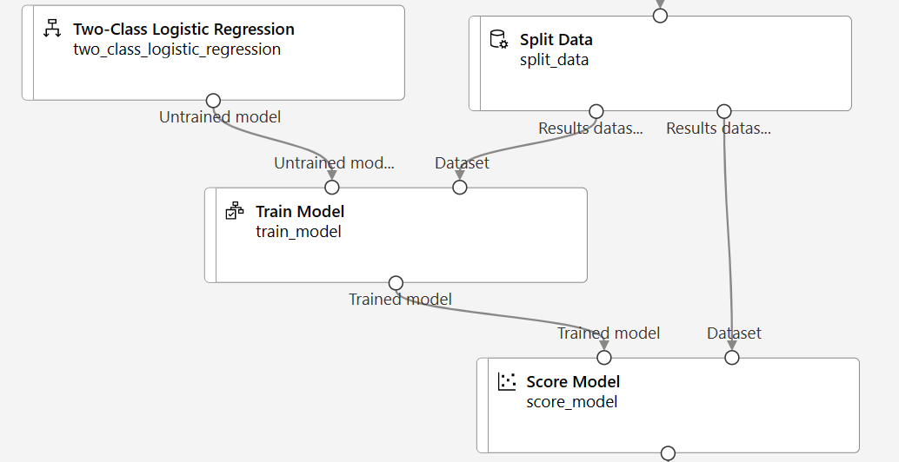
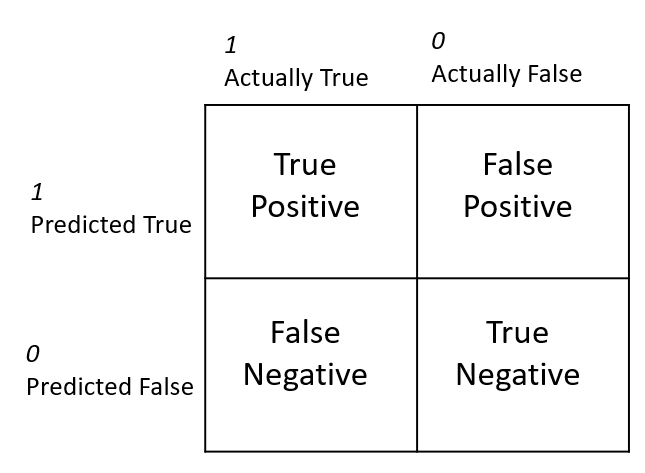
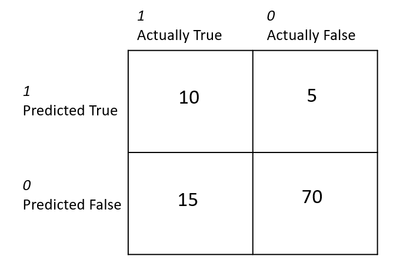
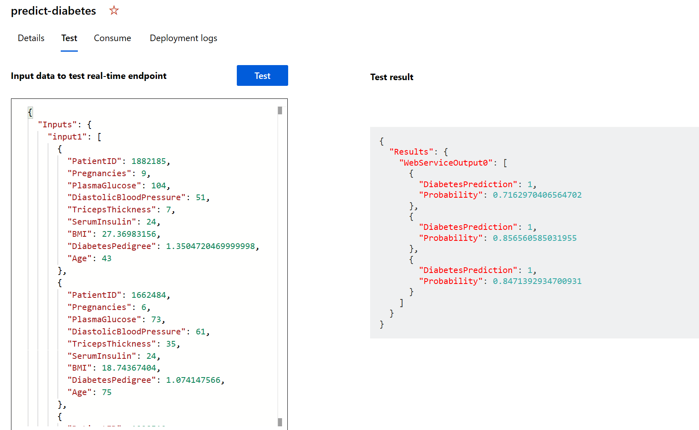

You can think of the steps to train and evaluate a classification machine learning model as: 
1. **Prepare data**: Identify the features and label in a dataset. Pre-process, or clean and transform, the data as needed.   
2. **Train model**: Split the data into two groups, a training and a validation set. Train a machine learning model using the training data set. Test the machine learning model for performance using the validation data set. 
3. **Evaluate performance**: Compare how close the model's predictions are to the known labels.  
4. **Deploy a predictive service**: After you train a machine learning model, you need to convert the training pipeline into a real-time inference pipeline. Then you can deploy the model as an application on a server or device so that others can use it. 

Let's follow these four steps as they appear in Azure Designer. 

## Prepare data 

Azure Machine Learning designer has several pre-built components that can be used to prepare data for training. These components enable you to clean data, normalize features, join tables, and more. 

## Train model 

To train a classification model, you need a dataset that includes historical *features*, characteristics of the entity for which you want to make a prediction, and known *label* values. The label is the class indicator you want to train a model to predict.

It's common practice to train the model using a subset of the data, while holding back some data with which to test the trained model. This enables you to compare the labels that the model predicts with the actual known labels in the original dataset.

You'll use *designer*'s **Score Model** component to generate the predicted class label value. Once you connect all the components, you'll want to run an experiment, which will use the data asset on the canvas to train and score a model.  

## Evaluate performance 

After training a model, it's important to evaluate its performance. There are many performance metrics and methodologies for evaluating how well a model makes predictions. You can review evaluation metrics on the completed job page by right-clicking on the **Evaluate model** component.  

#### Confusion matrix

The confusion matrix is a tool used to assess the quality of a classification model's predictions. It compares predicted labels against actual labels. 

In a binary classification model where you're predicting one of two possible values, the confusion matrix is a 2x2 grid showing the predicted and actual value counts for classes **1** and **0**. It categorizes the model's results into four types of outcomes. Using our diabetes example these outcomes can look like: 
- *True Positive*: The model predicts the patient has diabetes, and the patient does actually have diabetes.
- *False Positive*: The model predicts the patient has diabetes, but the patient doesn't actually have diabetes. 
- *False Negative*: The model predicts the patient doesn't have diabetes, but the patient actually does have diabetes. 
- *True Negative*: The model predicts the patient doesn't have diabetes, and the patient actually doesn't have diabetes.  

Suppose you have data for 100 patients. You create a model that predicts a patient does have diabetes 15% of the time, so it *predicts* 15 people have diabetes and *predicts* 85 people do not have diabetes. In actuality, suppose 25 people *actually* do have diabetes and 75 people *actually* do not have diabetes. This information can be presented in a confusion matrix such as the one below: 

For a multi-class classification model (where there are more than two possible classes), the same approach is used to tabulate each possible combination of actual and predicted value counts - so a model with three possible classes would result in a 3x3 matrix with a diagonal line of cells where the predicted and actual labels match.

Metrics that can be derived from the confusion matrix include:
- **Accuracy**: The number of correct predictions (true positives + true negatives) divided by the total number of predictions. 
- **Precision**: The number of the cases classified as positive that are actually positive: the number of true positives divided by (the number of true positives plus false positives). 
- **Recall**: The fraction of positive cases correctly identified: the number of true positives divided by (the number of true positives plus false negatives).
- **F1 Score**: An overall metric that essentially combines precision and recall.

Of these metrics, *accuracy* may be the most intuitive. However, you need to be careful about using accuracy as a measurement of how well a model performs. Using the model that predicts 15% of patients have diabetes, when actually 25% of patients have diabetes, we can calculate the following metrics:

The *accuracy* of the model is: (10+70)/ 100 = 80%. 

The *precision* of the model is: 10/(10+5) = 67%. 

The *recall* of the model is 10/(10+15) = 40%

#### Choosing a threshold 
A classification model predicts the probability for each possible class. In other words, the model calculates a likelihood for each predicted label. In the case of a binary classification model, the predicted probability is a value between 0 and 1. By default, a predicted probability _including or above_ 0.5 results in a class prediction of 1, while a prediction _below_ this threshold means that there's a greater probability of a *negative* prediction (remember that the probabilities for all classes add up to 1), so the predicted class would be 0. 

Designer has a useful *threshold slider* for reviewing how the model performance would change depending on the set threshold.
 

#### ROC curve and AUC metric 

Another term for *recall* is **True positive rate**, and it has a corresponding metric named **False positive rate**, which measures the number of negative cases incorrectly identified as positive compared between the number of actual negative cases. Plotting these metrics against each other for every possible threshold value between 0 and 1 results in a curve, known as the **ROC curve** (ROC stands for *receiver operating characteristic*, but most data scientists just call it a ROC curve). In an ideal model, the curve would go all the way up the left side and across the top, so that it covers the full area of the chart. The larger the *area under the curve*, of **AUC** metric, (which can be any value from 0 to 1), the better the model is performing. You can review the ROC curve in **Evaluation Results**. 

## Deploy a predictive service  
You have the ability to deploy a service that can be used in real-time. In order to automate your model into a service that makes continuous predictions, you need to create and deploy an inference pipeline.  

#### Inference pipeline 
To deploy your pipeline, you must first convert the training pipeline into a real-time inference pipeline. This process removes training components and adds web service inputs and outputs to handle requests.

The inference pipeline performs the same data transformations as the first pipeline for *new* data. Then it uses the trained model to *infer*, or predict, label values based on its features. This model will form the basis for a predictive service that you can publish for applications to use.

You can create an inference pipeline by selecting the menu above a completed job. 

#### Deployment 
After creating the inference pipeline, you can deploy it as an endpoint. In the endpoints page, you can view deployment details, test your pipeline service with sample data, and find credentials to connect your pipeline service to a client application. 

It will take a while for your endpoint to be deployed. The Deployment state on the **Details** tab will indicate *Healthy* when deployment is successful. 

On the **Test** tab, you can test your deployed service with sample data in a JSON format. The test tab is a tool you can use to quickly check to see if your model is behaving as expected. Typically it is helpful to test the service before connecting it to an application.
 

You can find credentials for your service on the **Consume** tab. These credentials are used to connect your trained machine learning model as a service to a client application.

