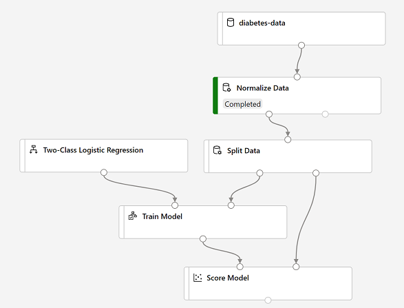

After you've used data transformations to prepare the data, you can use it to train a machine learning model.

## Add training modules

It's common practice to train the model using a subset of the data, while holding back some data with which to test the trained model. This enables you to compare the labels that the model predicts with the actual known labels in the original dataset.

In this exercise, you're going to extend the **Diabetes Training** pipeline as shown here:

> [!div class="centered"]
> 

Follow the steps below, using the image above for reference as you add and configure the required modules.

1. Open the **Diabetes Training** pipeline you created in the previous unit if it's not already open.
2. In the pane on the left, in the **Data Transformations** section, drag a **Split Data** module onto the canvas under the **Normalize Data** module. Then connect the *Transformed Dataset* (left) output of the **Normalize Data** module to the input of the **Split Data** module.
3. Select the **Split Data** module, and configure its settings as follows:
    * **Splitting mode** Split Rows
    * **Fraction of rows in the first output dataset**: 0.7
    * **Random seed**: 123
    * **Stratified split**: False
4. Expand the **Model Training** section in the pane on the left, and drag a **Train Model** module to the canvas, under the **Split Data** module. Then connect the *Result dataset1* (left) output of the **Split Data** module to the *Dataset* (right) input of the **Train Model** module.
5. The model we're training will predict the **Diabetic** value, so select the **Train Model** module and modify its settings to set the **Label column** to  **Diabetic** (matching the case and spelling exactly!)
6. The **Diabetic** label the model will predict is a class (0 or 1), so we need to train the model using a *classification* algorithm. Specifically, there are two possible classes, so we need a *binary classification* algorithm. Expand the **Machine Learning Algorithms** section, and under **Classification**, drag a **Two-Class Logistic Regression** module to the canvas, to the left of the **Split Data** module and above the **Train Model** module. Then connect its output to the **Untrained model** (left) input of the **Train Model** module.

> [!NOTE]
> There are multiple algorithms you can use to train a classification model. For help choosing one, take a look at the [Machine Learning Algorithm Cheat Sheet for Azure Machine Learning designer](https://aka.ms/mlcheatsheet?azure-portal=true).

7. To test the trained model, we need to use it to *score* the validation dataset we held back when we split the original data - in other words, predict labels for the features in the validation dataset. Expand the **Model Scoring & Evaluation** section and drag a **Score Model** module to the canvas, below the **Train Model** module. Then connect the output of the **Train Model** module to the **Trained model** (left) input of the **Score Model** module; and connect the **Results dataset2** (right) output of the **Split Data** module to the **Dataset** (right) input of the **Score Model** module.
8. Ensure your pipeline looks like this:

 > [!div class="centered"]
 > 

## Run the training pipeline

Now you're ready to run the training pipeline and train the model.

1. Select **Submit**, and run the pipeline using the existing experiment named **mslearn-diabetes-training**.
2. Wait for the experiment run to finish. This may take 5 minutes or more.
3. When the experiment run has finished, select the **Score Model** module and in the settings pane, on the **Outputs + Logs** tab, under **Data outputs** in the **Scored dataset** section, use the **Visualize** icon to view the results.
4. Scroll to the right, and note that next to the **Diabetic** column (which contains the known true values of the label) there is a new column named **Scored Labels**, which contains the predicted label values, and a **Scored Probabilities** columns containing a probability value between 0 and 1. This indicates the probability of a *positive* prediction, so probabilities greater than 0.5 result in a predicted label of ***1*** (diabetic), while probabilities between 0 and 0.5 result in a predicted label of ***0*** (not diabetic).
5. Close the **Score Model result visualization** window.

The model is predicting values for the **Diabetic** label, but how reliable are its predictions? To assess that, you need to evaluate the model.
