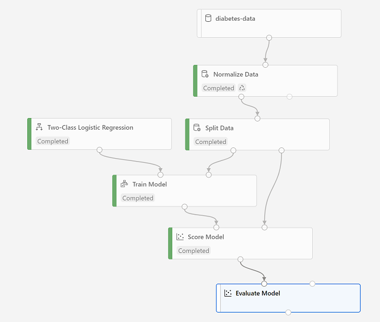

The validation data you held back and used to score the model includes the known values for the label. So to validate the model, you can compare the true values for the label to the label values that were predicted when you scored the validation dataset. Based on this comparison, you can calculate various metrics that describe how well the model performs.

## Add an Evaluate Model module

1. Open the **Diabetes Training** pipeline you created in the previous unit if it's not already open.
2. In the pane on the left, in the **Model Scoring & Evaluation** section, drag an **Evaluate Model** module to the canvas, under the **Score Model** module, and connect the output of the **Score Model** module to the **Scored dataset** (left) input of the **Evaluate Model** module.
3. Ensure your pipeline looks like this:

> [!div class="centered"]
> 

4. Select **Submit**, and run the pipeline using the existing experiment named **mslearn-diabetes-training**.
5. Wait for the experiment run to finish.
6. When the experiment run has finished, select the **Evaluate Model** module and in the settings pane, on the **Outputs + Logs** tab, under **Data outputs** in the **Evaluation results** section, use the **Visualize** icon to view the performance metrics. These metrics can help data scientists assess how well the model predicts based on the validation data.
7. View the *confusion matrix* for the model, which is a tabulation of the predicted and actual value counts for each possible class. For a binary classification model like this one, where you're predicting one of two possible values, the confusion matrix is a 2x2 grid showing the predicted and actual value counts for classes **0** and **1**, similar to this:

> [!div class="centered"]
> 

The confusion matrix shows cases where both the predicted and actual values were 1 (known as *true positives*) at the top left, and cases where both the predicted and the actual values were 0 (*true negatives*) at the bottom right. The other cells show cases where the predicted and actual values differ (*false positives* and *false negatives*). The cells in the matrix are colored so that the more cases represented in the cell, the more intense the color - with the result that you can identify a model that predicts accurately for all classes by looking for a diagonal line of intensely colored cells from the top left to the bottom right (in other words, the cells where the predicted values match the actual values). For a multi-class classification model (where there are more than two possible classes), the same approach is used to tabulate each possible combination of actual and predicted value counts - so a model with three possible classes would result in a 3x3 matrix with a diagonal line of cells where the predicted and actual labels match.

8. Review the metrics to the left of the confusion matrix, which include:
    - **Accuracy**: The ratio of correct predictions (true positives + true negatives) to the total number of predictions. In other words, what proportion of diabetes predictions did the model get right?
    - **Precision**: The fraction of positive cases correctly identified (the number of true positives divided by the number of true positives plus false positives). In other words, out of all the patients that the model predicted as having diabetes, how many are actually diabetic?
    - **Recall**: The fraction of the cases classified as positive that are actually positive (the number of true positives divided by the number of true positives plus false negatives). In other words, out of all the patients who actually have diabetes, how many did the model identify?
    - **F1 Score**: An overall metric that essentially combines precision and recall.
    - *We'll return to **AUC** later*.

    Of these metric, *accuracy* is the most intuitive. However, you need to be careful about using simple accuracy as a measurement of how well a model works. Suppose that only 3% of the population is diabetic. You could create a model that always predicts **0** and it would be 97% accurate - just not very useful! For this reason, most data scientists use other metrics like precision and recall to assess classification model performance.

9. Above the list of metrics, note that there's a **Threshold** slider. Remember that what a classification model predicts is the probability for each possible class. In the case of this binary classification model, the predicted probability for a *positive* (that is, diabetic) prediction is a value between 0 and 1. By default, a predicted probability for diabetes above 0.5 results in a class prediction of 1, while a prediction below this threshold means that there's a greater probability of the patient **not** having diabetes (remember that the probabilities for all classes add up to 1), so the predicted class would be 0. Try moving the threshold slider and observe the effect on the confusion matrix. If you move it all the way to the left (0), the Recall metric becomes 1, and if you move it all the way to the right (1), the Recall metric becomes 0.

10. Look above the Threshold slider at the **ROC curve** (ROC stands for *received operator characteristic*, but most data scientists just call it a ROC curve). Another term for *recall* is **True positive rate**, and it has a corresponding metric named **False positive rate**, which measures the number of negative cases incorrectly identified as positive compared the number of actual negative cases. Plotting these metrics against each other for every possible threshold value between 0 and 1 results in a curve. In an ideal model, the curve would go all the way up the left side and across the top, so that it covers the full area of the chart. The larger the *area under the curve* (which can be any value from 0 to 1), the better the model is performing - this is the **AUC** metric listed with the other metrics below. To get an idea of how this area represents the performance of the model, imagine a straight diagonal line from the bottom left to the top right of the ROC chart. This represents the expected performance if you just guessed or flipped a coin for each patient - you could expect to get around half of them right, and half of them wrong, so the area under the diagonal line represents an AUC of 0.5. If the AUC for your model is higher than this for a binary classification model, then the model performs better than a random guess.
11. Close the **Evaluate Model result visualization** window.

The performance of this model isn't all that great, partly because we performed only minimal feature engineering and pre-processing. You could try a different classification algorithm, such as **Two-Class Decision Forest**, and compare the results. You can connect the outputs of the **Split Data** module to multiple **Train Model** and **Score Model** modules, and you can connect a second **Score Model** module to the **Evaluate Model** module to see a side-by-side comparison. The point of the exercise is simply to introduce you to classification and the Azure Machine Learning designer interface, not to train a perfect model!
