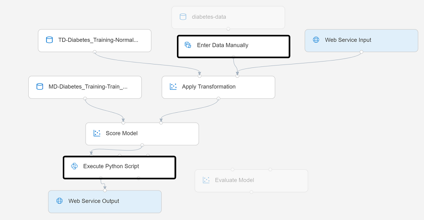
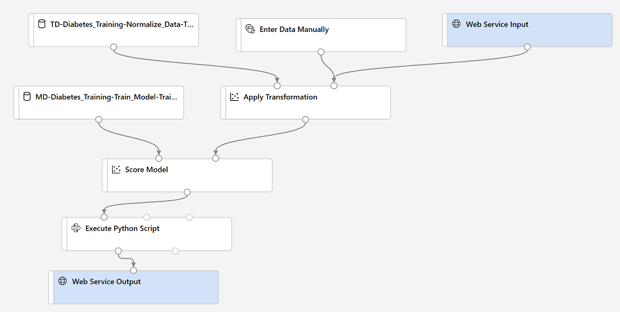

After creating and running a pipeline to train the model, you need a second pipeline that performs the same data transformations for new data, and then uses the trained model to *inference* (in other words, predict) label values based on its features. This pipeline will form the basis for a predictive service that you can publish for applications to use.

## Create an inference pipeline

1. In Azure Machine Learning Studio, click the **Designer** page to view all of the pipelines you have created. Then open the **Diabetes Training** pipeline you created previously.
2. In the **Create inference pipeline** drop-down list, click **Real-time inference pipeline**. After a few seconds, a new version of your pipeline named **Diabetes Training-real time inference** will be opened.

   *If the pipeline does not include **Web Service Input** and **Web Service Output** modules, go back to the **Designer** page and then re-open the **Diabetes Training-real time inference** pipeline.*

3. Rename the new pipeline to **Predict Diabetes**, and then review the new pipeline. It contains a web service input for new data to be submitted, and a web service output to return results. Some of the transformations and training steps have been encapsulated in this pipeline so that the statistics from your training data will be used to normalize any new data values, and the trained model will be used to score the new data.

    You are going to make the following changes to the inference pipeline:

> [!div class="centered"]
> 

- Replace the **diabetes-data** dataset with an **Enter Data Manually** module that does not include the label column (**Diabetic**).
- Remove the **Evaluate Model** module.
- Insert an **Execute Python Script** module before the web service output to return only the patient ID, predicted label value, and probability.

    Follow the remaining steps below, using the image and information above for reference as you modify the pipeline.

4. The inference pipeline assumes that new data will match the schema of the original training data, so the **diabetes-data** dataset from the training pipeline is included. However, this input data includes the **Diabetic** label that the model predicts, which is unintuitive to include in new patient data for which a diabetes prediction has not yet been made. Delete this module and replace it with an **Enter Data Manually** module from the **Data Input and Output** section, containing the following CSV data, which includes feature values without labels for three new patient observations:

    ```CSV
    PatientID,Pregnancies,PlasmaGlucose,DiastolicBloodPressure,TricepsThickness,SerumInsulin,BMI,DiabetesPedigree,Age
    1882185,9,104,51,7,24,27.36983156,1.350472047,43
    1662484,6,73,61,35,24,18.74367404,1.074147566,75
    1228510,4,115,50,29,243,34.69215364,0.741159926,59
    ```

5. Connect the new **Enter Data Manually** module to the same **Dataset** input of the **Apply Transformation** module as the **Web Service Input**.
6. The inference pipeline includes the **Evaluate Model** module, which is not useful when predicting from new data, so delete this module.
7. The output from the **Score Model** module includes all of the input features as well as the predicted label and probability score. To limit the output to only the prediction and probability:
    - Delete the connection between the **Score Model** module and the **Web Service Output**.
    - Add an **Execute Python Script** module from the **Python Language** section, replacing all of the default python script with the following code (which selects only the **PatientID**, **Scored Labels** and **Scored Probabilities** columns and renames them appropriately):

        ```Python
        import pandas as pd

        def azureml_main(dataframe1 = None, dataframe2 = None):

            scored_results = dataframe1[['PatientID', 'Scored Labels', 'Scored Probabilities']]
            scored_results.rename(columns={'Scored Labels':'DiabetesPrediction',
                                        'Scored Probabilities':'Probability'},
                                inplace=True)
            return scored_results
        ```

    - Connect the output from the **Score Model** module to the **Dataset1** (left-most) input of the **Execute Python Script**, and connect the output of the **Execute Python Script** module to the **Web Service Output**.
8. Verify that your pipeline looks similar to the following:

> [!div class="centered"]
> 

9. Run the pipeline as a new experiment named **mslearn-diabetes-inference** on your compute cluster. This may take a while!
10. When the pipeline has finished, select the **Execute Python Script** module, and in the settings pane, on the **Output + Logs** tab, visualize the **Result dataset** to see the predicted labels and probabilities for the three patient observations in the input data.

Your inference pipeline predicts whether or not patients are at risk for diabetes based on their features. Now you're ready to publish the pipeline so that client applications can use it.
