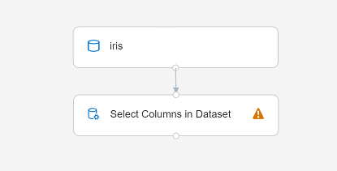
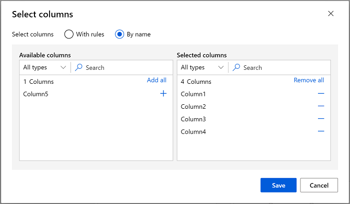
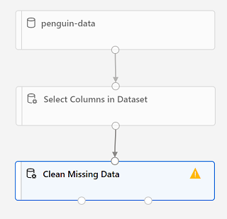
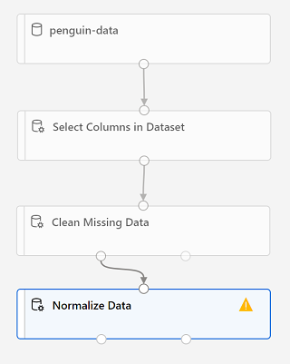

To train a clustering model, you need a dataset that includes multiple observations of the items you want to cluster, including numeric features that can be used to determine similarities between individual cases that will help separate them into clusters.

## Create a dataset

In Azure Machine Learning, data for model training and other operations is usually encapsulated in an object called a *dataset*. In this module, you'll use a dataset that includes observations of three species of penguin.

1. In [Azure Machine Learning studio](https://ml.azure.com?azure-portal=true), view the **Datasets** page. Datasets represent specific data files or tables that you plan to work with in Azure ML.
2. Create a dataset from web files, using the following settings:
    * **Basic Info**:
        * **Web URL**: https://aka.ms/penguin-data
        * **Name**: penguin-data
        * **Dataset type**: Tabular
        * **Description**: Penguin data
    * **Settings and preview**:
        * **File format**: Delimited
        * **Delimiter**: Comma
        * **Encoding**: UTF-8
        * **Column headers**: Use headers from the first file
        * **Skip rows**: None
    * **Schema**:
        * Include all columns other than **Path**
        * Review the automatically detected types
    * **Confirm details**:
        * Do not profile the dataset after creation
3. After the dataset has been created, open it and view the **Explore** page to see a sample of the data. This data represents measurements of the culmen (bill) length and depth, flipper length, and body mass for multiple observations of penguins. There are three species of penguin represented in the dataset: *Amelie*, *Gentoo*, and *Chinstrap*.

> [!NOTE]
> The penguins dataset used in the this exercise is a subset of data collected and made available by [Dr. Kristen
Gorman](https://www.uaf.edu/cfos/people/faculty/detail/kristen-gorman.php)
and the [Palmer Station, Antarctica LTER](https://pal.lternet.edu/), a
member of the [Long Term Ecological Research
Network](https://lternet.edu/).

## Create a pipeline

To get started with Azure machine Learning designer, first you must create a pipeline and add the dataset you want to work with.

1. In [Azure Machine Learning studio](https://ml.azure.com?azure-portal=true) for your workspace, view the **Designer** page and create a new pipeline.
2. In the **Settings** pane, change the default pipeline name (**Pipeline-Created-on-*date***) to **Train Penguin Clustering** (if the **Settings** pane is not visible, click the **&#9881;** icon next to the pipeline name at the top).
3. Note that you need to specify a compute target on which to run the pipeline. In the **Settings** pane, click **Select compute target** and select the compute cluster you created previously.
4. In the pane on the left side of the designer, expand the **Datasets** section, and drag the **penguin-data** dataset you created in the previous exercise onto the canvas.
5. Right-click (Ctrl+click on a Mac) the **penguin-data** dataset on the canvas, and on the **Visualize** menu, select **Dataset output**.
6. Review the schema of the data, noting that you can see the distributions of the various columns as histograms. Then select the **CulmenLength** column. The dataset should look similar to this:

> [!div class="centered"]
> 

7. Note the following characteristics of the dataset:

    - The dataset includes the following columns:
        - **CulmenLength**: Length of the penguin's bill in millimeters.
        - **CulmenDepth**: Depth of the penguin's bill in millimeters.
        - **FlipperLength**: Length of the penguin's flipper in millimeters.
        - **BodyMass**: Weight of the penguin in grams.
        - **Species**: Species indicator (0:"Amelie", 1:"Gentoo", 2:"Chinstrap")
    - There are two missing values in the **CulmenLength** column (the **CulmenDepth**, **FlipperLength**, and **BodyMass** columns also have two missing values).
    - The measurement values are in different scales (from tens of millimeters to thousands of grams).

8. Close the dataset visualization so you can see the dataset on the pipeline canvas.

## Apply transformations

To cluster the penguin observations, we're going to use only the measurements; so we'll discard the species column. We also need to remove rows where values are missing, and normalize the numeric measurement values so they're on a similar scale.

1. In the pane on the left, expand the **Data Transformation** section, which contains a wide range of modules you can use to transform data before model training.
2. To cluster the penguin observations, we're going to use only the measurements - we'll ignore the species column. So, drag a **Select Columns in Dataset** module to the canvas, below the **penguin-data** module and connect the output at the bottom of the **penguin-data** module to the input at the top of the **Select Columns in Dataset** module, like this:

> [!div class="centered"]
> 

3. Select the **Select Columns in Dataset** module, and in its **Settings** pane on the right, select **Edit column**. Then in the **Select columns** window, select **By name** and use the **+** links to select the column names **CulmenLength**, **CulmenDepth**, **FlipperLength**, and **BodyMass**; like this:

> [!div class="centered"]
> 

4. Save the **Select Columns in a Dataset** module settings to return to the designer canvas.
5. Drag a **Clean Missing Data** module to the canvas, below the **Select columns in a dataset** module and connect them like this:

> [!div class="centered"]
> 

6. Select the **Clean Missing Data** module, and in the settings pane on the right, click **Edit column**. Then in the **Select columns** window, select **With rules** and include **All columns**; like this:

> [!div class="centered"]
> 

7. With the **Clean Missing Data** module still selected, in the settings pane, set the following configuration settings:
    - **Minimum missing value ratio**: 0.0
    - **Maximum missing value ratio**: 1.0
    - **Cleaning mode**: Remove entire row

8. Drag a **Normalize Data** module to the canvas, below the **Clean Missing Data** module. Then connect the left-most output from the **Clean Missing Data** module to the input of the **Normalize Data** module.

> [!div class="centered"]
> 

9. Select the **Normalize Data** module, and in its **Settings** pane on the right, set the **Transformation method** to **MinMax** and select **Edit column**. Then in the **Select columns** window, select **With rules** and include **All columns**; like this:

> [!div class="centered"]
> 

10. Save the **Normalize Data** module settings to return to the designer canvas.

## Run the pipeline

To apply your data transformations, you need to run the pipeline as an experiment.

1. Ensure your pipeline looks similar to this:

> [!div class="centered"]
> 

2. Select **Submit**, and run the pipeline as a new experiment named **mslearn-penguin-training** on your compute cluster.
3. Wait for the run to finish. This may take 5 minutes or more. When the run has completed, the modules should look like this:

> [!div class="centered"]
> 

## View the transformed data

The dataset is now prepared for model training.

1. Select the completed **Normalize Data** module, and in its **Settings** pane on the right, on the **Outputs + logs** tab, select the **Visualize** icon for the **Transformed dataset**.
2. View the data, noting that the **Species** column has been removed, there are no missing values, and the values for all four features have been normalized to a common scale.
3. Close the normalized data result visualization.

Now that you have selected and prepared the features you want to use from the dataset, you're ready to use them to train a clustering model.
