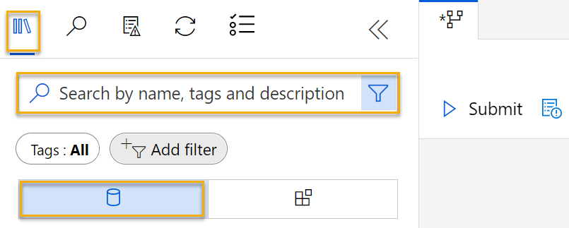
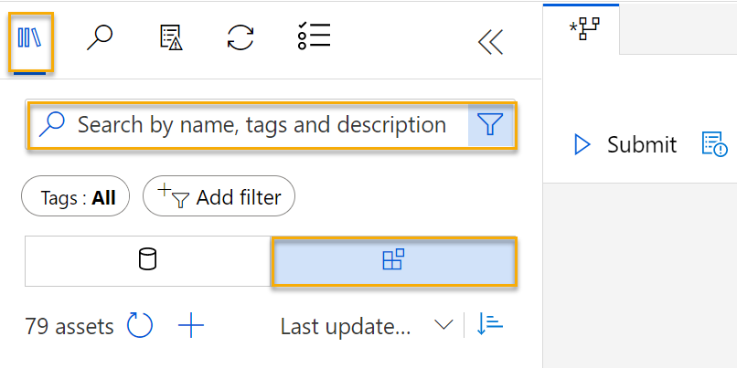

To train a clustering model, you need a dataset that includes multiple observations of the items you want to cluster, including numeric features that can be used to determine similarities between individual cases that will help separate them into clusters.

## Create a dataset

In Azure Machine Learning, data for model training and other operations is usually encapsulated in an object called a *dataset*. In this module, you'll use a dataset that includes observations of three species of penguin.

1. In [Azure Machine Learning studio](https://ml.azure.com?azure-portal=true), expand the left pane by selecting the three lines at the top left of the screen. View the **Data** page (under **Assets**). The Data page contains specific data files or tables that you plan to work with in Azure ML. You can create datasets from this page as well.
2. Create a dataset from web files, using the following settings:
    * **Basic Info**:
        * **Web URL**: https://aka.ms/penguin-data
        * **Name**: penguin-data
        * **Dataset type**: Tabular
        * **Description**: Penguin data
        * **Skip data validation**: _do not select_
    * **Settings and preview**:
        * **File format**: Delimited
        * **Delimiter**: Comma
        * **Encoding**: UTF-8
        * **Column headers**:  Only first file has headers
        * **Skip rows**: None
        * **Dataset contains multi-line data**: _do not select_
    * **Schema**:
        * Include all columns other than **Path**
        * Review the automatically detected types
    * **Confirm details**:
        * Do not profile the dataset after creation
3. After the dataset has been created, open it and view the **Explore** page to see a sample of the data. This data represents measurements of the culmen (bill) length and depth, flipper length, and body mass for multiple observations of penguins. There are three species of penguin represented in the dataset: *Adelie*, *Gentoo*, and *Chinstrap*.

> [!NOTE]
> The penguins dataset used in the this exercise is a subset of data collected and made available by [Dr. Kristen
Gorman](https://www.uaf.edu/cfos/people/faculty/detail/kristen-gorman.php)
and the [Palmer Station, Antarctica LTER](https://pal.lternet.edu/), a
member of the [Long Term Ecological Research
Network](https://lternet.edu/).

## Create a pipeline

To get started with Azure machine learning designer, first you must create a pipeline and add the dataset you want to work with.

1. In [Azure Machine Learning studio](https://ml.azure.com?azure-portal=true), expand the left pane by selecting the three lines icon at the top left of the screen. View the **Designer** page (under **Author**), and select the plus sign to create a new pipeline.
2. At the top right-hand side of the screen, select **Settings**. If the **Settings** pane is not visible, select the wheel icon next to the pipeline name at the top. 
3. In **Settings**, you must specify a compute target on which to run the pipeline. Under **Select compute type**, select **Compute cluster**. Then under **Select Azure ML *compute-type***, select the compute cluster you created previously. 
4. In **Settings**, under **Draft Details**, change the draft name (**Pipeline-Created-on-*date***) to **Train Penguin Clustering**
5. Select the *close icon* on the top right of the **Settings** pane to close the pane. 

    

### Load data to canvas 
1. Next to the pipeline name on the left, select the arrows icon to expand the panel if it is not already expanded. The panel should open by default to the **Asset Library** pane, indicated by the books icon at the top of the panel. Note that there is a search bar to locate assets. Notice two buttons, **Data** and **Components**. 

    

2. Click on **Data**. Search for and place the  **penguin-data** dataset onto the canvas.
3. Right-click (Ctrl+click on a Mac) the **penguin-data** dataset on the canvas, and click on **Preview data**. 
4. Review the *Profile* schema of the data, noting that you can see the distributions of the various columns as histograms. Then select the **CulmenLength** column. The dataset should look similar to this:

    

5. Note the following characteristics of the dataset:

    - The dataset includes the following columns:
        - **CulmenLength**: Length of the penguin's bill in millimeters.
        - **CulmenDepth**: Depth of the penguin's bill in millimeters.
        - **FlipperLength**: Length of the penguin's flipper in millimeters.
        - **BodyMass**: Weight of the penguin in grams.
        - **Species**: Species indicator (0:"Adelie", 1:"Gentoo", 2:"Chinstrap")
    - There are two missing values in the **CulmenLength** column (the **CulmenDepth**, **FlipperLength**, and **BodyMass** columns also have two missing values).
    - The measurement values are in different scales (from tens of millimeters to thousands of grams).

6. Close the dataset visualization so you can see the dataset on the pipeline canvas.

## Apply transformations

To cluster the penguin observations, we're going to use only the measurements; so we'll discard the species column. We also need to remove rows where values are missing, and normalize the numeric measurement values so they're on a similar scale.

1. In the **Asset Library** pane on the left, click on **Components**, which contain a wide range of modules you can use for data transformation and model training. You can also use the search bar to quickly locate modules.

    

2. To cluster the penguin observations, we're going to use only the measurements - we'll ignore the species column. So, search for a **Select Columns in Dataset** module and place it on the canvas, below the **penguin-data** module and connect the output at the bottom of the **penguin-data** module to the input at the top of the **Select Columns in Dataset** module, like this:

    

3. Double click on the **Select Columns in Dataset** module, and in the pane on the right, select **Edit column**. Then in the **Select columns** window, select **By name** and use the **+** links to select the column names **CulmenLength**, **CulmenDepth**, **FlipperLength**, and **BodyMass**; like this:

    

4. Close the **Select Columns in a Dataset** module settings to return to the designer canvas.
5. In the **Asset library**, search for a **Clean Missing Data** module and place it onto the canvas, below the **Select columns in a dataset** module and connect them like this:

    

6. Double click the **Clean Missing Data** module, and in the settings pane on the right, click **Edit column**. Then in the **Select columns** window, select **With rules** and include **All columns**; like this:

    

7. With the **Clean Missing Data** module still selected, in the settings pane, set the following configuration settings:
    - **Minimum missing value ratio**: 0.0
    - **Maximum missing value ratio**: 1.0
    - **Cleaning mode**: Remove entire row

8. In the **Asset library**, search for a **Normalize Data** module and place it to the canvas, below the **Clean Missing Data** module. Then connect the left-most output from the **Clean Missing Data** module to the input of the **Normalize Data** module.

    

9. Double click the **Normalize Data** module, and in the pane on the right, set the **Transformation method** to **MinMax** and select **Edit column**. Then in the **Select columns** window, select **With rules** and include **All columns**; like this:

    

10. Close the **Normalize Data** module settings to return to the designer canvas.

## Run the pipeline

To apply your data transformations, you need to run the pipeline as an experiment.

1. Select **Submit**, and run the pipeline as a **new experiment** named **mslearn-penguin-training** on your compute cluster.
2. Wait for the run to finish. This may take 5 minutes or more. 

    

    Notice that the left hand panel is now on the **Submitted Jobs** pane. You will know when the run is complete because the status of the job will change to **Complete**. 

## View the transformed data

1. When the run has completed, the dataset is now prepared for model training. Click on **Job Details**. You will be taken to another window which will show the modules like this:
    

2. In the new window, right click on the **Normalize Data** module, select **Preview data**, then select **Transformed dataset** to view the results. 
3. View the data, noting that the **Species** column has been removed, there are no missing values, and the values for all four features have been normalized to a common scale.
4. Close the normalized data result visualization. Return to the previous pipeline window.

Now that you have selected and prepared the features you want to use from the dataset, you're ready to use them to train a clustering model.