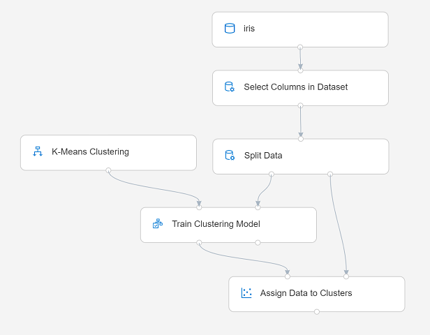
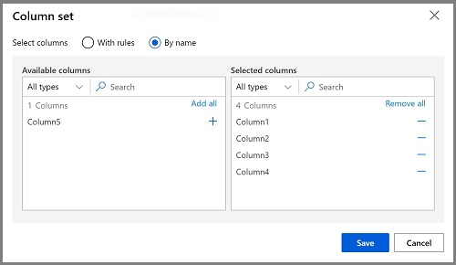

After you've used data transformations to prepare the data, you can use it to train a machine learning model.

## Add training modules

To train a clustering model, you need to apply a clustering algorithm to the data, using only the features that you have selected for clustering. You'll train the model with a subset of the data, and use the rest to test the trained model.

In this exercise, you're going to extend the **Train Penguin Clustering** pipeline as shown here:

> [!div class="centered"]
> 

Follow the steps below, using the image above for reference as you add and configure the required modules.

1. Open the **Train Penguin Clustering** pipeline, if it's not already open.
2. In the pane on the left, in the **Data Transformations** section, drag a **Split Data** module onto the canvas under the **Normalize Data** module. Then connect the left output of the **Normalize Data** module to the input of the **Split Data** module.
3. Select the **Split Data** module, and configure its settings as follows:
    * **Splitting mode**: Split Rows
    * **Fraction of rows in the first output dataset**: 0.7
    * **Random seed**: 123
    * **Stratified split**: False
4. Expand the **Model Training** section in the pane on the left, and drag a **Train Clustering Model** module to the canvas, under the **Split Data** module. Then connect the *Result dataset1* (left) output of the **Split Data** module to the *Dataset* (right) input of the **Train Clustering Model** module.
5. The clustering model should assign clusters to the data items by using all of the features you selected from the original dataset. Select the **Train Clustering Model** module and in its settings pane, on the **Parameters** tab, select **Edit Columns** and use the **With rules** option to include all columns; like this:

> [!div class="centered"]
> 

6. The model we're training will use the features to group the data into clusters, so we need to train the model using a *clustering* algorithm. Expand the **Machine Learning Algorithms** section, and under **Clustering**, drag a **K-Means Clustering** module to the canvas, to the left of the **penguin-data** dataset and above the **Train Clustering Model** module. Then connect its output to the **Untrained model** (left) input of the **Train Clustering Model** module.
7. The *K-Means* algorithm groups items into the number of clusters you specify - a value referred to as ***K***. Select the **K-Means Clustering** module and in its settings pane, on the **Parameters** tab, set the **Number of centroids** parameter to **3**.

    > [!NOTE] 
    > You can think of data observations, like the penguin measurements, as being multidimensional vectors. The K-Means algorithm works by:
    > 1. initializing *K* coordinates as randomly selected points called *centroids* in  *n*-dimensional space (where *n* is the number of dimensions in the feature vectors).
    > 2. Plotting the feature vectors as points in the same space, and assigning each point to its closest centroid.
    > 3. Moving the centroids to the middle of the points allocated to it (based on the *mean* distance).
    > 4. Reassigning the points to their closest centroid after the move.
    > 5. Repeating steps 3 and 4 until the cluster allocations stabilize or the specified number of iterations has completed.

8. After using 70% of the data to train the clustering model, you can use the remaining 30% to test it by using the model to assign the data to clusters. Expand the **Model Scoring & Evaluation** section and drag an **Assign Data to Clusters** module to the canvas, below the **Train Clustering Model** module. Then connect the **Trained model** (left) output of the **Train Clustering Model** module to the **Trained model** (left) input of the **Assign Data to Clusters** module; and connect the **Results dataset2** (right) output of the **Split Data** module to the **Dataset** (right) input of the **Assign Data to Clusters** module.

## Run the training pipeline

Now you're ready to run the training pipeline and train the model.

1. Ensure your pipeline looks like this:

> [!div class="centered"]
> 

2. Select **Submit**, and run the pipeline using the existing experiment named **mslearn-penguin-training** on your compute cluster.
2. Wait for the experiment run to finish. This may take 5 minutes or more.
3. When the experiment run has finished, select the **Assign Data to Clusters** module and in its settings pane, on the **Outputs + Logs** tab, under **Data outputs** in the **Results dataset** section, use the **Visualize** icon to view the results.
4. Scroll to the right, and note the **Assignments** column, which contains the cluster (0, 1, or 2) to which each row is assigned. There are also new columns indicating the distance from the point representing this row to the centers of each of the clusters - the cluster to which the point is closest is the one to which it is assigned.
5. Close the **Assign Data to Clusters** visualization.

The model is predicting clusters for the penguin observations, but how reliable are its predictions? To assess that, you need to evaluate the model.
