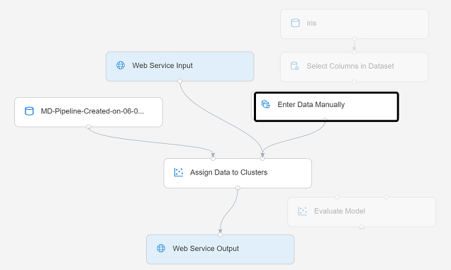
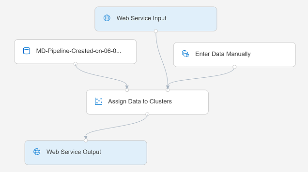

After creating and running a pipeline to train the clustering model, you can create an *inference pipeline* that uses the model to assign new data observations to clusters. This will form the basis for a predictive service that you can publish for applications to use.

## Create an inference pipeline

1. In Azure Machine Learning Studio, open the **Train Penguin Clustering** pipeline you created previously.
2. In the **Create inference pipeline** drop-down list, click **Real-time inference pipeline**. After a few seconds, a new version of your pipeline named **Train Penguin Clustering-real time inference** will be opened.

   *If the pipeline does not include **Web Service Input** and **Web Service Output** modules, go back to the **Designer** page and then re-open the **Train Penguin Clustering-real time inference** pipeline.*

3. Rename the new pipeline to **Predict Penguin Clusters**, and then review the new pipeline. It contains a web service input for new data to be submitted, and a web service output to return results. The transformations and clustering model in your training pipeline are encapsulated in this pipeline based on the statistics from your training data, and will be used to transform and score the new data.

    You are going to make the following changes to the inference pipeline:

    > [!div class="centered"]
    > 

    - Replace the **penguin-data** dataset with an **Enter Data Manually** module that does not include the **Species** column.
    - Remove the **Select Columns in Dataset** module, which is now redundant.
    - Connect the **Web Service Input** and **Enter Data Manually** modules (which represent inputs for data to be clustered) to the first **Apply Transformation** module.
    - Remove the **Evaluate Model** module.

    Follow the remaining steps below, using the image and information above for reference as you modify the pipeline.

4. The inference pipeline assumes that new data will match the schema of the original training data, so the **penguin-data** dataset from the training pipeline is included. However, this input data includes a column for the penguin species, which the model does not use. Delete both the **penguin-data** dataset and the **Select Columns in Dataset** modules, and replace them with an **Enter Data Manually** module from the **Data Input and Output** section. Then modify the settings of the **Enter Data Manually** module to use the following CSV input, which contains feature values for three new penguin observations (including headers):

    ```CSV
    CulmenLength,CulmenDepth,FlipperLength,BodyMass
    39.1,18.7,181,3750
    49.1,14.8,220,5150
    46.6,17.8,193,3800
    ```

5. Connect the outputs from both the **Web Service Input** and **Enter Data Manually** modules to the Dataset (right) input of the first **Apply Transformation** module.
6. Delete the **Evaluate Model** module.
7. Verify that your pipeline looks similar to the following:

> [!div class="centered"]
> 

8. Submit the pipeline as a new experiment named **mslearn-penguin-inference** on your compute cluster. This may take a while!
9. When the pipeline has finished, visualize the **Results dataset** output of the **Assign Data to Clusters** module to see the predicted cluster assignments and metrics for the three penguin observations in the input data.

Your inference pipeline assigns penguin observations to clusters based on their features. Now you're ready to publish the pipeline so that client applications can use it.
