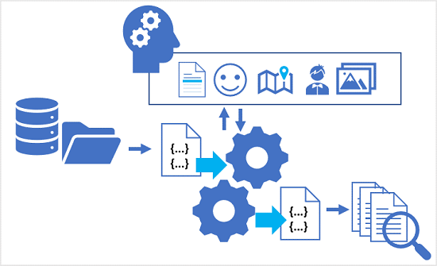
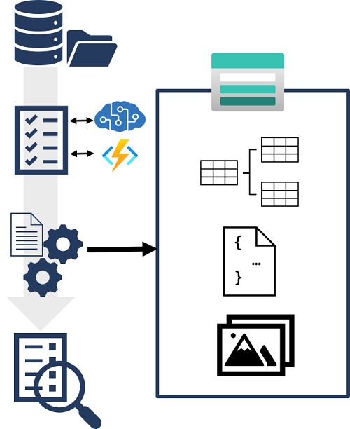

Azure Cognitive Search enables you to create search solutions in which a pipeline of AI skills is used to enrich data and populate an index.

The data enrichments performed by the skills in the pipeline supplement the source data with insights such as: 

- The language in which a document is written.
- Key phrases that might help determine the main themes or topics discussed in a document.
- A sentiment score that quantifies how positive or negative a document is.
- Specific locations, people, organizations, or landmarks mentioned in the content.
- AI-generated descriptions of images, or image text extracted by optical character recognition (OCR).

The enriched data in the index makes it possible to create a comprehensive search solution that goes beyond basic full text search of the source content.

## Knowledge stores

While the index might be considered the primary output from an indexing process, the enriched data it contains might also be useful in other ways. For example:

- Since the index is essentially a collection of JSON objects, each representing an indexed record, it might be useful to export the objects as JSON files for integration into a data orchestration process using tools such as Azure Data Factory.
- You may want to normalize the index records into a relational schema of tables for analysis and reporting with tools such as Microsoft Power BI.
- Having extracted embedded images from documents during the indexing process, you might want to save those images as files.

Azure Cognitive Search supports these scenarios by enabling you to define a *knowledge store* in the skillset that encapsulates your enrichment pipeline. The knowledge store consists of *projections* of the enriched data, which can be JSON objects, tables, or image files. When an indexer runs the pipeline to create or update an index, the projections are generated and persisted in the knowledge store.

In this module, you'll implement a knowledge store for *Margie's Travel*, a fictitious travel agency that uses information in brochures and hotel reviews to help customers plan trips.
