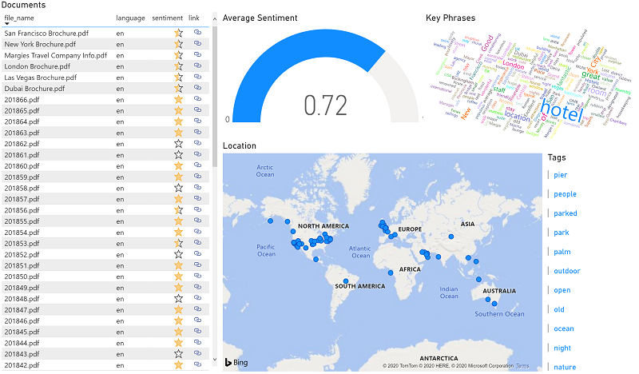

After you have run an indexer that uses a skillset to create a knowledge store, the enriched data extracted by the indexing process is persisted in the knowledge store projections.

## View object projections

The *object* projections defined in the Margie's Travel skillset consist of a JSON file for each indexed document. These files are stored in a blob container in the Azure Storage account specified in the skillset definition.

1. Open the [Azure portal](https://portal.azure.com?portal=true) and view the Azure Storage account you created at the beginning of this module (its name is similar to *store1234abcd5678efgh*).
2. Select the **Storage explorer** tab (in the pane on the left) to view the storage account in the storage explorer interface in the Azure portal.
2. Expand **BLOB CONTAINERS** to view the containers in the storage account. In addition to the **margies** container where the source data is stored, there should be two new containers: **margies-images** and **margies-knowledge**. These were created by the indexing process.
3. Select the **margies-knowledge** container. It should contain a folder for each indexed document.
4. Open any of the folders, and then open the **knowledge-projection.json** file it contains. Each JSON file contains a representation of an indexed document, including the enriched data extracted by the skillset as shown here.

    ```json
    {
        "file_id":"abcd1234....",
        "file_name":"Margies Travel Company Info.pdf",
        "url":"https://store....blob.core.windows.net/margies/...pdf",
        "language":"en",
        "sentiment":0.83164644241333008,
        "key_phrases":[
            "Margie’s Travel",
            "Margie's Travel",
            "best travel experts",
            "world-leading travel agency",
            "international reach"
            ],
        "locations":[
            "Dubai",
            "Las Vegas",
            "London",
            "New York",
            "San Francisco"
            ],
        "image_tags":[
            "outdoor",
            "tree",
            "plant",
            "palm"
            ]
    }
    ```

The ability to create *object* projections like this enables you to generate enriched data objects that can be incorporated into an enterprise data analysis solution - for example by ingesting the JSON files into an Azure Data Factory pipeline for further processing or loading into a data warehouse.

## View file projections

The *file* projections defined in the skillset create JPEG files for each image that was extracted from the documents during the indexing process.

1. In the storage explorer interface in the Azure portal, select the **margies-images** blob container. This container contains a folder for each document that contained images.
2. Open any of the folders and view its contents - each folder contains at least one \*.jpg file.
3. Open any of the image files to verify that they contain images extracted from the documents.

The ability to generate *file* projections like this makes indexing an efficient way to extract embedded images from a large volume of documents.

## View table projections

The *table* projections defined in the skillset form a relational schema of enriched data.

1. In the storage explorer interface in the Azure portal, expand **TABLES**.
2. Select the **Docs** table to view its columns. The columns include some standard Azure Storage table columns - to hide these, modify the **Column Options** to select only the following columns:
    - **document_id** (the key column automatically generated by the indexing process)
    - **file_id** (the encoded file URL)
    - **file_name** (the file name extracted from the document metadata)
    - **language** (the language in which the document is written)
    - **sentiment** the sentiment score calculated for the document.
    - **url** the URL for the document blob in Azure storage.
3. View the other tables that were created by the indexing process:
    - **ImageTags** (contains a row for each individual image tag with the **document_id** for the document in which the tag appears).
    - **KeyPhrases** (contains a row for each individual key phrase with the **document_id** for the document in which the phrase appears).
    - **Locations** (contains a row for each individual location with the **document_id** for the document in which the location appears).

The ability to create *table* projections enables you to build analytical and reporting solutions that query the relational schema. The automatically generated key columns can be used to join the tables in queries - for example to return all of the locations mentioned in a specific document.

With the enriched document data persisted in the relational tables, you can use tools like Microsoft Power BI to analyze and visualize it, gaining rich new insights:



## Clean up resources

Now that you have finished the exercises, you can delete the Azure resources.

1. Right-click (Ctrl+click if using a Mac) the **03-Create-a-knowledge-store** folder and select **Open in Integrated Terminal**. This will open a new bash terminal pane.
2. In the terminal pane, enter the following command to delete the resources used in this module:

    ```bash
    bash reset.sh
    ```
3. When prompted, follow the link, enter the provided code, and sign into your Azure subscription. Then wait for the script to complete and confirm that the resource group has been deleted.

When your resources have been deleted, continue to the next unit to check your learning.
