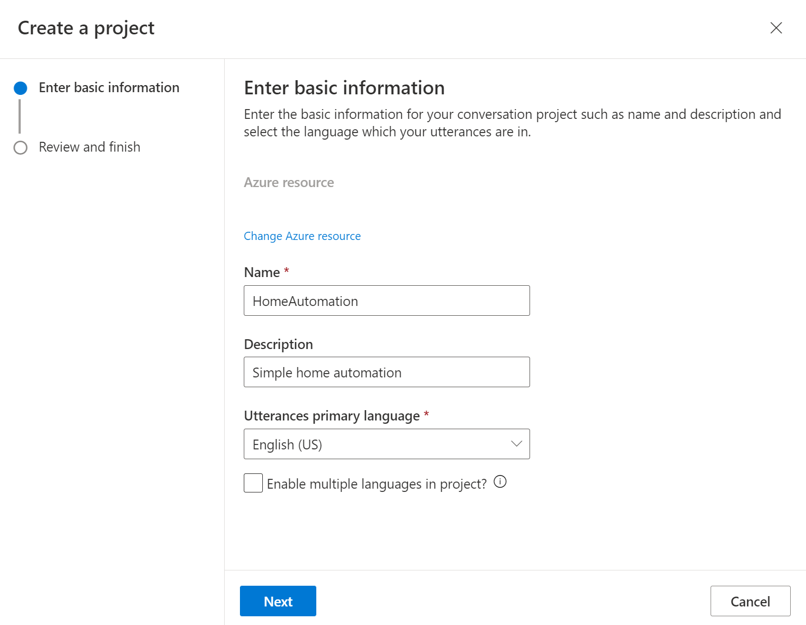
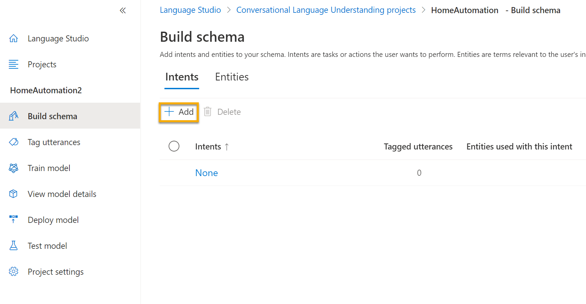
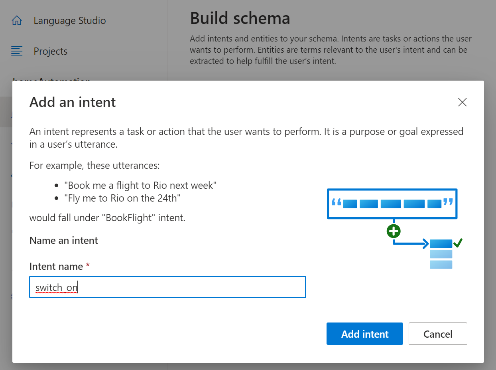
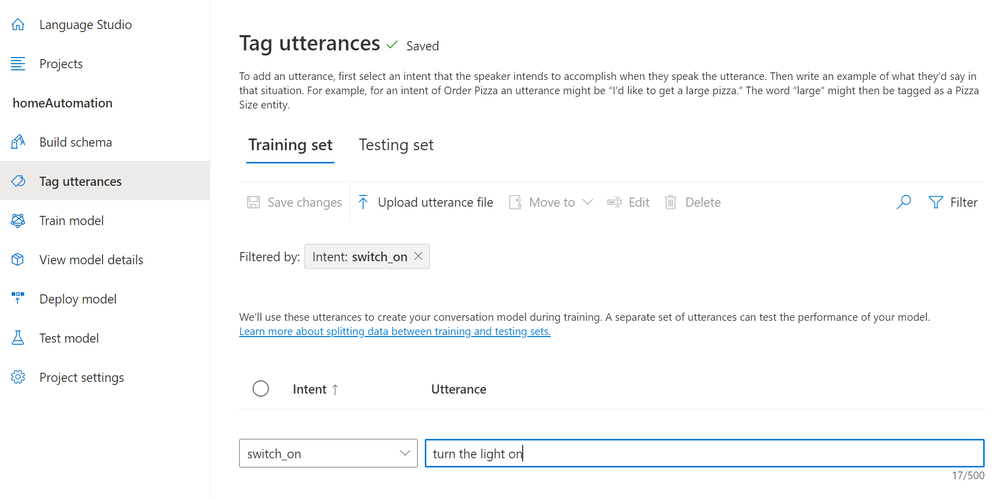
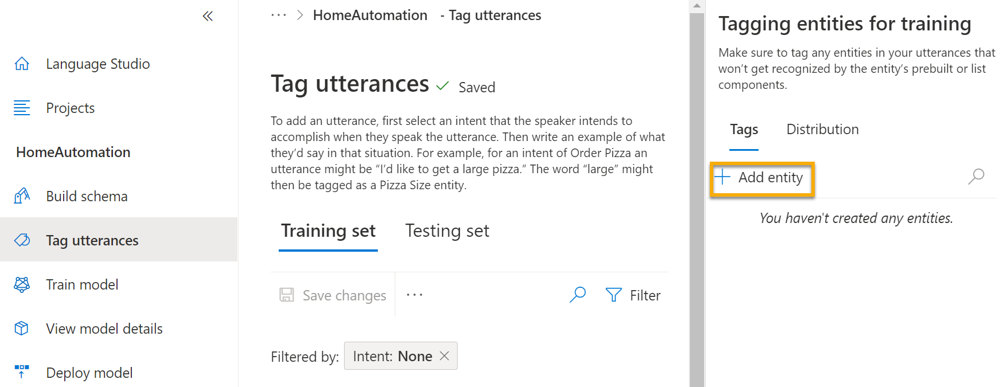
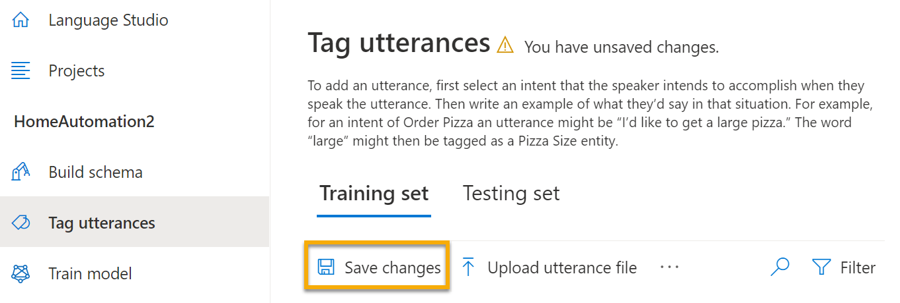
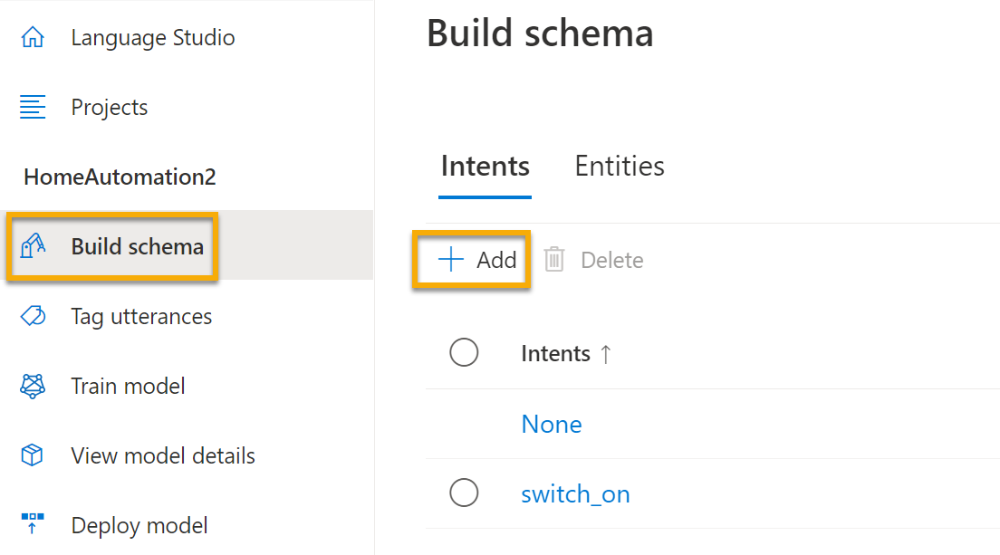
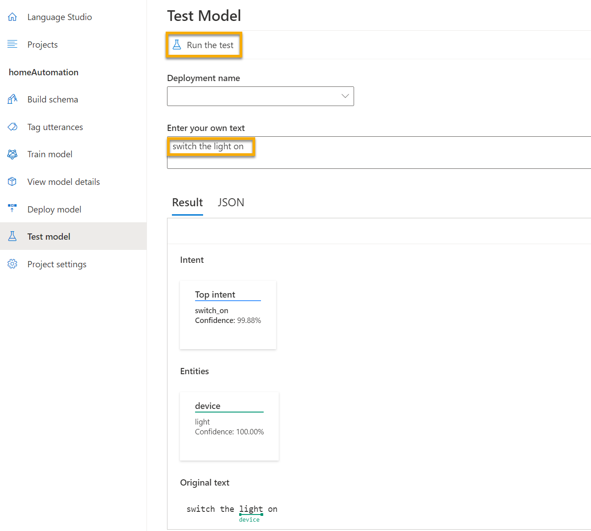

Increasingly, we expect computers to be able to use AI in order to understand spoken or typed commands in natural language. For example, you might want to implement a home automation system that enables you to control devices in your home by using voice commands such as "switch on the light" or "put the fan on", and have an AI-powered device understand the command and take appropriate action.

To test the capabilities of the Conversational Language Understanding service, we'll use a command-line application that runs in the Cloud Shell. The same principles and functionality apply in real-world solutions, such as web sites or phone apps.

## Create a *Language service* resource

You can use the Conversational Language Understanding service by creating a **Language service** resource. 

If you haven't already done so, create a **Language service** resource in your Azure subscription.

1. In another browser tab, open the Azure portal at [https://portal.azure.com](https://portal.azure.com?azure-portal=true), signing in with your Microsoft account.
2. Click the **&#65291;Create a resource** button, search for *Language service*, and create a **Language service** resource with the following settings:
    - Select additional features: *Keep the default features and click Continue to create your resource*  
    - **Subscription**: *Your Azure subscription*.
    - **Resource group**: *Select or create a resource group with a unique name*.
    - **Region**: *Choose either the West US 2 or West Europe region*
    - **Name**: *Enter a unique name*.
    - **Pricing tier**: Standard (S)
    - **Legal Terms**: _Agree_ 
    - **Responsible AI Notice**: _Agree_

3. Review and create the resource, and wait for deployment to complete. Then go to the deployed resource.
4. View the **Keys and Endpoint** page for your Language service resource. You will need the endpoint and keys to connect from client applications.

### Create a Conversational Language Understanding App

To implement natural language understanding with Conversational Language Understanding, you create an app; and then add entities, intents, and utterances to define the commands you want the app. 

1. In a new browser tab, open the Language Studio portal at [https://language.azure.com](https://language.azure.com?azure-portal=true) and sign in using the Microsoft account associated with your Azure subscription.
2. If prompted to choose a Language resource, select the following settings:
    - **Azure Directory**: The Azure directory containing your subscription.
    - **Azure subscription**: Your Azure subscription.
    - **Language resource**: The Language resource you created previously.

    >[!TIP]
    >If you are ***not*** prompted to choose a language resource, it may be because you have multiple Language resources in your subscription; in which case:
        1. On the bar at the top if the page, click the **Settings (&#9881;)** button.
        2. On the **Settings** page, view the **Resources** tab.
        3. Select your language resource, and click **Switch resource**.
        4. At the top of the page, click **Language Studio** to return to the Language Studio home page.
3. At the top of the portal, in the **Create new** menu, select **Conversational language understanding**.

4. In the **Create a project** dialog box, on the **Enter basic information** page, enter the following details and click **Next**:
    - **Name**: HomeAutomation
    - **Description**: Simple home automation
    - **Utterances primary language**: English
    - **Enable multiple languages in project**: *Do not select*

    

5. On the *Review and finish* page, click **Create**. 

### Create intents, utterances, and entities

An *intent* is an action you want to perform - for example, you might want to switch on a light, or turn off a fan. In this case, you'll define two intents: one to switch on a device, and another to switch off a device. For each intent, you'll specify sample *utterances* that indicate the kind of language used to indicate the intent.

1. In the **Build schema** pane, ensure that **Intents** is selected Then click **Add**, and add an intent with the name **switch_on** (in lower-case) and click **Add intent**.

    
            
2. Select the **switch_on** intent. It will take you to the **Tag utterances** page. Next to the **switch_on** intent, type the utterance ***turn the light on*** and press **Enter** to submit this utterance to the list.

     

3. The language service needs at least five different utterance examples for each intent to sufficiently train the language model. Add five more utterance examples for the **switch_on** intent:  
    - ***switch on the fan***
    - ***put the fan on***
    - ***put the light on***
    - ***switch on the light***
    - ***turn the fan on***
4. On the **Tagging entities for training** pane on the right-hand side of the screen, select **Tags**, then select **Add entity**. Type **device** (in lower-case), select **List** and select **Done**. 

     
            

5. In the ***turn the fan on*** utterance, highlight the word "fan". Then in the list that appears, in the *Search for an entity* box select **device**. 

     

6. Do the same for all the utterances. Tag the rest of the *fan* or *light* utterances with the **device** entity. When you're finished, verify that you have the following utterances and make sure to select **Save changes**: 

    | **intent** | **utterance** | **entity** |
    | --------------- | ------------------ | ------------------ |
    | switch_on   | Put on the fan      | Device - *select fan* |
    | switch_on   | Put on the light    | Device - *select light* |
    | switch_on   | Switch on the light | Device - *select light* |
    | switch_on   | Turn the fan on     | Device - *select fan* |
    | switch_on   | Switch on the fan   | Device - *select fan* |
    | switch_on   | Turn the light on   | Device - *select light* |

     

7. In the pane on the left, click **Build schema** and verify that your **switch_on** intent is listed. Then click **Add** and add a new intent with the name **switch_off** (in lower-case).

     

8. Click on the **switch_off** intent. It will take you to the **Tag utterances** page. Next to the **switch_off** intent, add the utterance ***turn the light off***. 
9. Add five more utterance examples to the **switch_off** intent. 
    - ***switch off the fan***
    - ***put the fan off***
    - ***put the light off***
    - ***turn off the light***
    - ***switch the fan off***

10. Tag the words *light* or *fan* with the **device** entity. When you're finished, verify that you have the following utterances and make sure to select **Save changes**:  

    | **intent** | **utterance** | **entity** | 
    | --------------- | ------------------ | ------------------ |
    | switch_off   | Put the fan off    | Device - *select fan* | 
    | switch_off   | Put the light off  | Device - *select light* |
    | switch_off   | Turn off the light | Device - *select light* |
    | switch_off   | Switch the fan off | Device - *select fan* |
    | switch_off   | Switch off the fan | Device - *select fan* |
    | switch_off   | Turn the light off | Device - *select light* |

### Train the model

Now you're ready to use the intents and entities you have defined to train the conversational language model for your app.

1. On the left hand side of Language Studio, select **Train model**. Use the following settings: 
    - **Train a new model**: *Selected and choose a model name*
    - **Run evaluation with training**: *Enabled evaluation*
    - Click **Train** at the bottom of the page.
2. Wait for training to complete. 

### Deploy and test the model

To use your trained model in a client application, you must deploy it as an endpoint to which the client applications can send new utterances; from which intents and entities will be predicted.

1. On the left-hand side of Language Studio, click **Deploy model**.
2. Select your model name and click **Add deployment**. Use these settings: 
    - **Create a new deployment name**: *Create a unique name*
    - **Assign trained model to your deployment name**: *Select the name of the trained model*
    Click **Submit**.

3. When the model is deployed, click **Test model** on the left-hand side of the page, and then select your deployed model under **Deployment name**.
4. Enter the following text, and then click **Run the test**:

    *switch the light on*

     

    Review the result that is returned, noting that it includes the predicted intent (which should be **switch_on**) and the predicted entity (**device**) with confidence scores that indicates the probability the model calculated for the predicted intent and entity. The JSON tab shows the comparative confidence for each potential intent (the one with the highest confidence score is the predicted intent)

5. Clear the text box and test the model with the following utterances:
    - *turn off the fan*
    - *put the light on*
    - *put the fan off*

## Run Cloud Shell 

Now let's try out your deployed model. To do so, we'll use a command-line application that runs in the Cloud Shell on Azure. 

1. Leaving the browser tab with Language Studio open, switch back to browser tab containing the Azure portal.
2. In the Azure portal, select the **[>_]** (*Cloud Shell*) button at the top of the page to the right of the search box. Clicking the button opens a Cloud Shell pane at the bottom of the portal. 

    

3. The first time you open the Cloud Shell, you may be prompted to choose the type of shell you want to use (*Bash* or *PowerShell*). Select **PowerShell**. If you do not see this option, skip the step.  
4. If you are prompted to create storage for your Cloud Shell, ensure your subscription is specified and select **Create storage**. Then wait a minute or so for the storage to be created. 

           

5. Make sure the the type of shell indicated on the top left of the Cloud Shell pane is switched to *PowerShell*. If it is *Bash*, switch to *PowerShell* by using the drop-down menu. 
    
     

6. Wait for PowerShell to start. You should see the following screen in the Azure portal:  

     

## Configure and run a client application

Now let's open and edit a pre-written script, which will run the client application. 

1. In the command shell, enter the following command to download the sample application and save it to a folder called ai-900.

    ```
    git clone https://github.com/MicrosoftLearning/AI-900-AIFundamentals ai-900
    ```
   
>[!NOTE]
>If you already used this command in another lab to clone the *ai-900* repository, you can skip this step.

2. The files are downloaded to a folder named **ai-900**. Now we want to see all of the files in this folder and work with them. Type the following commands into the shell: 

     ```
    cd ai-900
    code .
    ```

    Notice how the script opens up an editor like the one in the image below: 
 
    

3. In the **Files** pane on the left, select the **understand.ps1** file in the **ai-900** folder. This file contains some code that uses your Conversational Language Understanding model. 

    Don't worry too much about the details of the code, the important thing is that it needs the endpoint and key for your Language service model. You'll get the endpoint and key from the Language Studio.

4. Switch back to the browser tab containing Language Studio. Then in Language Studio, open the **Deploy model** page and select your model. Then click the **Get prediction URL** button. The two pieces of information you need are in this dialog box:
    - The endpoint for your model - you can copy the endpoint from the **Prediction URL** box.
    - The key for your model - the key is in the **Sample request** as the value for the **Ocp-Apim-Subscription-Key** parameter, and looks similar to ***0ab1c23de4f56gh7i8901234jkl567m8***.
    
5. Copy the endpoint value, then switch back to the browser tab containing the Cloud Shell and paste it into the code editor, replacing **YOUR_ENDPOINT** (within the quotation marks). The repeat that process for the key, replacing **YOUR_KEY**.

    After pasting the key and endpoint values, the first lines of code should look similar to what you see below:

    ```PowerShell
    $endpointUrl="https://some-name.cognitiveservices.azure.com/language/..."
    $key = "0ab1c23de4f56gh7i8901234jkl567m8"
    ```

6. At the top right of the editor pane, use the **...** button to open the menu and select **Save** to save your changes. Then open the menu again and select **Close Editor**.
7. In the PowerShell pane, enter the following command to run the code:

    ```
    ./understand.ps1 "Turn on the light"
    ``` 

8. Review the results. The app should have predicted that the intended action is to switch on the light.
9. Now try another command:

    ```
    ./understand.ps1 "Switch the fan off"
    ```

10. Review the results from this command. The app should have predicted that the intended action is to switch off the fan.

11. Experiment with a few more commands; including commands that the model was not trained to support, such as "Hello" or "switch on the oven". The app should generally understand commands for which its language model is defined, and fail gracefully for other input.

## Learn more

This app shows only some of the capabilities of the Conversational Language Understanding feature of the Language service. To learn more about what you can do with this service, see the [Conversational Language Understanding page](/azure/cognitive-services/language-service/conversational-language-understanding/overview).
