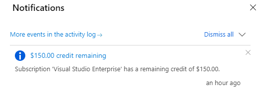

To use the Azure Cognitive Services, you will require a valid Azure subscription. Microsoft provides various options for creating or using an Azure subscription.  You can sign up for a free trial account using a Microsoft Account and try out the various services that are offered for free trial.

[Purchasing an Azure subscription from Microsoft directly](https://azure.microsoft.com/pricing/purchase-options/pay-as-you-go/) is another option.  A fast and easy way to get an Azure subscription that will be billed based on the services you create and consume.  You can also choose to purchase an Azure subscription [through a Microsoft representative](https://azure.microsoft.com/overview/sales-number/), which is primarily an option for large organizations or customers who already have a Microsoft representative.

You can also use Azure as part of managed service from a [Microsoft partner](https://azure.microsoft.com/partners/). The option provides these benefits:

- Get your bill from and pay for Azure usage through your CSP.
- Get support for Azure through your CSP.
- Work with your CSP for Azure provisioning, deployment, and usage management.

## Azure free trial

Many will want to choose the Azure free trial to get an idea of how the services work or to test application concepts. With the free trial, you get:

- 12 months of free service. Your first 30 days are free and you can upgrade to a pay-as-you-go plan afterwards. More than 25 services continue to be free for the remaining 11 months (if you upgrade to pay-as-you-go).
- Credit of $200 to experiment with Azure, beyond the free amounts. If you run beyond the free limit of a service, the subscription will start to consume some of this credit.
- No autorenew.  You will be notified before your 30-day window about upgrading to the pay-as-you-go option.  You can still use the remaining free services in your 12 months.  You will be required to enter credit card information at that time and any services or consumption beyond the free limits, will be billed to that credit card.

## Visual Studio subscriptions

If you are a developer with a Visual Studio subscription, you will also enjoy access to some Azure benefits. There are various levels of subscriptions available and the amount of Azure credits you receive are determined by the Visual Studio subscription level you have.

| Subscription Level | Monthly Azure Credits |
|---|---:|
| Enterprise | $150 |
| MSDN Platforms | $100 |
| Professional | $50 |
| Test Professional | $50 |

For any of the subscriptions listed, you will need to activate your credits from your subscription page. Once they are activated, you will be notified of the current remaining credits each time you log into your Azure subscription.

## Learning objectives

In this module you will learn:

- how to create cognitive service resources in Azure
- how to access the keys and endpoint information for use in your applications
- how to manage the resource once it's created
- how to monitor the resource

## Pre-requisites

- an active Azure subscription
- ability to navigate the Azure portal