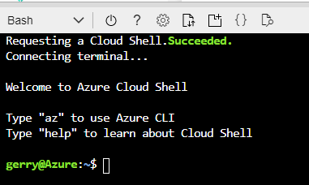

Prior to accessing any of the Cognitive Services functionality on Azure, you will need to create a Cognitive Services resource. Using the various services (Speech, Computer Vision etc.), requires, at a minimum, an access key and a service endpoint URL.  The information is required for authorization of applications that will be accessing these services.  You will create either a single-service resource or a multi-service resource, depending on the services you access.

- **Multi-service** resource:
    - Access multiple Azure Cognitive Services with a single key and endpoint.
    - Consolidates billing from the services you use.
- **Single-service** resource:
    - Access a single Azure Cognitive Service with a unique key and endpoint for each service created.
    - Use the free tier to try out the service.

If you choose the multi-service resource, you will enable access to these Cognitive Services:

- Computer Vision
- Content Moderator
- Face API
- Language Understanding (LUIS)
- Text Analytics
- Translator Text
- Bing Search v7
- Bing Custom Search
- Bing Entity Search
- Bing Autosuggest
- Bing Spell Check

If you choose the single-service resource option, you get access to all the Cognitive Services listed for the multi-service resource, plus the additional Cognitive Services listed here:

- Speech Services
- Speaker Recognition
- Immersive Reader
- QnA Maker
- Anomaly Detector
- Ink Recognizer
- Personalizer

## Resource fields

During the creation of these services, you will be asked for several pieces of information.  Correctly configuring the service is critical to ensuring you are able to properly manage the resources later.  There are also key considerations around naming the service to ensure unique service names within regions and subscriptions. The table outlines the key fields with information regarding usage.

| Setting | Description |
|---|---|
| **Name** | A descriptive name for your cognitive services resource. For example, *MyCognitiveServicesResource*. |
| **Subscription** | Select one of your available Azure subscriptions. |
| **Location** | The location of your cognitive service instance. Different locations may introduce latency, but have no impact on the runtime availability of your resource. |
| **Pricing tier** | The cost of your Cognitive Services account depends on the options you choose and your usage. For more information, see the API [pricing details](https://azure.microsoft.com/pricing/details/cognitive-services/).
| **Resource group** | The Azure resource group that will contain your Cognitive Services resource. You can create a new group or add it to a pre-existing group. |

## Create a Cognitive Services resource using the Azure portal

1. To create a new Cognitive Services resource using the Azure portal, sign in to the Azure portal
1. Select the + Create a resource option in the left nav pane or on the Home page of the Azure portal
1. In the text entry to search the Azure Marketplace, enter **Cognitive Services** for a multi-service resource or the specific name of the Cognitive Service you want to create, such as **QnA Maker**
1. Select the appropriate service from the options
1. Select the **Create** button
1. Complete the information required in the dialog according to the descriptions provided in the table

## Create a Cognitive Services resource using the Azure Command Line Interface (CLI)

Creating the necessary Cognitive Services using the Azure portal is only one method available.  If your organization uses a DevOps process or requires automation for consistency in deployments, updates, and removal of services, the Azure portal is not the ideal choice.  Microsoft offers different options for scripting the creation of Cognitive Services.  One of these options is the Azure Command Line Interface (CLI).

### Use the CLR in the Azure portal

You can use the CLI locally or from within the Azure portal. Accessing the CLI from the portal, requires that you are logged into the portal.  You can then access the CLI with the following steps:

1. Sign in to the Azure portal
1. Locate and select the **Cloud Shell** button on the top nav bar of the Azure portal

    

1. If this is the first time you have opened **Cloud Shell**, you will be prompted to create a storage account.  Follow the procedure to do so
1. Once the storage account is created, Azure requests a Cloud Shell and then connects to the terminal
1. You are now ready to issue CLI commands

    

### Install and use the CLR Locally

If you need to automate Cognitive Service creation or removal, using the portal is not the best choice. Automation through scripting and the CLI is best done by installing the CLI on your local computer, or the computer in which the scripts will execute. Using the Azure CLI requires installing the tool on the local computer.  Visit the [Azure CLI Installer](https://docs.microsoft.com/cli/azure/install-azure-cli?view=azure-cli-latest) page to begin the installation.

>[!NOTE]
>The link to the installer defaults to the Windows installer but in the nav pane on the left, you will find installation options for MacOS and various Linux options.

The scenario presented here will make the assumption that you are creating a new resource using the CLI, and not updating existing services. As a result, the sequence presented focuses on initial service creation.  Many of the steps translate to use in an automation scenario as well.

Once the CLI is installed, your first step is to sign in to the Azure subscription.  Signing in is required before you can execute any commands against an Azure subscription. Once you are logged in, you will have access to your Azure subscription.  If you have multiple subscriptions, you will also need to switch to the proper subscription that will contain the resources you will create.

### Exercise - Create a Multi-service Cognitive Service resource using the CLI

1. Open a command prompt, or terminal, on your local computer
1. Enter the command

    ```azurecli
    az login
    ```

    >[!TIP]
    > If you want to automate the script, you will need to modify the ``` az login ``` command with credential information.  Because there numerous options, visit the [az login reference](https://docs.microsoft.com/cli/azure/reference-index?view=azure-cli-latest#az-login) page for details on specific options

1. A browser window opens for you to enter your credentials.  Sign in with your Azure subscription account information
1. Once you have successfully logged in, the service responds with a list of your current Azure subscriptions.
1. If you only have one Azure subscription, you can continue working with the samples here.  
    >[!TIP]
    > If you have multiple subscriptions, you should choose the active subscription that you will work with. You accomplish this by executing the ``` az account set --subscription <subscriptionName>``` command.  You replace &lt;subscriptionName&gt; with the actual name of the subscription you want to work with.  Use the ``` az account show ``` command to determine what your current subscription is set to.

1. When creating your Cognitive Service resource, you will place it in a region (the location attribute). Before choosing a region, get a list of regions that are available for your subscription to avoid errors in the script, if you choose a region that is not available for your subscription.
1. Enter the command

    ```azurecli
    az account list-locations --query "[].{Region:name}" --out table 
    ```

1. Once you determine the supported regions, choose the region closest to you, or closest to the location where the resource will be used and create a resource group in that region.  A resource group helps organize your resources and makes management easier.
1. Create a resource group in your region with the following command 

    ```azurecli 
    az group create --name cog-services-staging --location westus
    ```

1. The command creates a resource group called **cog-services-staging** and places it in the **westus** region.
1. Now that you are on the proper Azure subscription and have created a new resource group in the appropriate region, create a multi-service Cognitive Services resource with the following command,

    ```azurecli
    az cognitiveservices account create --name myMultiCogService --resource-group cog-services-staging --kind CognitiveServices   --sku F0 --location westus --yes
    ```

    >[!NOTE]
    >This command uses the F0 sku but if your subscription already has an F0, which is a free tier, you may get an error returned, **InvalidSkuId - The SKU name 'F0' in account type 'CognitiveServices' is invalid.** If that is the case, change F0 to S0.

1. This command uses a set of options that are explained in the table.  For a full list, see the [Cognitive Services create reference](https://docs.microsoft.com/azure/cognitive-services/cognitive-services-apis-create-account-cli?tabs=windows):

    | Option | Description |
    |---|---|
    | **--name** | Cognitive service account name |
    | **--resource-group** | Name of resource group. You can configure the default group using ``` az configure --defaults group=<name> ``` |
    | **--kind** | The API name of cognitive services account. Value from: ``` az cognitiveservices account list-kinds ``` |
    | **--sku** | Name of the Sku of cognitive services account. Value from ``` az cognitiveservices account list-skus``` 
    | **--location** | The Azure region to create the resource in |
    | **--yes** | Optional parameter to not prompt for terms confirmation |

1. If you want to validate these commands, log into the Azure portal to view the newly created items. You can find the new service in the All Resources section of the portal

    

1. The image shows myMultiCogService resource, in the cog-services-staging resource group, hosted in the westus region.
1. The next article will discuss the management of keys for your service
