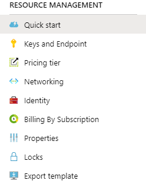

There are various aspects to your new Cognitive Service resource that you should be aware of.  Most of the tasks are for the management aspect of your service, including updating the service, monitoring the service, and controlling access. The focus of this topic is on the **Resource Management** section of the Cognitive Service.



After creating our Cognitive Service resource and it has been deployed, going to the resource will direct you to the **Quick Start** page where you can find links to various information on how to work with these services on Azure.  Note the section numbered 3, contains a list of services that you can use with a multi-service resource, if that is what you created.  The links will take you to the landing pages for each resource listed.

## Keys and endpoints

To access your service from an application, you will need to know the endpoint URL and have access to at least one of the keys.  The Keys and Endpoint section provides this information.  Depending on the service, you are working with, the endpoint will be unique to that specific service and the associated keys will provide authorization to use only the service at that endpoint. For a multi-service resource, the endpoint is typically of the form ``` https://westus.api.cognitive.microsoft.com/ ```.  The endpoint makes use of the region, in this example **westus**.  The rest of the endpoint is fairly generic.  

On the **Keys and Endpoint** page, you can also copy the keys necessary to access the service, or you can regenerate one or both of the keys if the need arises.  You can also use the Azure CLI to perform operations on the keys as well.  The two commands you will need to work with are **list** and the **regenerate**.  These commands are part of the ``` az cognitiveservices account ``` command.  Two examples follow:

Get a list of keys for the myMultiCogService resource in the cog-services-staging resource group.

```azurecli
az cognitiveservices account keys list --name myMultiCogService --resource-group cog-services-staging
```

Regenerate Key 2 in the myMultiCogService resource in the cog-services-staging resource group.

```azurecli
az cognitiveservices account keys regenerate --name myMultiCogService --resource-group cog-services-staging --key-name key2
```

## Pricing tier

The pricing tier is set when you create the resource.  If there are other available pricing tiers, you can select one of them in the **Pricing Tier** page.  You would change your pricing tier to match your anticipated usage needs for that service.  As an example, if you select F0 during creation of the service but your needs extend beyond the free tier, you could then change to the S0 pricing tier.

You can use the Azure CLI to determine the pricing tier for your service.  The attribute you will be using is listed as **sku** and not pricing tier.  An example of the command follows:

```azurecli
az cognitiveservices account list-skus --kind CognitiveServices --location westus
```

An example of the results:

```json
[
  {
    "kind": "CognitiveServices",
    "locations": [
      "WESTUS"
    ],
    "name": "S0",
    "resourceType": "accounts",
    "restrictions": [],
    "tier": "Standard"
  }
]
```

As you might expect, you can also update your pricing tier from the Azure CLI with a command.

```azurecli
az cognitiveservices account update --name myMultiCogService -g cog-services-staging --sku S0
```

## Manage properties

The properties of the Cognitive Service resource are concerned with the subscription, resource group, location, and pricing tier.  You can list and manage many of these attributes using the Azure CLI.  The portal also allows you to change some of the options such as the subscription and resource group.

1. Run this command to display the service information.

    ```azurecli
        az cognitiveservices account show --name myMultiCogService --resource-group cog-services-staging
    ```

1. The service information is returned in JSON format.

    ```json
    {
      "customSubDomainName": null,
      "endpoint": "https://westus.api.cognitive.microsoft.com/",
      "etag": "\"cf010fe5-0000-0700-0000-5eb2f8ed0000\"",
      "id": "/subscriptions/89429ec6-7544-4e27-b768-1172cdc01efa/resourceGroups/cog-services-staging/providers/Microsoft.CognitiveServices/accounts/myMultiCogService",
      "identity": {
        "type": "None"
      },
      "internalId": "89cc0af3399d482dbe013597a3879deb",
      "kind": "CognitiveServices",
      "location": "westus",
      "name": "myMultiCogService",
      "networkAcls": null,
      "provisioningState": "Succeeded",
      "resourceGroup": "cog-services-staging",
      "sku": {
        "name": "S0",
        "tier": null
      },
      "tags": null,
      "type": "Microsoft.CognitiveServices/accounts"
    }
    ```

    The key information we are concerned with here is the endpoint, kind, location, name, resource group, sku, and tags. You can change some of the information in this list with the ``` az cognitiveservices account update ``` command.

1. Add some tags to the service with this command.

    ```azurecli
    az cognitiveservices account update --name myMultiCogService -g cog-services-staging --sku S0 --tags department=development cost-center=dev02 environment=staging
    ```

In this example, myMultiCogService in the cog-services-staging resource group, will be updated to use the S0 sku and have tags added.  You apply tags to your Azure resources, resource groups, and subscriptions to logically organize them into a taxonomy. Each tag consists of a name and a value pair. For example, you can apply the name "Environment" and the value "Production" to all the resources in production. See [Microsoft's resource naming and tagging decision guide](https://docs.microsoft.com/azure/cloud-adoption-framework/decision-guides/resource-tagging/?toc=/azure/azure-resource-manager/management/toc.json) for recommendations on using tagging.

>[!TIP]
>Tag names are not case-sensitive but tag values are case-sensitive.

## Locks

Locks are a mechanism in Azure that helps protect the resources you create.  They can be applied to your Cognitive Services resources as well.   There are two basic types of locks:

- Delete - authorized users are able to read and modify the resource, but they cannot delete the resource
- Read-only - authorized users are able to read properties on the resource but they cannot modify or delete the resource

Follow these steps to add a **Read-only** lock to the myMultiCogService resource.

1. Select the Locks option under the Resource Management section
1. Select the + Add button to add a new lock
1. Enter a descriptive lock name such as **myCogServiceRO**
1. Choose the **Read-only** lock type
1. Enter some notes to further clarify the purpose, for example **Make service read-only**
1. Select Ok to create the lock
1. The lock will apply to all users

You can view the locks from the Azure CLI.

Retrieve a list of locks at the subscription level:

```azurecli
az lock list
```
