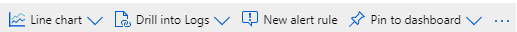

The Monitoring section in your Cognitive Services resource includes four areas that you can use for monitoring of your resource.  These include Alerts, Metrics, Diagnostic settings, and Logs.

## Alerts

Microsoft Azure provides a robust alerting and monitoring solution: Azure Monitor. You use Azure Monitor to configure notifications and alerts for your key systems and applications. These alerts will ensure that the correct team knows when a problem arises.

Every alert or notification available in Azure Monitor is the product of a rule. Some of these rules are built into the Azure platform. You use alert rules to create custom alerts and notifications. No matter which target resource or data source you use, the composition of an alert rule remains the same.

The exercise will cover how to create a simple alert.  Once the alert is in place, an Azure CLI command will be executed against the resource to trigger the alert.  A review of the alert page will show the details of what occurred.  To get a deeper insight into the severity levels and how to work with the various other types of alerts, visit the [alerts overview](https://docs.microsoft.com/azure/azure-monitor/platform/alerts-overview?toc=%2Fazure%2Fazure-monitor%2Ftoc.json) page.

### Configure an alert

1. Sign in to the Azure portal
1. Locate your Cognitive Service resource in your dashboard or the resources page.
1. Under the **Monitoring** section, select **Alerts**
1. Select **+ New alert rule**
1. Verify that the proper Cognitive Service resource is selected under **Resource**
1. Select the **Add** button under **Condition**
1. In the **Configure signal logic** page that appears on the right, you can narrow the **Signal type** by selecting the drop-down list and choosing a category.  There are two choices, **Metrics** and **Activity Log**.  Select **Activity Log** from the drop-down list
1. From the filtered list, select the **List Keys** option
1. Leave the default **Chart period** set to **Over the last 6 hours**
1. Leave the remaining options at their default and select the **Done** button
1. Alerts server their purpose best when someone is notified that the event has occurred.  We do not have and notification groups or email address configured at this time.  Because the **Action Groups** section is optional, do not configure it at this time unless you already have an Action group configured.
1. In the **Alert Details** section, enter **Keys List Alert** for the Alert rule name.
1. Select **Create alert rule**
1. Azure will create the new Alert
1. Refresh the page. Azure will tell you that **All is good! You have no alerts.
1. Open an Azure CLI Cloud Shell by selecting the **Cloud Shell** icon in the top nav bar
1. Wait until Azure has requested the Cloud Shell and connected to a terminal
1. Enter the following command,

    ```azurecli
    az cognitiveservices account keys list --name myMultiCogService --resource-group cog-services-staging
    ```

    >[!NOTE]
    >If you have previously create a Read-only lock on your resource, you will need to remove that lock first or this command will fail.

1. On your **Alert page**, change the **Time range** to **Past hour** by selecting from the drop-down list.
1. You should see a **Sev 4** alert listed in the table.
1. Select that alert to open a detailed view on the alert

## Metrics

Metrics are numerical values that describe some aspect of a system at a point in time. Azure Monitor can capture metrics in near real time. The metrics are collected at regular intervals and are useful for alerting because of their frequent sampling. You can use a variety of algorithms to compare a metric to other metrics and observe trends over time.

Metrics are stored in a time-series database. This data store is most effective for analyzing time-stamped data. Metrics are suited for alerting and fast detection of issues. They can tell you about system performance. If needed, you can combine them with logs to identify the root cause of issues.

### Create a metric

1. Ensure you are signed in to you Azure subscription with the Azure portal open
1. Locate you Cognitive Service resource, in this example we use the myMultiCogService that we have used in the module
1. In the **Monitoring** section, locate and select **Metrics**
1. Select **+ New chart**
1. A new chart opens allowing your select the metrics you want to monitor
1. Ensure the correct Cognitive Service is selected in the **Scope** entry
1. Leave the default **Metric namespace**
1. Select the drop down menu for **Metric**
1. As the list opens, hover the mouse cursor over each entry to display a pop-up that explains the purpose of the metric.  Note the metrics for **Characters translated** and **Characters trained**.  These metrics would help you monitor a service that performing translation services or training models. The information available in these metrics would help you understand some of your billing or get an idea of the costs associated for these services.
1. Select **Total Calls**
1. In the **Aggregation** list, select **Count**.  This will allow you to monitor the total calls to you Cognitive Service resource which is useful in determining how much the service is being used over a period of time.
1. You can also choose a different chart type, look into the logs, or pin the chart to the dashboard for easy viewing, with the options in the chart header bar.

    

1. You can leave this metric in your Cognitive Service and view the results when you create an application that accesses the resource. 

## Diagnostic settings

You can configure diagnostic settings in your Cognitive Service resource to provide detailed information for diagnostics and auditing. The platform logs and metrics will be sent to a logging destination that you choose when configuring the settings.  The available data that can be logged includes audit information, RequestResponse data, and AllMetrics.

Currently, you can have the diagnostic information sent to a Log Analytics workspace, Event Hubs, or Azure Storage.  Each diagnostic setting that you configure, can only send data to one destination. If you need to send data to more than one destination, you will need to configure a new diagnostic setting for that destination.

### Diagnostic destinations

| Destination | Description |
|---|---|
| **Log Analytics Workspace** | Collecting logs and metrics into a Log Analytics workspace allows you to analyze them with other monitoring data collected by Azure Monitor using powerful log queries and also to leverage other Azure Monitor features such as alerts and visualizations.|
| **Event Hubs** | Sending logs and metrics to Event Hubs allows you to stream data to external systems such as third-party SIEMs and other log analytics solutions. |
| **Azure Storage** | Archiving logs and metrics to an Azure storage account is useful for audit, static analysis, or backup. Compared to Azure Monitor Logs and a Log Analytics workspace, Azure storage is less expensive and logs can be kept there indefinitely. |

### Create a diagnostic setting

>[!NOTE]
>You must have an existing storage account created before completing this exercise.  If you do not have any storage accounts configured yet, follow the instructions on [this page](https://docs.microsoft.com/azure/storage/common/storage-account-create?tabs=azure-portal) to create one, before proceeding with the exercise.

1. After creating a metric for monitoring total calls for the Cognitive Service, you also want to send that metric data to a diagnostic destination.
1. Sign in to your Azure subscription and open your Cognitive Service resource.
1. Under the **Monitoring** section, select **Diagnostic settings**.
1. Select **+ Add diagnostic setting**.
1. For the **Diagnostic settings name**, enter the value **Log Total Calls**.
1. Under **Category details**, select the **AllMetrics** option.  This will include all metrics that you have configured for this service.
1. To help reduce the costs of dealing with the diagnostic settings, select the option **Archive to a storage account**.  This allows you to archive the metric data for later evaluation at a reduced cost, when compared to using a Log Analytics Workspace.
1. Once you select **Archive to a storage account**, you are required to enter some extra information. This relates to the storage account that will be used for the data and the number of days to retain the data.
1. Enter **30** in the **Retention (days)** location.
1. Under the **Destination details** section, notes are displayed letting you know that you will be charged data rates for the storage of the metric data and another note telling you that all storage accounts are displayed.
1. Select the appropriate subscription from **Subscription** list.
1. Select an existing storage account from the **Storage account** list.  Note that you must select an existing storage account.  The option to create a new one, from this page, is not possible.
1. Select the **Save** button.
1. Data will not be sent to storage account until you have successfully made calls to the Cognitive Service, to which the Metrics are applied.

## Logs

Logs contain time-stamped information about changes made to resources. The type of information recorded varies by log source. The log data is organized into records, with different sets of properties for each type of record. The logs can include numeric values such as Azure Monitor metrics, but most include text data rather than numeric values.

The most common type of log entry records an event. Events can occur sporadically rather than at fixed intervals or according to a schedule. Events are created by applications and services, which provide the context for the events. You can store metric data in logs to combine them with other monitoring data for analysis.

You log data from Azure Monitor in a Log Analytics workspace. Azure provides an analysis engine and a rich query language. The logs show the context of any problems and are useful for identifying root causes.

### Create a Log Analytics Workspace

1. Sign in to your Azure Subscription.
1. Select your Cognitive Service.
1. Under the **Monitoring** section, select **Logs**.
1. To create a log for monitoring your resource, you require a **Log Analytics Workspace**.
1. You can either select the **+ Add** button in the top nav bar or you can select the **Create log analytics workspace** button in the main page of the Logs panel.
1. Ensure that your active subscription is selected in the **Subscription** option.
1. Select an appropriate **Resource Group**, such as **cog-services-staging**.
1. Provide a descriptive name for the Log, example **Multi-cog-serv-log**.
1. Select a **Region** to store the logs.  This should be a region that is appropriate for the log files but is typically the same region as your resources are deployed in.
1. Select the **Next: Pricing Tier**
1. The available options may depend on region and subscription level.  For more details on the pricing plans, see the [Log Analytics Pricing](https://go.microsoft.com/fwlink/?linkid=871069)page.
1. Select **Review + Create** unless you want to add tags for reference.  If you want to add tags, select the **Next:Tags** button and enter the appropriate information.
1. Watch the **status** at the top of the page and when it turns green and indicates **Validation passed**, select **Create** at the bottom of the page.
1. Once the workspace is deployed, select the **Go to resource** button.
1. To learn about the various options for accessing the logs collected, follow the links in the **Get started with Log Analytics** section to explore all the options available.  This course does not teach how to connect to or query the log analytics workspace data.

### Test your metrics report

1. Start by opening a browser tab or window and navigating to [Visual Studio Codespaces](https://visualstudio.microsoft.com/services/visual-studio-online/).

    > [!NOTE]
    > At this time, Safari is not a supported browser for the preview of Visual Studio Codespaces.

    You will require an Azure subscription to create an environment for Visual Studio Codespaces.
1. Select the **Get started** button.
1. Sign in using your Microsoft Account that is linked to your Azure subscription.
1. If this is the first time you have used Visual Studio Code online, you will be required to create a new plan, which should be selected in the drop-down at the top of the page.
1. Select **Create Environment**.
1. Select your **Subscription** in the **Select Billing** pane and choose a location for the service.
1. Select **Create**.
1. Once your plan is created, you can then create you first environment.  
1. If the **Create Environment** panel does not open automatically, select **Create environment**.
1. Enter an environment name of your choosing, example **CogServicesTest**.
1. Copy the following URL and paste it into the Git Repository area on the **Create Environment** panel: `https://github.com/MicrosoftLearning/AI-102-Process-Speech`
1. Leave the rest of the settings at their default and select **Create**.
1. It will take a few minutes for the environment to be created so while you wait, go to your **Speech** service in the **Azure portal** and copy one of your keys, and also note the region where the service was created.
1. Once the environment indicates that it is available, either select the title, or select the three vertical dots in the lower right of the environment box and choose **Connect**.
1. Visual Studio Codespaces will now synchronize the GitHub repo and run the scripts that were present in the devcontainer.  This is required to set up the proper Python environment, in this case 3.5.3.
1. If you get any messages about installing additional extensions or components, choose to do so.
1. Refresh the browser window to ensure the environment changes are applied.
1. Expand the **transcribe_speech_to_text** folder.
1. Expand the **python** folder.
1. Select the **speechtotext.py** file in the explorer pane.
1. Locate the **YourSubscriptionKey**, **YourServiceRegion** line in the file and paste your key into the proper spot and set the region to where you created your **myMultiCogService**, such as **westus**.
1. You will need to add a package for the Cognitive Services speech functions so open a terminal window in VS Code Online and paste the following command in the terminal window, and hit Enter to add the package: `sudo pip install --upgrade azure-cognitiveservices-speech`
1. Locate the **Run Python File in Terminal** button in the upper right corner of VS Code Online and select it to run the code.
1. Run the code three or four more times to ensure we have more than one access of the service.
1. The result of the speech to text transcription is displayed in the terminal window.  Feel free to download the **narration.wav** file from the GitHub repo if you want to hear the audio that was used.
1. Switch to the browser tab that contains your Cognitive Service resource.
1. Select the **Metrics** option under **Monitoring**.
1. Ensure that the **Scope** is still set to your Cognitive Service resource.
1. Select **Total Calls** in the **Metric** drop down.
1. Select the **Count** option from the drop down for **Aggregation**.
1. Towards the right of the chart, you should notice a line spike indicating the number of calls that you triggered using the code in this exercise.
