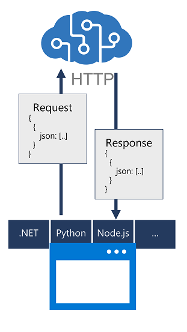

You can develop an application that uses cognitive services using REST interfaces, but it is easier to build more complex solutions by using native libraries for the programming language in which you are developing the application.

Software development kits (SDKs) for common programming languages abstract the REST interfaces for most cognitive services. SDK availability varies by individual cognitive services, but for most services there is an SDK for languages such as:

- Microsoft C# (.NET Core)
- Python
- JavaScript (Node.js)
- Go
- Java

Each SDK includes packages that you can install in order to use service-specific libraries in your code, and online documentation to help you determine the appropriate classes, methods, and parameters used to work with the service.
