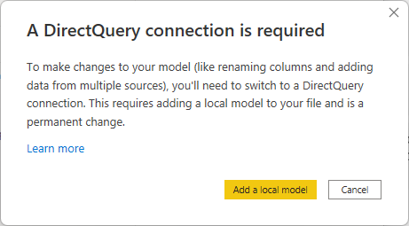
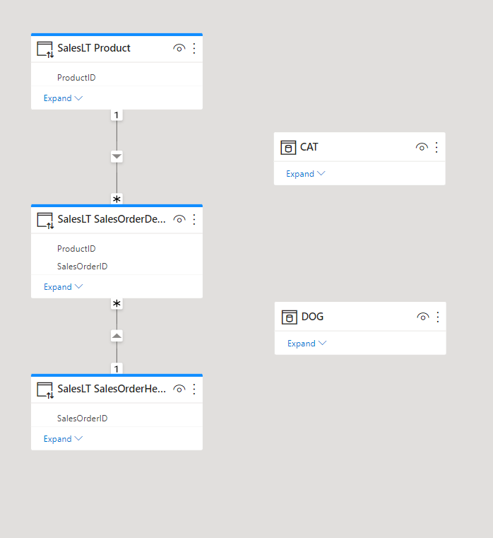

When you were first introduced to Power BI, you probably learned how to get data from various sources such as SQL Server databases, Excel files, and even text files. Creating the same or similar dataset for each report is tedious work. Further, if others also want to develop reports on that exact dataset, what's your process for sharing?

## Create reusable core assets

Assets can mean datasets, dataflows, reports, and dashboards. We'll most commonly mean datasets in this module. In our example above, you spent precious time curating the perfect dataset, and now you can share and reuse it. Before creating visuals, publish the file to Power BI service and effectively create a "core dataset".

Next time someone needs to create a report on that dataset, they can connect to a Power BI dataset from Power BI Desktop. If you publish to a shared location, it allows peers to use the same dataset. A single shared dataset protects data integrity. This trustworthy dataset also prevents orphaned datasets when someone recreates a report without deleting the earlier copies. As an enterprise data analyst, it's your responsibility to be a good data steward to encourage the democratization of data rather than disparate copies of data with questionable quality.

## Create specialized datasets

In our introduction example, we recognized the need to reduce report size and provide targeted reports across regions. To meet these goals, we create "specialized datasets". Consider creating a new dataset with the specific regional data, instead of creating a single report with global data and filtering or using row-level security to limit what regional data users can see.

To create a specialized dataset, open a new Power BI Desktop instance and connect to the core dataset. You're now connected live to that dataset, which doesn't allow any changes to the model, but you can filter and visualize data. To make changes to the model, such as adding a regional data source, you must enable the preview feature, [Direct-query datasets](/power-bi/connect-data/desktop-directquery-datasets-azure-analysis-services).

Once this feature is enabled, you'll need to switch to a DirectQuery connection, and can add more direct query or import connections.

Now, you're able to extend the model with the "Make changes to the model" option. You can see below where there are the three SalesLT tables from the core-dataset, then there are two other tables without relationships to any other tables yet.

We'll provide an exercise at the end of this module to help you visualize this concept more.

## Promote and certify datasets

Now that we're going to maintain and share our core dataset, we need to let people know it exists. Endorsement makes it easier for users to find high-quality content they need.

You can currently endorse:

* Datasets
* Dataflow
* Reports
* Apps

**Promotion** allows you to highlight content you believe is valuable and ready for others to use. To promote content, you need write permissions in the workspace.

**Certification** is a more rigorous process. Because certified content is being highly regarded, first a Power BI administrator enables certification, specify information about how content can be certified, and identify reviewers who can certify content. If your Power BI administrator has allowed certifiable content, you'll either have to follow the steps to certification, or you may be granted permissions to directly certify content.

To promote or certify content, you need to:

* Navigate to workspace
* Open *settings* for content
* Expand *Endorsement and discovery* section
* Select *Promoted* or *Certified*

See a screenshot below of the Endorsement section, with Promoted and Make discoverable selected. Notice that Certified option is greyed out. If you follow the link, *"How do I get my dataset certified?"* in the Certified option, you'll see the documentation published by your Power BI administrators on how to attain certification. 

There's also a *Make discoverable* option that allows users to find this content by name, tables, columns, etc. 

> [!NOTE]
> Full details about Endorsement can be found at the [Power BI service Endorsement overview](/power-bi/collaborate-share/service-endorsement-overview).
