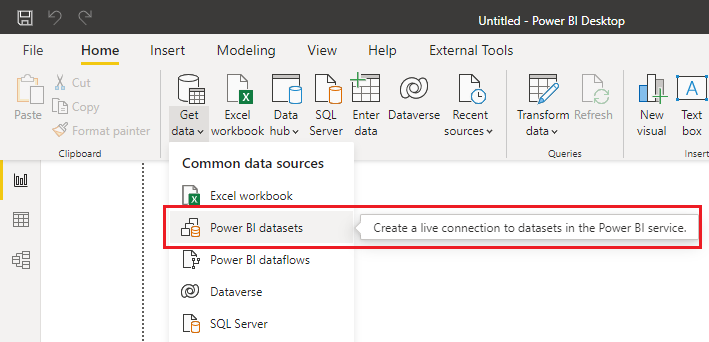
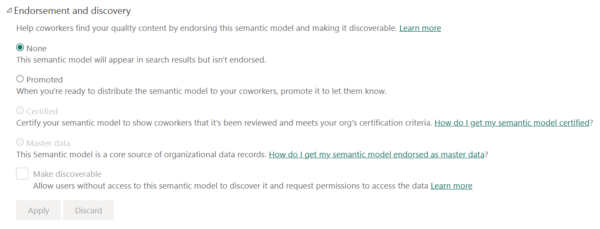

When you were first introduced to Power BI, you probably learned how to get data from various sources such as SQL Server databases, Excel files, and even text files. While you may have combined all of those files in your first attempt at a Power BI report, it's a lot of work to repeat every time you want to connect to that exact dataset you created. Further, if others also want to develop reports on that exact dataset, what's your process for sharing?

## Create reusable core assets

Assets can mean datasets, dataflows, reports, and dashboards. We'll most commonly mean datasets in this module. In our example above, after you spent precious time curating the perfect dataset, you should reuse and share it. Before creating visuals, publish the file to Power BI service and effectively create a "core" dataset.

Now you open a new Power BI Desktop instance, connect to a Power BI dataset, and choose your new dataset. If you publish to a shared location, your peers can build off that same shared dataset as well. It also helps enforce data integrity by using the dataset as a single source of truth instead of having everyone creating datasets, potentially making errors, and multiplying copies of data across the organization. Even worse, we all know someone who created something and then created a second copy when they need to make updates, leaving the first copy orphaned and undeleted. Power BI is about the democratization of data however, good data stewards limit how many datasets are created for data sources and manage a trustworthy dataset.

## Create specialized datasets

In our introduction example, we recognized the need to reduce report size and provide targeted reports across regions. To meet these goals, we create specialized datasets. Instead of creating a single report with global data and adding filtering or row-level security to limit what regional data users can see, consider creating a new dataset with the specific regional data.

To create a specialized dataset, open a new Power BI Desktop instance, connect to the core dataset, then filter in the Power Query Editor as needed. Just like you did with the core dataset, publish this new specialized dataset to a workspace, and share that dataset for report development.

We'll provide an exercise at the end of this module to help you visualize this concept more.

## Promote and certify datasets

Now that we're going to maintain and share our core dataset, we need to let people know it exists. Endorsement makes it easier for users to find high-quality content they need.

You can currently endorse:

* Datasets
* Dataflow
* Reports
* Apps

**Promotion** allows you to highlight content you believe is valuable and ready for others to use. To promote content, you need write permissions in the workspace.

**Certification** is a more rigorous process. Because certified content is being highly regarded, first a Power BI administrator enables certification, specify information about how content can be certified, and identify reviewers who can certify content. If your Power BI administrator has allowed certifiable content, you'll either have to follow the steps to certification, or you may be granted permissions to directly certify content.

> [!TIP]
> You will know if you can certify directly if the *Certified* option is not greyed out.

To promote or certify content, you need to:

* Navigate to workspace
* Open *settings* for content
* Expand *Endorsement and discovery* section
* Select *Promoted* or *Certified*

> [!NOTE]
> There is also a *Make discoverable* option that allows users to find this content by name, tables, columns, etc.

See a screenshot below of the Endorsement section, with Promoted and Make discoverable selected. Certified is greyed out and there's a link to learn *How do I get my dataset certified?*.

> [!INFO]
> Full details about Endorsement can be found [at the Power BI service Endorsement overview](/power-bi/collaborate-share/service-endorsement-overview).
