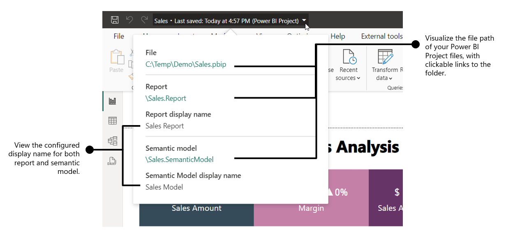
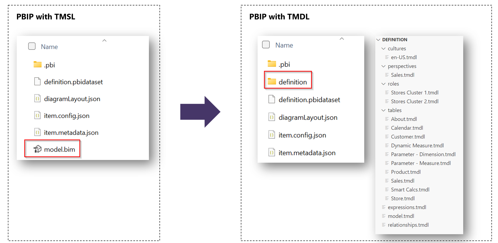
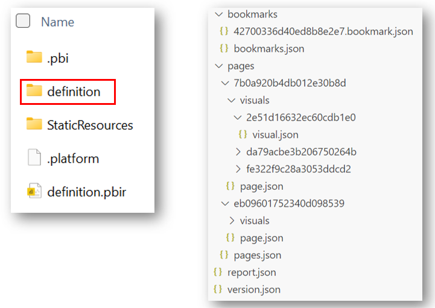
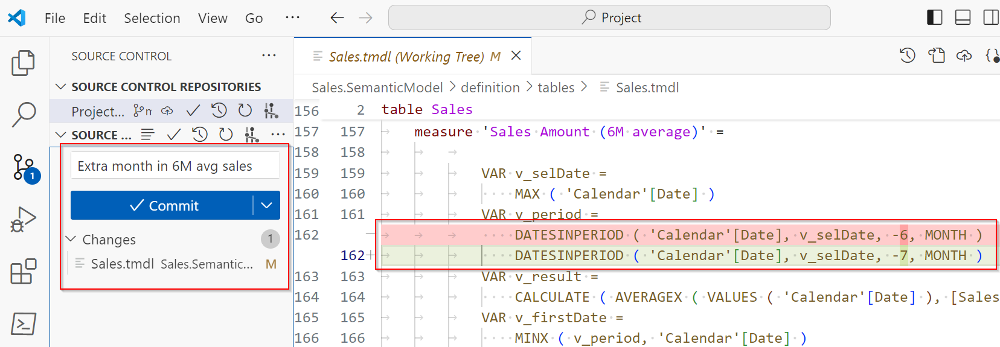
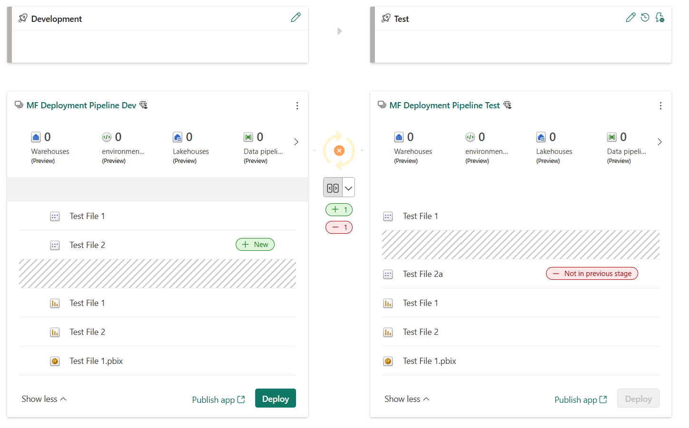
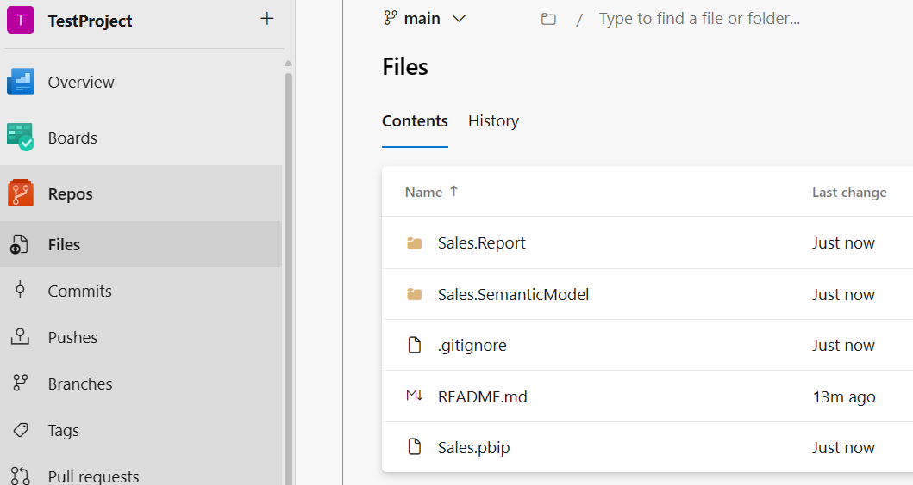

Lifecycle management refers to the process of tracking and managing each stage of the development process. The Power BI report development process includes creating reusable assets and deciding how to handle changes to your semantic models and reports.

Traditional Power BI *.pbix* files store the semantic model and report in a single binary file, which doesn't allow granular tracking with source control. Power BI Project files, in combination with code editors and source control systems, allow you to track versions and manage code deployments as part of a Continuous Integration Continuous Delivery (CI/CD) system.

## Create a Power BI Project file

Power BI Project files store your semantic model and report in individual plain text files for use with code editors and source control solutions. There are many benefits to using Power BI projects to track and manage your report development:

- **Text editor support**: Item definition files are JSON formatted text files containing semantic model and report metadata.
- **Source control**: Power BI semantic model and report item definitions can be stored in a source control system, like Git.

These files can be used in a code editor like Microsoft Visual Studio Code (VS Code) to support Git integration. When you save your work as a Power BI Project (*.pbip*), the report and semantic model item definitions are saved as individual plain text files in a simple, intuitive folder structure.

## Power BI Project structure

When you create a Power BI Project, all of the metadata is stored in flat files. As shown in the earlier screenshot, there are separate folders for the **semantic model** and the **report**. This separation might feel familiar if you've published reports to the Power BI service before.

- The **semantic model** folder stores all of the data stored in a semantic model, including relationships, measures, and transformations.
- The **report** folder stores all of the data for the visuals and report pages, including custom visuals and mobile layout.

Existing Projects use TMSL (Tabular Model Scripting Language), which stores the data in a single *model.bim* file. You can enable and upgrade your Project to use TMDL (Tabular Model Definition Language), which stores the metadata in individual files. Power BI Projects are *in preview* and you might have a different folder structure if you don't have all preview features enabled.

The following screenshot shows the definition folder within the Project Report folder. The definition folder is available with the **Enhanced .pbir (Power BI Report) format**.

> [!NOTE]
> See the [Power BI Desktop projects (PREVIEW)](/power-bi/developer/projects/projects-overview) documentation for full details and considerations and limitations.

## Track and manage with Projects

Power BI .pbix files are binary and changes aren't visible in code editors. When changes are made to a file, you don't know if it's in the semantic model or visuals without reviewing the entire report and semantic model. When you use a Power BI .pbip file, you can continue to develop your report in Power BI Desktop and have a trackable record to review if a report isn't behaving as expected.

Let's expand on our example with a core semantic model and specialized semantic models for different regions. Consider your team stores Power BI files in OneDrive to have version control. You were informed that one of the custom regional reports isn't displaying accurate numbers and begin to investigate. You need to open either an older copy of the file or one of the other regional files and review them entirely to find the difference.

In comparison, if you have a Power BI Project and also use source control, such as Git, then you can review changes through previous pull requests to quickly see the change. Once you identify the change, you can compare it to the other file and make the necessary fix.

In the following screenshot, you can see a difference in the measure where a single value 6 was changed to 7 by mistake. This example uses VS Code and Git to see the difference in the code and version history of previous changes.

## Continuous Integration and Continuous Delivery (CI/CD)

Many organizations use CI/CD systems to propose and validate changes during development before releasing them to production. A common system design has different stages to perform checks between Development and Test environments before deploying to Production.

In the Power BI service, you can use Deployment pipelines to create different workspaces that match your stages. Once you have your pipeline and workspaces configured, when you make changes in Development, you can see the difference between Test before deploying the changes. The following screenshot shows how the changes between the stages are visually represented.

> [!NOTE]
> Deployment pipelines require each workspace to be assigned to a Premium or Fabric capacity. You can also track differences between other Fabric items in workspaces, if you are using them.

CI/CD systems also typically use source control to track and manage changes. This version control with Power BI Project files is possible through **Git integration**. Git integration in VS Code enables developers working with Power BI Desktop projects to streamline development processes, source control, and collaboration with Git repositories. With Git integration, you can:

- Backup and version your work.
- Revert to previous states.
- Collaborate with others or work alone using Git branches.
- Use the capabilities of familiar source control tools, like Azure DevOps.

In the following screenshot, you can see the Azure DevOps repo (repository) with files in the main branch. Developers can clone this repo, create their own development branches, and then create pull requests to merge into main. This development process allows collaboration on the same content without losing work.

### Considerations

This unit provides an overview of what's possible using Power BI Projects and how to combine them with Git integration and Deployment pipelines. Each organization has different requirements and you can use this content to help understand how to use these tools for your needs.

> [!TIP]
> See the [Introduction to the CI/CD process as part of the ALM cycle in Microsoft Fabric](/fabric/cicd/cicd-overview) documentation for in-depth scenarios and possibilities.
