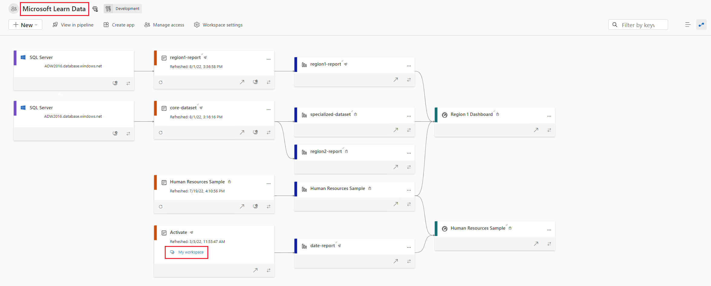

We covered how to create core and specialized Power BI semantic models and templates to distribute within the organization. Now report developers can connect directly to those curated semantic models, but might be unsure which semantic models and other items should be used. Chained semantic models can also present a problem if report developers don't know what data source or core semantic model relates to a report. You can solve both of these issues in the Power BI service with Endorsement and Lineage view.

## Endorse semantic models

Users can discover other semantic models in the Power BI service and build their own reports. You can use this feature and make it easier for collaboration through **Endorsement**. Endorsement helps users find high-quality content they need by identifying the contest as verified and trustworthy.

Items can receive one of three endorsement badges - Promoted, Certified, or Master data:

- **Promoted** means that the item creators think the item is ready for sharing and reuse. Any user with write permissions on an item can promote it.

- **Certified** means that an organization-authorized reviewer has certified that the item meets the organization's quality standards, can be regarded as reliable and authoritative, and is ready for use across the organization.

- **Master data** means the data in the item is a core source of organizational data. The master data designation might be used to indicate a single source of truth for certain kinds of data, such as product codes or customer lists.

See the following screenshot of the Endorsement and discovery section in the semantic model settings. For both Certified and Master data, there are links to help you know how to get your data certified or endorsed as master data. These links are configured by an administrator for your organization. Also note the option to make the item discoverable or not.

:::image type="content" source="../media/power-bi-request-content-certification.png" alt-text="Screenshot of the semantic model Endorsement and discovery settings as previously described.":::

> [!NOTE]
> Power BI is also an experience in Microsoft Fabric and endorsement can be applied to all Power BI and Fabric items, except Power BI Dashboards. See more in the [Endorsement overview](/fabric/governance/endorsement-overview) documentation.

## Explore with Lineage view

Lineage view in a Power BI workspace allows you to view dependencies between the different workspace items. An example would be seeing underlying data sources for a semantic model and the final report all connected by lines.

In the following screenshot, we explore a single workspace in lineage view. From left to right, you see different data sources, the semantic model, and finally the report.

- The data sources include an HTML file, two different Text/CSV files, and a SQL Server.
- The Sales Analysis semantic model comprises all of the data sources.
- The Sales Analysis report is built from the Sales Analysis semantic model.

Notice how the Sales Analysis report has a badge with a checkmark in it, which indicates that the report is *Promoted*.

Lineage view allows you to quickly identify dependencies across a workspace for your assets. This view gives you easy administration especially when you have many items in a single workspace. Reviewing lineage view is also sometimes known as *impact analysis* and is a form of data governance.
