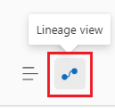
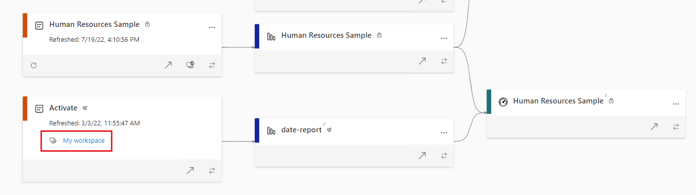

In the last unit, we created core and specialized Power BI datasets to distribute within the organization. Now report developers can connect directly to those curated datasets instead of creating new, but how do you know which dataset is being used for a report once it's published to Power BI service. Introducing *lineage view*.

## Explore with lineage view

Navigate to a workspace in Power BI service and in the top-right corner of the menu bar, there are two icons:

- List view is three horizontal lines stacked (*also known as the hamburger icon*).
- Lineage view is two circles connected by a line.

This view shows how reports and dashboards are dependent on specific datasets, represented by lines from datasets to reports and dashboards.

In the image below, we explore a single workspace *Microsoft Learn Data* in lineage view. This workspace has multiple data sources, datasets, reports, and dashboards. Even one report has a dataset in a different workspace. From left to right, you see the SQL Server data source, then datasets, then reports, and finally dashboards.

- At the top-left, there are two SQL Server data source items representing the same Azure SQL database.
- Two datasets are connected to the data sources, region1-report and core-dataset.
  - The region1-report only has a single region1-report associated with it. *This indicates that someone developed a report and dataset entirely in Power BI Desktop.*
  - The core-dataset has two related reports, specialized-report and region2-report, each flowing to the Region 1 Dashboard on the far right.

> [!NOTE]
> Two separate SQL Server data sources are represented because the region1-report dataset and report was created separately from the core-dataset dataset.
>
> There's no "core-dataset" report because it was deleted. By default, when you publish from Power BI Desktop, even if you have no visuals, a report file will be created. Since this blank isn't relevant, it was deleted.

- Further down the image, we see two more datasets without their data sources; Human Resources Sample and Activate. These datasets each connect to separate reports.
  - Take note that the Activate dataset lives in the *My workspace*, not the one we're actively exploring.
- Both of these reports are connected to another Human Resources Sample dashboard.
  - The Human Resources Sample report connects to our Region 1 Dashboard.

In summary, when using lineage view, you can quickly identify dependencies across a workspace for your assets. This view gives you easy administration especially when you have many items in a single workspace.

> [!TIP]
> While we are able to see datasets in other workspaces, lineage view only applies to Power BI service. For better understanding of your data estate relationships, refer to the module on **Microsoft/Azure Purview (what's it called? need a link).**