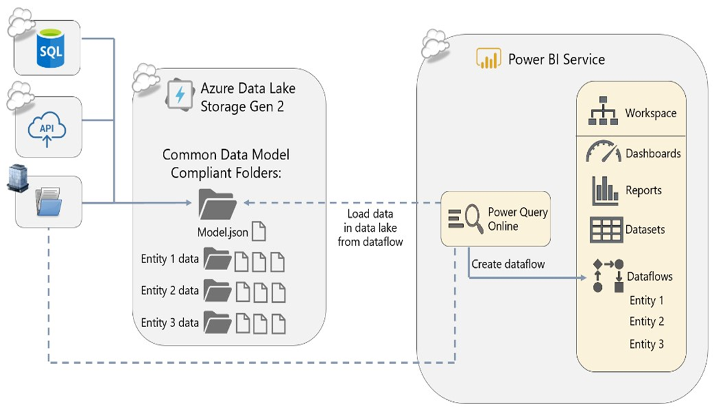

Power BI dataflows enable you to build reusable data tables in a workspace using Power Query Online, and share them for use in other reports and with other users for reuse in other workspaces. Dataflows are objects in a workspace alongside datasets, dashboards, reports, and workbooks. When a Power BI dataflow is refreshed, behind the scenes it loads its data into files located in a data lake, Azure Data Lake Storage Gen 2 (ADLS Gen 2).

> [!div class="mx-imgBorder"]
> 

Power BI dataflows should be used in Premium capacity for enterprise solutions, to take advantage of features like advanced compute, incremental refresh, and linked and computed entities.

> [!NOTE]
> Dataflows are supported for Power BI Pro, Premium Per User (PPU), and Power BI Premium users. Learn more about [Premium-only features of dataflows](/power-bi/transform-model/dataflows/dataflows-premium-features).

Data used with Power BI is stored in internal storage provided by Power BI by default. With the integration of dataflows and Azure Data Lake Storage Gen 2 (ADLS Gen2), you can [store your dataflows in your organization's Azure Data Lake Storage Gen2 account](/power-bi/transform-model/dataflows/dataflows-azure-data-lake-storage-integration). This essentially allows you to "bring your own storage" to Power BI dataflows, and establish a connection at the tenant or workspace level.

## Why use dataflows?

Dataflows were designed to promote reusable ETL logic that prevents the need to create additional connections to your data source.

Dataflows are a great choice for you if:
- There's no data warehouse in your organization.
- You want to extend a core dataset or data in the data warehouse with consistent data.
- Self service users need frequent access to an up-to-date subset of data from the data warehouse without having access to the data warehouse itself.
- You have slower data sources.
  - Dataflows extract data once and reuse it multiple times, which can reduce the overall data refresh time for slower data sources.
  - Computed entities may be faster than referencing queries with the enhanced compute engine.
- You have chargeable data sources.
  - Dataflows can **reduce costs** associated with data refresh if you're getting data from chargeable data sources.
  - Dataflows increase control and reduce the number of calls to the source system.
  - Datasets refresh against dataflows without affecting source systems.
- You have different versions of datasets floating around your organization. Dataflows **increase consistency** between datasets.
  - Increased structural consistency by reducing the chance that users will prepare data differently
  - Increased temporal consistency by having a single set of data extracted from source systems at a single point in time
  - Shared tables that have no source, such as a standard date dimension, can be standardized across your organization.
- You want to **reduce or hide the complexity** of data sources.
  - You can expose common data entities for larger groups of analysts that have already been transformed and simplified.
  - You can also partition data horizontally, using multiple data flows. For example, upstream dataflows contain all data and are available only to a small group of users. Downstream dataflows then contain curated subsets of data, and can be made available to members of appropriate security groups.

## Benefits and limitations

While there are notable benefits to using dataflows in your dataset design, there are also a few limitations that users should keep in mind.

Benefits:
- Reduced load on database queries.
- Reduced number of users accessing source data.
- Provides single version of properly structured data for analysts to build reports from.

Limitations:
- Not a replacement for a data warehouse.
- Row-level security isn't supported.
- If not using dataflows in Premium capacity, performance can be an issue.

> [!IMPORTANT]
> See [Dataflow considerations and limitations](/power-bi/transform-model/dataflows/dataflows-features-limitations) for a complete list of considerations and limitations.

## Dataflows in Power BI Premium

Power BI Premium was designed for enterprise deployments. Dataflow features available in premium offer substantial performance benefits and include the use of:
- Enhanced compute engine
- DirectQuery
- Computed entities
- Linked entities
- Incremental refresh

### Optimize dataflows using the enhanced compute engine
The enhanced compute engine in Power BI dataflows enables you to optimize the use of dataflows by:
- Speeding up refresh operations when computed entities or linked entities are involved (for example, performing *joins*, *distinct*, *filters*, and *group by*).
- Enabling DirectQuery connectivity over dataflows using the compute engine.
- Achieve improved performance in the transformation steps of dataflows when entities are cached within the compute engine.

> [!TIP]
> Learn more about [Power BI Premium features of dataflows](/power-bi/transform-model/dataflows/dataflows-premium-features).

## Distinction between dataflows

Perhaps you've also heard of Azure Data Factory dataflows and you're wondering what the best type of dataflow is to use in your scenario.

Power BI dataflows and Azure Data Factory (ADF) wrangling dataflows are often considered to do the same thing: extract data from source systems, transform data, and load the transformed data into a destination. They're both powered by Power Query online, but there are differences in these two types of dataflows. You can implement a solution that works with a combination of the two.

### When to use ADF wrangling dataflows or Power BI dataflows

Data transformation should always be done as close to the source as possible. If your analytics solution includes Azure Data Factory and you have the skills to implement transformations upstream of Power BI, you should. 

| Features                   | Power BI dataflows                                                         | Data Factory wrangling dataflows         |
|----------------------------|----------------------------------------------------------------------------|------------------------------------------|
| Destinations               | Dataverse or Azure Data Lake Storage                                       | Many destinations                        |
| Power Query transformation | All Power Query functions are supported                                    | A limited set of functions is supported |
| Sources                    | Many sources are supported                                                 | Only a few sources                       |
| Scalability                | Depends on the Premium capacity and the use of the enhanced compute engine | Highly scalable                          |

> [!TIP]
> Learn more about how [Microsoft Power Platform dataflows and Azure Data Factory wrangling dataflows relate to each other](/power-query/dataflows/power-platform-dataflows-and-adf-wrangling-data-flows).
