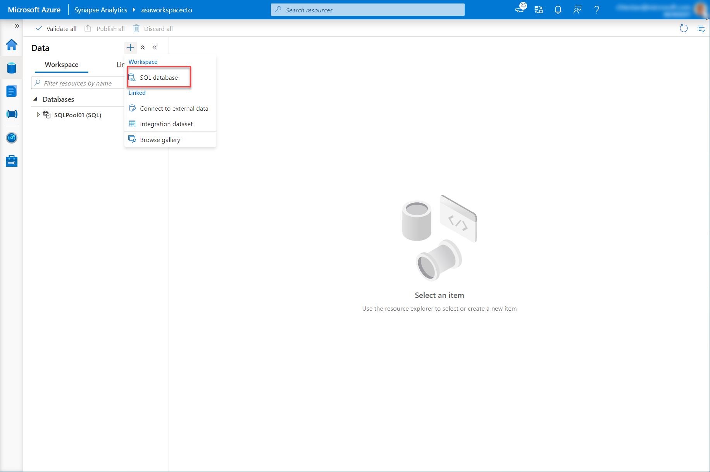
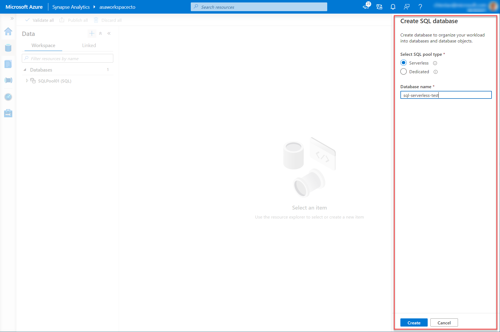

Once you are familiar with your data, you can define the metadata objects inside of serverless SQL pool so the clients connecting to it can discover them and query the data in the lake. The first metadata object you will create is a database.

To create a new database as an Azure Synapse serverless SQL pool, go to the **Data** hub, click **+** button and select **Synapse SQL database**.  
  


Choose one of the following two pool type options: 

- Built-in (serverless SQL pool) 
- Dedicated SQL pool (like former SQL DW pool)  

Select **Built-in** if it isn’t already selected, choose a **database name** and press the button **Create**. 
  



In addition to using the Synapse Studio user interface to create a database, you can execute the following Transact-SQL statement in serverless SQL pool: 

```sql
CREATE DATABASE [YourDatabaseName] 
```

