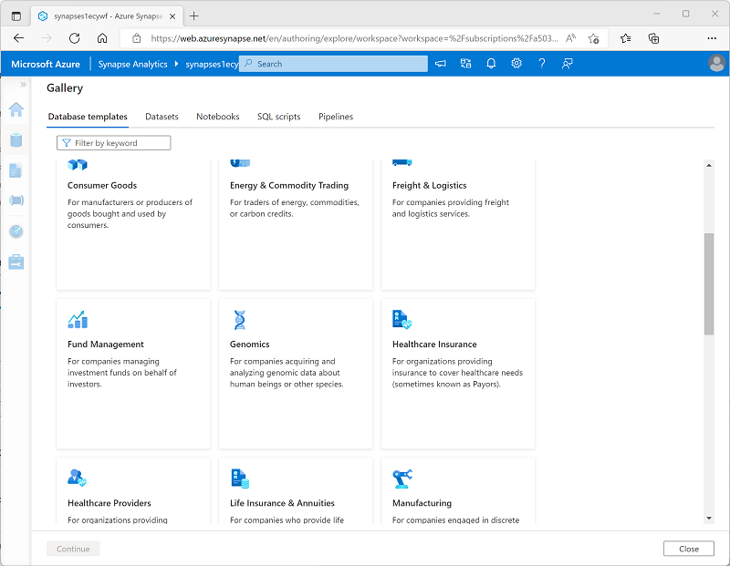

You can create a Lake database from an empty schema, to which you add definitons for tables and the relationships between them. However, Azure Synapse Analytics provides a comprehensive collection of database templates that reflect common schemas found in multiple business scenarios; including:

- Agriculture
- Automotive
- Banking
- Consumer goods
- Energy and commodity trading
- Freight and logistics
- Fund management
- Healthcare insurance
- Healthcare provider
- Manufacturing
- Retail
- *and many others...*

You can use one of the enterprise database templates as the starting point for creating your lake database, or you can start with a blank schema and add and modify tables from the templates as required.
