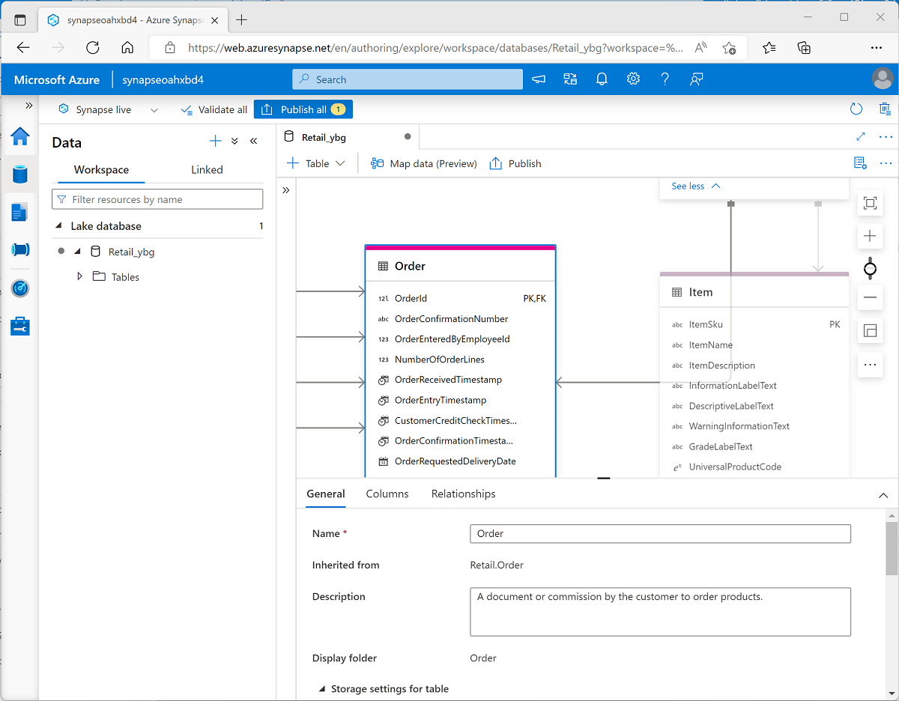

You can create a lake database using the lake database designer in Azure Synapse Studio. Start by adding a new lake database on the **Data** page, selecting a template from the gallery or starting with a blank lake database; and then add and customize tables using the visual database designer interface.

As you create each table, you can specify the type and location of the files you want to use to store the underlying data, or you can create a table from existing files that are already in the data lake. In most cases, it's advisable to store all of the database files in a consistent format within the same root folder in the data lake.

## Database designer

The database designer interface in Azure Synapse Studio provides a drag-and-drop surface on which you can edit the tables in your database and the relationships between them.

Using the database designer, you can define the schema for your database by adding or removing tables and:

- Specifying the name and storage settings for each table.
- Specifying the names, key usage, nullability, and data types for each column.
- Defining relationships between key columns in tables.

When your database schema is ready for use, you can publish the database and start using it.
