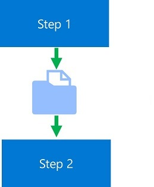

Often, a pipeline line includes at least one step that depends on the output of a preceding step. For example, you might use a step that runs a python script to preprocess some data, which must then be used in a subsequent step to train a model.

## The OutputFileDatasetConfig Object

The **OutputFileDatasetConfig** object is a special kind of dataset that:

- References a location in a datastore for interim storage of data.
- Creates a data dependency between pipeline steps.

You can view a **OutputFileDatasetConfig** object as an intermediary store for data that must be passed from a step to a subsequent step.



## OutputFileDatasetConfig Step Inputs and Outputs

To use a **OutputFileDatasetConfig** object to pass data between steps, you must:

1. Define a named **OutputFileDatasetConfig** object that references a location in a datastore. If no explicit datastore is specified, the default datastore is used.
2. Pass the **OutputFileDatasetConfig** object as a script argument in steps that run scripts.
3. Include code in those scripts to write to the **OutputFileDatasetConfig** argument as an output or read it as an input.

For example, the following code defines a **OutputFileDatasetConfig** object that for the preprocessed data that must be passed between the steps.

```python
from azureml.data import OutputFileDatasetConfig
from azureml.pipeline.steps import PythonScriptStep, EstimatorStep

# Get a dataset for the initial data
raw_ds = Dataset.get_by_name(ws, 'raw_dataset')

# Define a PipelineData object to pass data between steps
data_store = ws.get_default_datastore()
prepped_data = OutputFileDatasetConfig('prepped')

# Step to run a Python script
step1 = PythonScriptStep(name = 'prepare data',
                         source_directory = 'scripts',
                         script_name = 'data_prep.py',
                         compute_target = 'aml-cluster',
                         # Script arguments include PipelineData
                         arguments = ['--raw-ds', raw_ds.as_named_input('raw_data'),
                                      '--out_folder', prepped_data])

# Step to run an estimator
step2 = PythonScriptStep(name = 'train model',
                         source_directory = 'scripts',
                         script_name = 'train_model.py',
                         compute_target = 'aml-cluster',
                         # Pass as script argument
                         arguments=['--training-data', prepped_data.as_input()])
```

In the scripts themselves, you can obtain a reference to the **OutputFileDatasetConfig** object from the script argument, and use it like a local folder.

```python
# code in data_prep.py
from azureml.core import Run
import argparse
import os

# Get the experiment run context
run = Run.get_context()

# Get arguments
parser = argparse.ArgumentParser()
parser.add_argument('--raw-ds', type=str, dest='raw_dataset_id')
parser.add_argument('--out_folder', type=str, dest='folder')
args = parser.parse_args()
output_folder = args.folder

# Get input dataset as dataframe
raw_df = run.input_datasets['raw_data'].to_pandas_dataframe()

# code to prep data (in this case, just select specific columns)
prepped_df = raw_df[['col1', 'col2', 'col3']]

# Save prepped data to the PipelineData location
os.makedirs(output_folder, exist_ok=True)
output_path = os.path.join(output_folder, 'prepped_data.csv')
prepped_df.to_csv(output_path)
```
