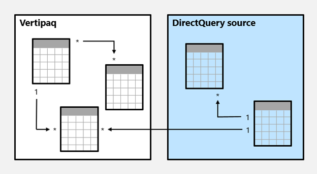
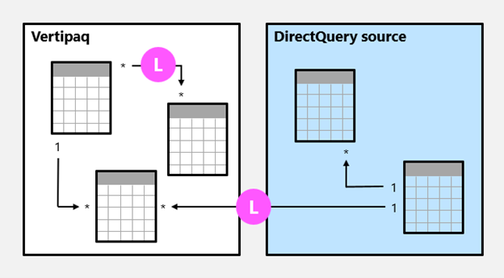

Model relationships, from an evaluation perspective, are classified as either regular or limited. It's not a configurable relationship property. It’s inferred from the cardinality type and the data source of the two related tables. It's important to understand the evaluation type because there may be performance implications or consequences should data integrity be compromised. These implications and integrity consequences are described in this unit.

First, some modeling theory is required to fully understand relationship evaluations.

An import or DirectQuery model sources all of its data from either the VertiPaq cache or the source database. In both instances, Power BI is able to determine that a "one" side of a relationship exists.

A composite model, however, can comprise tables using different storage modes (import, DirectQuery, or dual), or multiple DirectQuery sources. Each source, including the VertiPaq cache of imported data, is considered to be a source group. Model relationships can then be classified as intra source group or inter/cross source group. An intra source group relationship is one that relates two tables within a source group, while an inter/cross source group relationship relates tables across two source groups. Relationships in import or DirectQuery models are always intra source group.

Here's an example of a composite model.

In this example, the composite model consists of two source groups: a VertiPaq source group and a DirectQuery source group. The VertiPaq source group contains three tables, and the DirectQuery source group contains two tables. One cross source group relationship exists to relate a table in the Vertipaq source group to a table in the DirectQuery source group.

## Regular relationships

A model relationship is regular when the query engine can determine the "one" side of relationship. It has confirmation that the "one" side column contains unique values. All one-to-many intra source group relationships are regular relationships.

In the following example, there are two regular relationships, both marked as **R**. Relationships include the one-to-many relationship contained within the VertiPaq source group, and the one-to-many relationship contained within the DirectQuery source group.

For import models, where all data is stored in the VertiPaq cache, Power BI creates a data structure for each regular relationship at data refresh time. The data structures consist of indexed mappings of all column-to-column values, and their purpose is to accelerate joining tables at query time.

At query time, regular relationships permit table expansion to happen. Table expansion results in the creation of a virtual table by including the native columns of the base table and then expanding into related tables. For import tables, table expansion is done in the query engine; for DirectQuery tables it’s done in the native query that’s sent to the source database (as long as the **Assume referential integrity** property isn't enabled). The query engine then acts upon the expanded table, applying filters and grouping by the values in the expanded table columns.

> [!NOTE]
> Inactive relationships are expanded also, even when the relationship isn't used by a calculation. Bi-directional relationships have no impact on table expansion.

For one-to-many relationships, table expansion takes place from the "many" to the "one" sides by using `LEFT OUTER JOIN` semantics. When a matching value from the "many" to the "one" side doesn't exist, a blank virtual row is added to the "one" side table. This behavior applies only to [regular relationships](/power-bi/transform-model/desktop-relationships-understand), not to [limited relationships](/power-bi/transform-model/desktop-relationships-understand).

Table expansion also occurs for one-to-one intra source group relationships, but by using `FULL OUTER JOIN` semantics. This join type ensures that blank virtual rows are added on either side, when necessary.

Blank virtual rows are effectively unknown members. Unknown members represent referential integrity violations where the "many" side value has no corresponding "one" side value. Ideally these blanks shouldn’t exist. They can be eliminated by cleansing or repairing the source data.

Here’s how table expansion works with an animated example.

In this example, the model consists of three tables: **Category**, **Product**, and **Sales**. The **Category** table relates to the **Product** table with a one-to-many relationship, and the **Product** table relates to the **Sales** table with a one-to-many relationship. The **Category** table contains two rows, the **Product** table contains three rows, and the **Sales** tables contains five rows. 

There are matching values on both sides of all relationships meaning that there aren’t any referential integrity violations. A query-time expanded table is revealed. The table consists of the columns from all three tables. It's effectively a denormalized perspective of the data contained in the three tables. A new row is added to the **Sales** table, and it has a production identifier value (9) that has no matching value in the **Product** table. It's a referential integrity violation. In the expanded table, the new row has (Blank) values for the **Category** and **Product** table columns.

## Limited relationships

A model relationship is limited when there's no guaranteed "one" side. A limited relationship can happen for two reasons:

- The relationship uses a many-to-many cardinality type (even if one or both columns contain unique values).

- The relationship is cross source group (which can only ever be the case for composite models).

In the following example, there are two limited relationships, both marked as **L**. The two relationships include the many-to-many relationship contained within the VertiPaq source group, and the one-to-many cross source group relationship.

For import models, data structures are never created for limited relationships. In that case, Power BI resolves table joins at query time.

Table expansion never occurs for limited relationships. Table joins are achieved by using `INNER JOIN` semantics, and for this reason, blank virtual rows aren’t added to compensate for referential integrity violations.

There are additional restrictions related to limited relationships:

- The `RELATED` DAX function can't be used to retrieve the "one" side column values.

- Enforcing RLS has topology restrictions.

> [!NOTE]
> In Power BI Desktop model view, it's not always possible to determine whether a model relationship is regular or limited. A many-to-many relationship will always be limited, as will be a one-to-many relationship when it's a cross source group relationship. To determine whether it's a cross source group relationship, you'll need to inspect the table storage modes and data sources to arrive at the correct determination.

## Precedence rules

Bi-directional relationships can introduce multiple, and therefore ambiguous, filter propagation paths between model tables. The following list presents precedence rules that Power BI uses for ambiguity detection and path resolution:

1. Many-to-one and one-to-one relationships, including limited relationships

2. Many-to-many relationships

3. Bi-directional relationships, in the reverse direction (that is, from the "many" side)

## Performance preference

The following list orders filter propagation performance, from fastest to slowest performance:

1. One-to-many intra source group relationships

2. Many-to-many model relationships achieved with an intermediary table and that involve at least one bi-directional relationship

3. Many-to-many cardinality relationships

4. Cross source group relationships