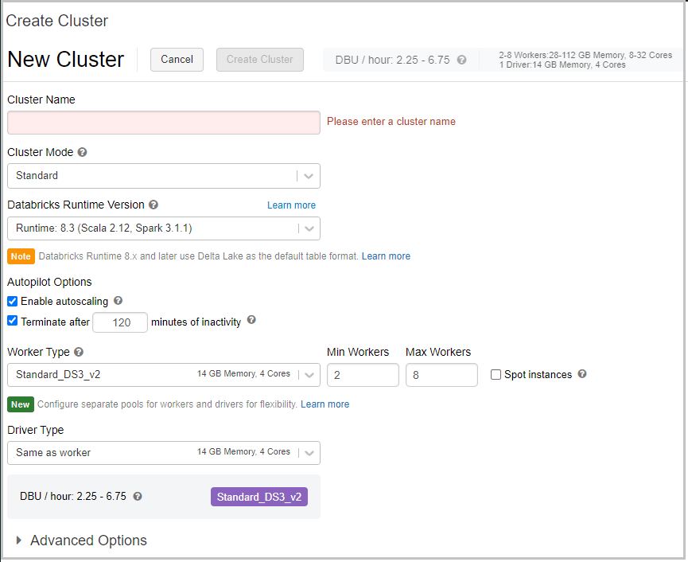

Imagine you're part of an analytics team that needs to build a new data pipeline that involves copying data from multiple sources into a data lake for processing. You use Azure Databricks to transform the data, and you want to ensure your processing occurs as soon as the data is ready. Processing the data from a notebook is just one step of the data pipeline. Your team conducted research on orchestration platforms and has decided to use Azure Data Factory, given its ability to connect to several services both on-premises and in the cloud, and to easily build data pipelines.

Your supervisor requested that you investigate the ability to execute Azure Databricks jobs from Azure Data Factory, passing in parameters used for data processing, and returning parameters used to continue the pipeline processing.

## Learning objectives

In this module, you'll:

- Create an Azure Data Factory pipeline with a Databricks activity.
- Execute a Databricks notebook with a parameter.
- Retrieve and log a parameter passed back from the notebook.
- Monitor your Data Factory pipeline.

## Prerequisites

None.

You can use Azure Data Factory to ingest data collected from different sources and coordinate processing jobs in Azure Databricks as part of your data pipeline.

## What is Azure Data Factory?

Azure Data Factory is a data ingestion and transformation service that allows you to load raw data from over 70 different on-premises or cloud sources. The ingested data can be cleaned, transformed, restructured, and loaded back into a data warehouse. After the data is in the data warehouse, it's ready to use for several analytical purposes.

Data Factory supports data workflow pipelines. These pipelines are a logical group of tasks and activities that allows end-to-end data-processing scenarios.

## Unit prerequisites

**Microsoft Azure Account**: You will need a valid and active Azure account for the Azure labs. If you do not have one, you can sign up for a [free trial](https://azure.microsoft.com/free/).

- If you are a Visual Studio Active Subscriber, you are entitled to Azure credits per month. See this [link](https://azure.microsoft.com/pricing/member-offers/msdn-benefits-details/) to find out more, including how to activate and start using your monthly Azure credit.

- If you are not a Visual Studio Subscriber, you can sign up for the FREE [Visual Studio Dev Essentials](https://www.visualstudio.com/dev-essentials/) program to create an Azure free account.

## Create the required resources

To complete this module, you will need to deploy an Azure Data Factory instance and an Azure Databricks workspace in your Azure subscription.

### Create an Azure Data Factory instance

1. Open the [Azure portal](https://portal.azure.com?azure-portal=true).

1. Under **Azure services**, select **Create a resource**. The **Create a resource** pane appears.

1. In the *Search services and marketplace* search box, search for and select *Data Factory*. The **Data Factory** pane appears.

1. Select **Create**. The **Create Data Factory** pane appears.

1. On the **Basics** tab, enter the following values for each setting.

   | Setting | Value |
   |---|---|
   | **Project details** |
   | Subscription | Select the subscription you're using for this workshop. |
   | Resource group | Select the **Create new** link, and enter *databricks-learning-paths*, and select **OK**. |
   | **Instance details** |
   | Region | From the dropdown list, select any available location. |
   | Name | Enter a unique name for your app. For example, you could use *\<yourname\>;databricks*. |
   | Version | Select **V2**. |

1. Select **Next: Git configuration**.

1. On the **Git configuration** tab, check the **Configure Git later** checkbox.

1. Select **Review + create**.

1. After validation passes, select **Create** to create your data factory.

1. When deployment completes, select **Go to resource**. Your *Data factory (V2)* pane appears.

### Deploy an Azure Databricks workspace

1. Open the [Azure portal](https://portal.azure.com?azure-portal=true).

1. In the top search box, search for and select *Azure Databricks*. The **Azure Databricks** pane appears.

1. Select **Create azure databricks service**. The **Create an Azure Databricks workspace** pane appears.

1. On the **Basics** tab, enter the following values for each setting.

   | Setting | Value |
   |---|---|
   | **Project Details** |
   | Subscription | Select the subscription in which to deploy the workspace. |
   | Resource group | Select the **Create new** link, and enter *databricks-workspace*, and select **OK**. |
   | **Instance Details** |
   | Workspace name | Enter a unique name for your app. For example, you could use *\<yourname\>;databricks-workspace*. |
   | Region | From the dropdown list, a location near you for deployment. For the list of regions supported by Azure Databricks, see [Azure services available by region](https://azure.microsoft.com/regions/services/). |
   | Pricing Tier | From the dropdown list, select **Premium (+ Role-based access controls)**. |

1. Select **Review + create**.

1. After validation succeeds, select **Create**.

1. After deployment completes, select **Go to resource**. Your *Azure Databricks * pane appears.

### Create a cluster

1. Select **Launch Workspace** to open your Azure Databricks workspace.

1. Under **Common Tasks**, select **New Cluster** to add a new cluster. The **Create Cluster** pane appears.

1. Select **Create Cluster** to add a new cluster.

    

1. In the **Cluster Name** field, enter a name for your cluster. Use your name or initials to easily differentiate your cluster from your coworkers.

1. In the **Cluster Mode** dropdown list, select **Single Node**.

1. In the **Databricks Runtime Version** field, select **Runtime: 7.3 LTS (Scala 2.12, Spark 3.0.1)**.

1. Under **Autopilot Options**, leave the **Terminate after** box *checked*, and in the text box, enter `45`.

1. In the **Node Type** field, select **Standard_DS3_v2**.

1. In the top menu bar, select **Create Cluster**. Wait for the *Clusters* pane to appear containing your cluster.
