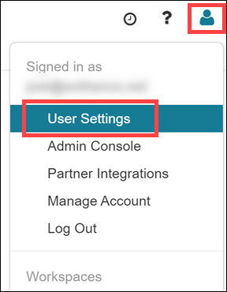
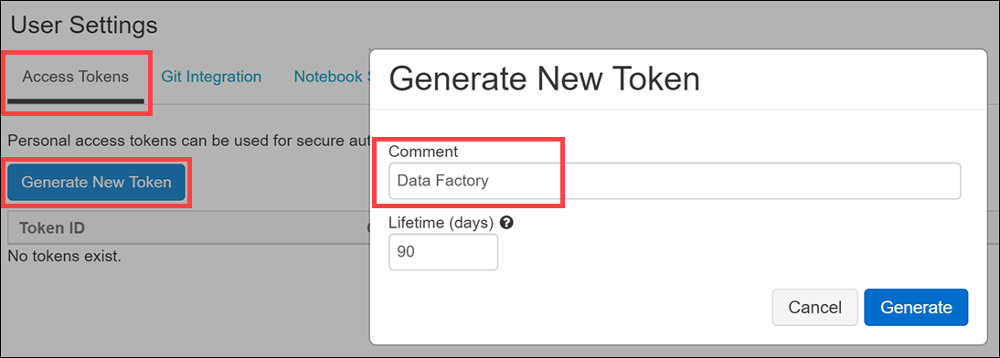
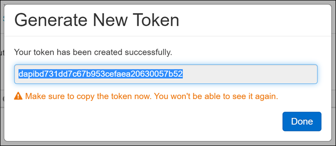
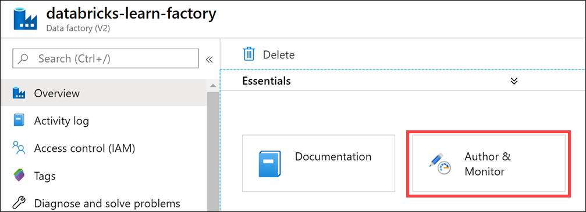
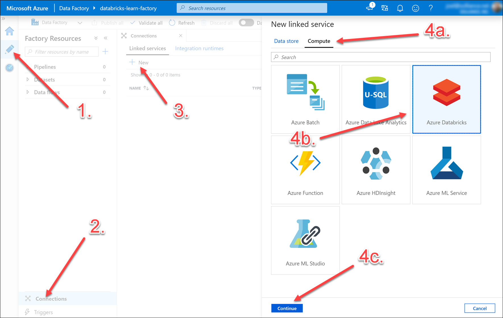
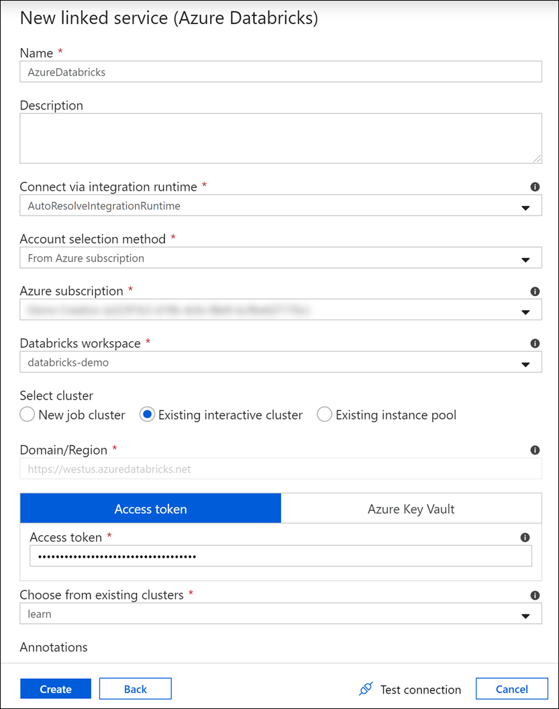
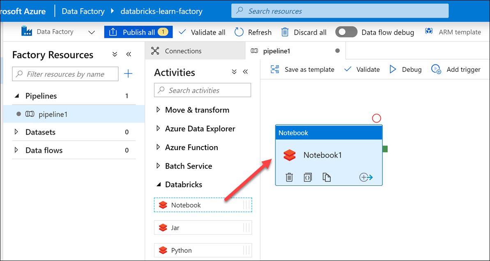

Azure Data Factory is a cloud-based ETL and data integration service that allows you to create data-driven workflows for orchestrating data movement and transforming data at scale. Using Azure Data Factory, you can create and schedule data-driven workflows (called pipelines) that can ingest data from disparate data stores.

A data factory can have one or more pipelines. A pipeline is a logical grouping of activities that together perform a task. For example, a pipeline could contain a set of activities that ingest and clean log data, and then kick off a mapping data flow to analyze the log data. The pipeline allows you to manage the activities as a set instead of each one individually. You deploy and schedule the pipeline instead of the activities independently.

While here, we will show scheduling a notebook with the Data Factory UI. You can also schedule `.jar` and `.py` files, taking advantage of the much lower cost of Data Engineering vs. interactive clusters. [Find detailed pricing details here](https://azure.microsoft.com/pricing/details/databricks/).

## Step 1: Retrieve Access Token from the Azure Databricks workspace

Go to your Azure Databricks workspace and generate a user access token for the Data Factory pipeline you will create later, by following these steps:

1. Go to your Azure Databricks workspace.

1. Select the user icon on the top-right of the workspace, and then select **User Settings**.

    

1. Under the **Access Tokens** tab, select **Generate New Token**. In the **Generate New Token** dialog box, add `Data Factory` for the Comment, and then select **Generate**.

    

1. Copy the new token, and save it to a text editor for later reference. This only appears once.

    

## Step 2: Go to Azure Databricks Linked Service

1. Open the Azure Data Factory service in Azure. Select **Author & Monitor** to open Data Factory in a new browser tab.

   

1. On the `Let's get started` page, select the pencil icon in the left pane to switch to the **Author** tab.

1. Select `Connections` at the lower left corner of the **Factory Resources** pane.

1. Select `New` in the **Connections** tab under `Linked Services`.

1. In the `New Linked Service` pane, select the `Compute` tab, and then select the `Azure Databricks` tile. Finally, select `Continue`.

   

## Step 3: Configure Linked Service

> [!IMPORTANT]
> To properly populate, this form should be completed from top to bottom. Accept the defaults for the reamining fields not described herein.

1. Select your current subscription from the dropdown list for `Azure subscription`.

1. Select the `Databricks workspace` for this module.

1. For `Select cluster`, select `Existing interactive cluster`. Normally, `New job cluster` is preferred for triggered pipelines as they use a lower cost engineering tier cluster.

1. For `Access token`, paste the access token you created in Step 1.

1. Select the name of your cluster from the dropdown list, under `Choose from existing clusters`.

1. Select `Create`.

   

## Step 4: Create an ADF Pipeline & Add a Databricks Notebook Activity

1. Hover over the number to the right of `Pipelines`, and select the ellipses that appears.

1. Select `New pipeline`.

1. In the `Activities` pane to the right of the `Factory Resources` pane, select `Databricks` to expand this section.

1. Drag the `Notebook` option into the tableau to the right.

   
