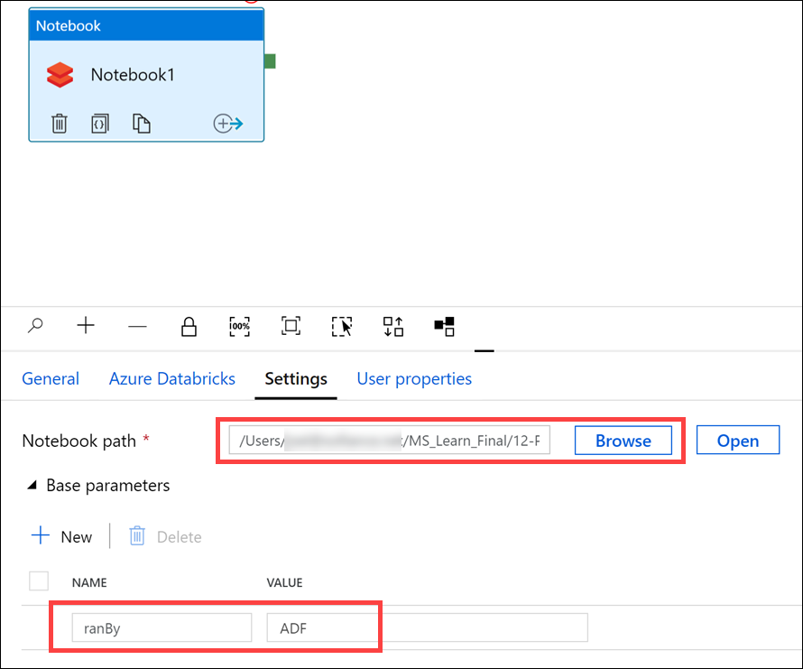
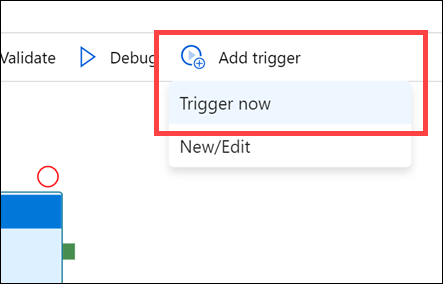
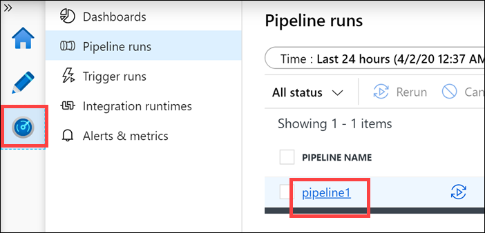

Before finishing the Notebook activity in your new Data Factory pipeline, you need to import the notebook used for this unit.

## Step 1: Clone the Databricks archive

1. If you do not currently have your Azure Databricks workspace open, in the Azure portal, go to your deployed Azure Databricks workspace, and select **Launch Workspace**.

1. In the left menu pane, select **Workspace** > **Users**, and select your username (the entry with the house icon).

1. In the pane that appears, select the arrow next to your name, and select **Import**.

    

1. In the **Import Notebooks** dialog box, select the URL and paste in the following URL:

    ```
    https://github.com/solliancenet/microsoft-learning-paths-databricks-notebooks/blob/master/data-engineering/DBC/12-Production-Workloads-with-Azure-Data-Factory.dbc?raw=true
    ```

1. Select **Import**.

1. Select the **12-Production-Workloads-with-Azure-Data-Factory** folder that appears.

1. You should see the `Record-Run` notebook. Open the notebook to review its contents, then return to this page to continue.

## Step 2: Configure Databricks Notebook Activity

1. Go back to the Azure Data Factory pipeline.

1. With the notebook activity still selected, select the **Azure Databricks** tab near the bottom of the pane.

1. Select the `Databricks linked service` you created in the previous unit from the dropdown list.

1. Under the **Settings** tab, select **Browse** to enter an interactive file explorer for the directory of your linked Databricks workspace.

1. Go to the **12-Production-Workloads-with-Azure-Data-Factory** directory, select the notebook **Record-Run**, and select **OK**.
1. Select **Base parameters** to expand a dropdown list, and then select **New**.

1. Under **Name**, enter `ranBy`. For **Value**, enter `ADF`.

    

## Step 3: Publish and trigger the pipeline

1. At the top left, you should see a `Publish all` button highlighted in blue with a yellow **1** on it. Select **Publish** to save your configurations (this is required to trigger the pipeline).

    

1. Select `Add trigger`, and then select `Trigger now` from the dropdown list. Select `Finish` at the bottom of the pane that appears.

    

## Step 4: Monitor the run

1. On the left menu pane, select the **Monitor** icon below the pencil icon. This will pull up a list of all recent pipeline runs.

1. In the **Actions** column, select the name of the action to `View activity runs`. This will allow you to see the current progress of your pipeline.

    

1. Your scheduled notebook will appear in the list at the bottom of the window. Select the glasses icon to view the **Details**.

    

1. In the window the appears, select **Run page url**. The page that loads will be a live view of the notebook as it runs in Azure Databricks. Within the notebook, you should see the `ranBy` value is "ADF", which is the parameter the pipeline's notebook activity passed to the notebook on execution.

    

1. After the notebook has finished running, you'll be able to view the `Output` of the notebook by selecting the middle icon in the `Actions` column. Note that the `"runOutput"` here is the value that was passed to `dbutils.notebook.exit()` in the scheduled notebook.

    
