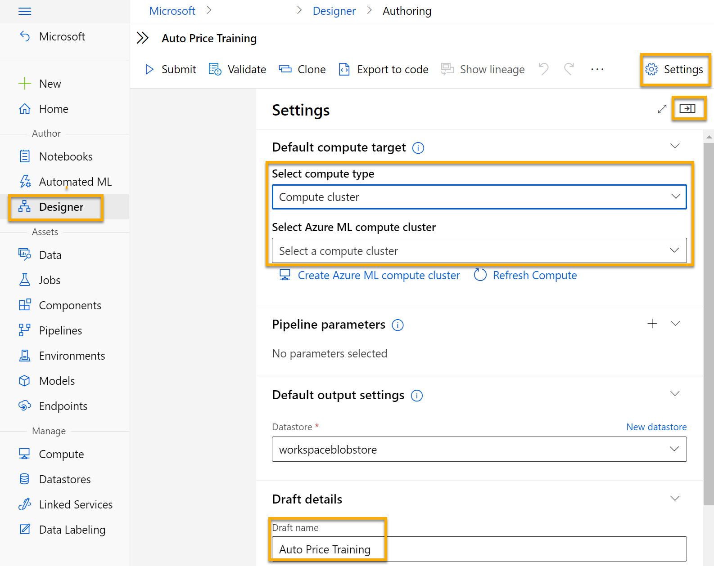
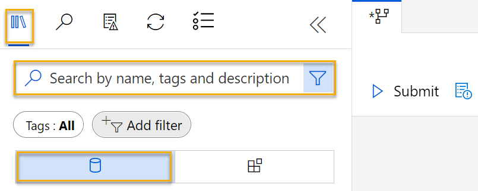
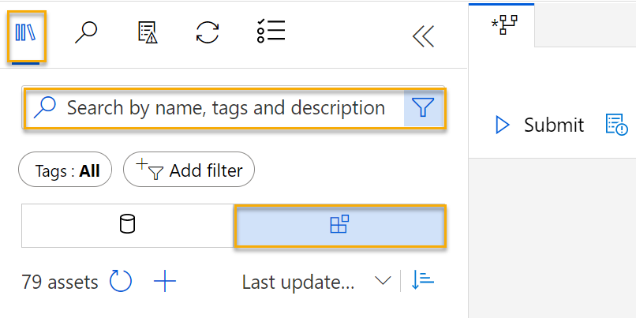

To train a regression model, you need a dataset that includes historical *features*, characteristics of the entity for which you want to make a prediction. You also need known *label* values, the numeric value that you want to train a model to predict.

## Create a pipeline

To use the Azure Machine Learning designer, you create a *pipeline* that you use to train a machine learning model. This pipeline starts with the dataset from which you want to train the model.

1. In [Azure Machine Learning studio](https://ml.azure.com?azure-portal=true), expand the left pane by selecting the three lines icon at the top left of the screen. View the **Designer** page (under **Author**), and select **+** to create a new pipeline.
2. At the top right-hand side of the screen, select **Settings**. If the **Settings** pane is not visible, select the wheel icon next to the pipeline name at the top. 
3. In **Settings**, you must specify a compute target on which to run the pipeline. Under **Select compute type**, select **Compute cluster**. Then under **Select Azure ML *compute-type***, select the compute cluster you created previously. 
4. In **Settings**, under **Draft Details**, change the draft name (**Pipeline-Created-on-*date***) to **Auto Price Training**.   
5. Select the *close icon* on the top right of the **Settings** pane to close the pane. 

## Add and explore a dataset

In this module, you train a regression model that predicts the price of an automobile based on its characteristics. Azure Machine Learning includes a sample dataset that you can use for this model.

1. Next to the pipeline name on the left, select the arrows icon to expand the panel if it is not already expanded. The panel should open by default to the **Asset Library** pane, indicated by the books icon at the top of the panel. Note that there is a search bar to locate assets. Notice two buttons, **Data** and **Components**. 

    

2. Click on **Data**. Search for and place the **Automobile price data (Raw)** dataset onto the canvas.
3. Right-click (Ctrl+click on a Mac) the **Automobile price data (Raw)** dataset on the canvas, and click on **Preview data**. 
4. Review the *Dataset output* schema of the data, noting that you can see the distributions of the various columns as histograms.
5. Scroll to the right of the dataset until you see the **Price** column, which is the label that your model predicts.
6. Scroll back to the left and select the **normalized-losses** column header. Then review the statistics for this column. Note there are quite a few missing values in this column. Missing values  limit the column's usefulness for predicting the **price** label so you might want to exclude it from training.
7. Close the **Automobile price data (Raw) result visualization** window so that you can see the dataset on the canvas like this:

    

## Add data transformations

You typically apply data transformations to prepare the data for modeling. In the case of the automobile price data, you add transformations to address the issues you identified when you explored the data.

1. In the **Asset Library** pane on the left, click on **Components**, which contain a wide range of modules you can use for data transformation and model training. You can also use the search bar to quickly locate modules.

    

2. Search for a **Select Columns in Dataset** module and place it to the canvas, below the **Automobile price data (Raw)** module. Then connect the output at the bottom of the **Automobile price data (Raw)** module to the input at the top of the **Select Columns in Dataset** module, like this:

    

3. Double click on the **Select Columns in Dataset** module to access a settings pane on the right. Select **Edit column**. Then in the **Select columns** window, select **By name** and **Add all** to add all the columns. Then remove **normalized-losses**, so your final column selection looks like this:

    

In the rest of this exercise, you go through steps to create a pipeline that looks like this:

Follow the remaining steps, use the image for reference as you add and configure the required modules.

4. In the **Asset Library**, search for a **Clean Missing Data** module and place it under the **Select Columns in Dataset** module on the canvas. Then connect the output from the **Select Columns in Dataset** module to the input of the **Clean Missing Data** module.
5. Double click the **Clean Missing Data** module, and in the pane on the right, click **Edit column**. Then in the **Select columns** window, select **With rules**, in the **Include** list select **Column names**, in the box of column names enter **bore**, **stroke**, and **horsepower** like this:

    

6. With the **Clean Missing Data** module still selected, in the pane on the right, set the following configuration settings:
    - **Minimum missing value ratio**: 0.0
    - **Maximum missing value ratio**: 1.0
    - **Cleaning mode**: Remove entire row
    
    >[!TIP]
    >If you view the statistics for the **bore**, **stroke**, and **horsepower** columns, you'll see a number of missing values. These columns have fewer missing values than **normalized-losses**, so they might still be useful in predicting **price** once you exclude the rows where the values are missing from training.

7. In the **Asset library**, search for a **Normalize Data** module and place it on the canvas, below the **Clean Missing Data** module. Then connect the left-most output from the **Clean Missing Data** module to the input of the **Normalize Data** module.
8. Double click on the **Normalize Data** module to view its parameters pane. Note that it requires you to specify the transformation method and the columns to be transformed. Then, set the transformation to **MinMax**. Apply a rule by selecting **Edit column** to include the following **Column names**:
    - **symboling**
    - **wheel-base**
    - **length**
    - **width**
    - **height**
    - **curb-weight**
    - **engine-size**
    - **bore**
    - **stroke**
    - **compression-ratio**
    - **horsepower**
    - **peak-rpm**
    - **city-mpg**
    - **highway-mpg**

    

    >[!TIP]
    >If you compare the values in the **stroke**, **peak-rpm**, and **city-mpg** columns, they are all measured in different scales, and it is possible that the larger values for **peak-rpm** might bias the training algorithm and create an over-dependency on this column compared to columns with lower values, such as **stroke**. Typically, data scientists mitigate this possible bias by *normalizing* the numeric columns so they're on the similar scales.

## Run the pipeline

To apply your data transformations, you must run the pipeline as an experiment.

1. Ensure that your pipeline looks similar to this image:

    

2. Select **Submit**, and select **new experiment** named **mslearn-auto-training** on your compute cluster.
3. Wait for the run to finish, which might take 5 minutes or more. 

    

    Notice that the left hand panel is now on the **Submitted Jobs** pane. You will know when the run is complete because the status of the job will change to **Completed**. 

4. When the run has completed, click on **Job detail**. You will be taken to another window. Note that the modules have completed check marks like this:

    

The dataset is now prepared for model training. Close the Job detail window to return to the pipeline. 

