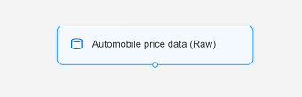
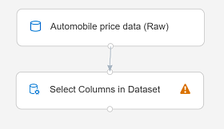
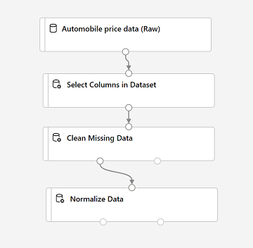
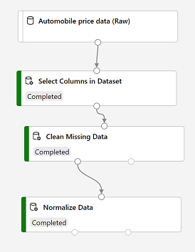

To train a regression model, you need a dataset that includes historical *features*, characteristics of the entity for which you want to make a prediction. You also need known *label* values, the numeric value that you want to train a model to predict.

## Create a pipeline

To use the Azure Machine Learning designer, you create a *pipeline* that you use to train a machine learning model. This pipeline starts with the dataset from which you want to train the model.

1. In [Azure Machine Learning studio](https://ml.azure.com?azure-portal=true), view the **Designer** page (under **Author**), and select **+** to create a new pipeline.
2. At the top left-hand side of the screen, click on the  default pipeline name (**Pipeline-Created-on-*date***) and change it to **Auto Price Training**. 
3. You must specify a compute target on which to run the pipeline. In the **Settings** pane, click on **Select compute target** to select the compute cluster you created previously (if the **Settings** pane is not visible, select the **&#9881;** icon next to the pipeline name at the top).  

## Add and explore a dataset

In this module, you train a regression model that predicts the price of an automobile based on its characteristics. Azure Machine Learning includes a sample dataset that you can use for this model.

1. Next to the pipeline name on the left, select the button **>>** to expand the panel. Find the **Sample datasets** section, and drag the **Automobile price data (Raw)** dataset from the **Samples** section onto the canvas.
2. Right-click (Ctrl+click on a Mac) the **Automobile price data (Raw)** dataset on the canvas, and on the **Outputs** menu, click **Dataset output** on the *Preview data* graph icon.
3. Review the schema of the data. Note that you can see the distributions of the various columns as histograms.
4. Scroll to the right of the dataset until you see the **Price** column, which is the label that your model predicts.
5. Select the column header for the **price** column and view the details that are displayed in the pane to the right. These include various statistics for the column values, and a histogram with the distribution of the column values.
6. Scroll back to the left and select the **normalized-losses** column header. Then review the statistics for this column. Note there are quite a few missing values in this column. Missing values  limit the column's usefulness for predicting the **price** label so you might want to exclude it from training.
7. View the statistics for the **bore**, **stroke**, and **horsepower** columns. Note the number of missing values. These columns have fewer missing values than **normalized-losses**, so they might still be useful in predicting **price** once you exclude the rows where the values are missing from training.
8. Compare the values in the **stroke**, **peak-rpm**, and **city-mpg** columns. These columns are all measured in different scales, and it is possible that the larger values for **peak-rpm** might bias the training algorithm and create an over-dependency on this column compared to columns with lower values, such as **stroke**. Typically, data scientists mitigate this possible bias by *normalizing* the numeric columns so they're on the similar scales.
9. Close the **Automobile price data (Raw) result visualization** window so that you can see the dataset on the canvas like this:

> [!div class="centered"]
> 

## Add data transformations

You typically apply data transformations to prepare the data for modeling. In the case of the automobile price data, you add transformations to address the issues you identified when you explored the data.

1. In the pane on the left, expand the **Data Transformation** section, which contains a wide range of modules you can use to transform data before model training.
2. Drag a **Select Columns in Dataset** module to the canvas, below the **Automobile price data (Raw)** module. Then connect the output at the bottom of the **Automobile price data (Raw)** module to the input at the top of the **Select Columns in Dataset** module, like this:

> [!div class="centered"]
> 

3. Select the **Select Columns in Dataset** module, and in its **Settings** pane on the right, select **Edit column**. Then in the **Select columns** window, select **By name** and use the **+** links to add all columns other than **normalized-losses**, like this:

> [!div class="centered"]
> 

In the rest of this exercise, you go through steps to create a pipeline that looks like this:

> [!div class="centered"]
> 

Follow the remaining steps, use the image for reference as you add and configure the required modules.

4. Drag a **Clean Missing Data** module from the **Data Transformations** section, and place it under the **Select Columns in Dataset** module. Then connect the output from the **Select Columns in Dataset** module to the input of the **Clean Missing Data** module.
5. Select the **Clean Missing Data** module, and in the settings pane on the right, click **Edit column**. Then in the **Select columns** window, select **With rules**, in the **Include** list select **Column names**, in the box of column names enter **bore**, **stroke**, and **horsepower** like this:

> [!div class="centered"]
> 

6. With the **Clean Missing Data** module still selected, in the settings pane, set the following configuration settings:
    - **Minimum missing value ratio**: 0.0
    - **Maximum missing value ratio**: 1.0
    - **Cleaning mode**: Remove entire row
7. Drag a **Normalize Data** module to the canvas, below the **Clean Missing Data** module. Then connect the left-most output from the **Clean Missing Data** module to the input of the **Normalize Data** module.
8. Select the **Normalize Data** module and view its settings. Note that it requires you to specify the transformation method and the columns to be transformed. Then, set the transformation to **MinMax**. Apply a rule to edit the columns to include the following **Column names**:
    - **symboling**
    - **wheel-base**
    - **length**
    - **width**
    - **height**
    - **curb-weight**
    - **engine-size**
    - **bore**
    - **stroke**
    - **compression-ratio**
    - **horsepower**
    - **peak-rpm**
    - **city-mpg**
    - **highway-mpg**

> [!div class="centered"]
> 

## Run the pipeline

To apply your data transformations, you must run the pipeline as an experiment.

1. Ensure that your pipeline looks similar to this image:

> [!div class="centered"]
> 

2. Select **Submit**, and run the pipeline as a new experiment named **mslearn-auto-training** on your compute cluster.
3. Wait for the run to finish, which might take 5 minutes or more. When the run has completed, the modules should look like this:

> [!div class="centered"]
> 

## View the transformed data

The dataset is now prepared for model training.

1. Select the completed **Normalize Data** module, and in its **Settings** pane on the right, on the **Outputs + logs** tab, select the **Preview data** icon for the **Transformed dataset**.
2. View the data. Note that the **normalized-losses** column has been removed, all rows contain data for **bore**, **stroke**, and **horsepower**, and the numeric columns you selected have been normalized to a common scale.
3. Close the normalized data result visualization.
